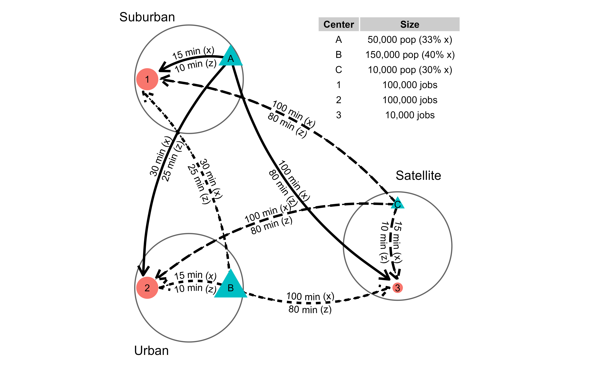
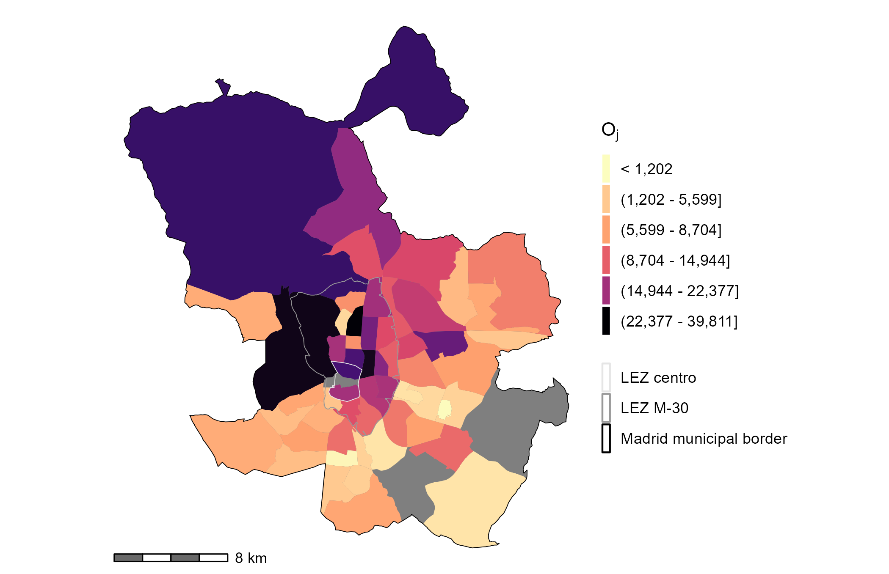
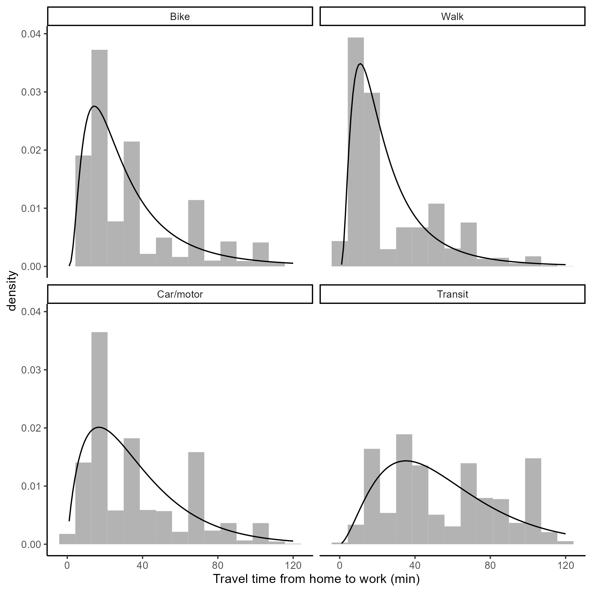
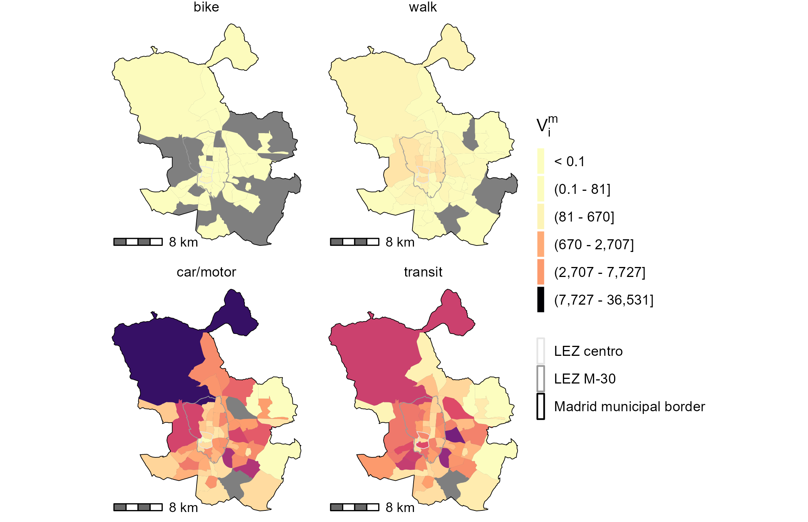
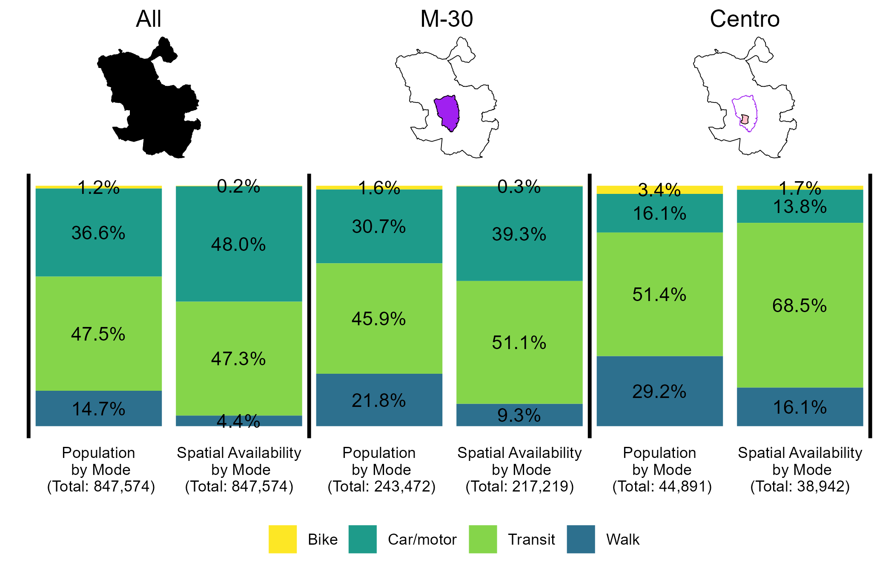

```{r knitr-setup, include=FALSE}
knitr::opts_chunk$set(
  echo = FALSE,
  cache = TRUE,
  warning = FALSE,
  message = FALSE,
  comment = '', 
  out.width = "0.85\\linewidth")

options(scipen=999) #eliminate scientific notation in print outs.
```

```{r load-packages, include=FALSE, cache=FALSE}
# library(fitdistrplus) # Help to Fit of a Parametric Distribution to Non-Censored or Censored Data
# library(gridExtra) # Miscellaneous Functions for "Grid" Graphics 
# library(kableExtra) # Construct Complex Table with 'kable' and Pipe Syntax

# library(shadowtext) # Shadow Text Grob and Layer
# library(skimr) # Compact and Flexible Summaries of Data
# library(spdep) # Spatial Dependence: Weighting Schemes, Statistics
# library(tidyr) # Tidy Messy Data
# options(scipen = 999)

library(patchwork) # The Composer of Plots
library(sf) # Simple Features for R
library(dplyr) # A Grammar of Data Manipulation
library(ggplot2) # Create Elegant Data Visualisations Using the Grammar of Graphics
library(ggforce) # Accelerating 'ggplot2'
library(geomtextpath) # Curved Text in 'ggplot2'
library(sfheaders)
library(ggpmisc) # Miscellaneous Extensions to 'ggplot2'
library(ggrepel) # Automatically Position Non-Overlapping Text Labels with 'ggplot2'
library(ggspatial) # Spatial Data Framework for ggplot2
library(flextable) # Functions for Tabular Reporting
library(scales) # Scale Functions for Visualization
library(TAM) #Test Analysis Modules
library(officer)
library(ggnewscale)
library(cowplot)
```

```{r sp_avail-function,include=FALSE}
#defining the spatial availability function
sp_avail <- function(x, o_id, d_id, pop, opp, r, f, alpha = 1){

  o_id <- rlang::enquo(o_id)
  d_id <- rlang::enquo(d_id)
  pop <- rlang::enquo(pop)
  opp <- rlang::enquo(opp)
  r <- rlang::enquo(r)
  f <- rlang::enquo(f)

  # Sum of population in system
  sum_pop <- x %>%
    dplyr::distinct(!!o_id,
                    .keep_all = TRUE) %>%
    dplyr::mutate(sum_pop = !!r*(!!pop)^alpha) %>%
    dplyr::pull(sum_pop) %>%
    sum()

  # Balancing factor size
  f_p <- dplyr::pull(x, !!r) * dplyr::pull(x, !!pop)^alpha / sum_pop

  # Sum of impedance
  sum_impedance <- x %>%
    dplyr::group_by(!!d_id) %>%
    dplyr::summarize(sum_impedance = sum(!!f))

  # Join sum of impedance to table
  x <- x %>%
    dplyr::left_join(sum_impedance,
                     by = rlang::as_name(d_id))
  
  # Balancing factor impedance
  f_c <- dplyr::pull(x, !!f) / x$sum_impedance

  # Add balancing factors to table
  x$f_c <- f_c
  x$f_p <- f_p
  
  # Sum of balancing factors for mass and impedance
  sum_pa <- x %>%
    dplyr::group_by(!!d_id) %>%
    dplyr::summarize(sum_pa= sum(f_p * f_c))

  x <- x %>%
    dplyr::left_join(sum_pa,
                     by = rlang::as_name(d_id))
  
  # Joint balancing factor
  f_t <- (f_p * f_c) / dplyr::pull(x, sum_pa)

  dplyr::pull(x, !!opp) * f_t
}

#detailed
sp_avail_detailed <- function(x, o_id, d_id, pop, opp, r, f, alpha = 1){
  
  o_id <- rlang::enquo(o_id)
  d_id <- rlang::enquo(d_id)
  pop <- rlang::enquo(pop)
  opp <- rlang::enquo(opp)
  r <- rlang::enquo(r)
  f <- rlang::enquo(f)
  
  sum_pop <- x %>%
    dplyr::distinct(!!o_id,
                    .keep_all = TRUE) %>%
    dplyr::mutate(sum_pop = !!r*(!!pop)^alpha) %>%
    dplyr::pull(sum_pop) %>%
    sum()
  
  f_p <- dplyr::pull(x, !!r) * dplyr::pull(x, !!pop)^alpha / sum_pop
  
  sum_impedance <- x %>%
    dplyr::group_by(!!d_id) %>%
    dplyr::summarize(sum_impedance = sum(!!f))
  
  x <- x %>%
    dplyr::left_join(sum_impedance,
                     by = rlang::as_name(d_id))
  
  f_c <- dplyr::pull(x, !!f) / x$sum_impedance
  
  x$f_c <- f_c
  x$f_p <- f_p
  
  sum_pa <- x %>%
    dplyr::group_by(!!d_id) %>%
    dplyr::summarize(sum_pa= sum(f_p * f_c))
  
  x <- x %>%
    dplyr::left_join(sum_pa,
                     by = rlang::as_name(d_id))
  x$f_t <- (f_p * f_c) / dplyr::pull(x, sum_pa)
  
  x %>%
    dplyr::mutate(V_ij = !!opp * f_t)
}
```

```{r synthetic-data, include=FALSE}
od_tt <- data.frame(i = c("A", "A", "A", "B", "B", "B", "C", "C", "C"), # Three origins
                    j = c("1", "2", "3", "1", "2", "3", "1", "2", "3"), # Three destinations
                    tt_x = c(15, 30, 100, 30, 15, 100, 100, 100, 15), # Travel time, x-mode(original) 
                    tt_z = c(10, 25, 80, 25, 10, 80, 80, 80, 10), # Travel time, z-mode  (the faster mode - like car)
                    pop = c(50000, 50000, 50000, 150000, 150000, 150000, 10000, 10000, 10000), # Population
                    opp = c(100000, 100000, 10000, 100000, 100000, 10000, 100000, 100000, 10000)) # Jobs

#write the dataframe long.
od_tt_m <- data.frame(i = c("A", "A", "A", "A", "A", "A",
                            "B", "B", "B", "B", "B", "B",
                            "C", "C", "C", "C", "C", "C"), # Three origins
                    j = c("1", "2", "3", "1", "2", "3", 
                          "1", "2", "3", "1", "2", "3", 
                          "1", "2", "3", "1", "2", "3"), # Three destinations
                    m = c("z", "z", "z", "x", "x", "x",
                          "z", "z", "z", "x", "x", "x",
                          "z", "z", "z", "x", "x", "x"),
                    tt = c(10, 25, 80,15, 30, 100,  #travel time, z-mode (faster) AND THEN x-mode (the slower mode, original)
                           25,  10,  80, 30, 15, 100, 
                           80, 80, 10, 100, 100, 15), 
                    pop = c(33000, 33000, 33000, 16500, 16500, 16500,
                            90000, 90000, 90000, 60000, 60000,60000,
                            7000,7000, 7000, 3000, 3000, 3000),
                    opp = c(100000, 100000, 10000, 100000, 100000, 10000,
                            100000, 100000, 10000, 100000, 100000, 10000,
                            100000, 100000, 10000, 100000, 100000, 10000)) 
```

```{r data-figure-with-toy-example, include=FALSE}
od <- data.frame(id = c("A", "B", "C", "1", "2", "3"),
                 type = c("Population", "Population", "Population", "Jobs", "Jobs", "Jobs"),
                 size = c(50000, 150000, 10000, 100000, 100000, 10000),
                 x = c(2.5, 2.5, 6.5, 0.5, 0.5, 6.5),
                 y = c(8.0, 2.5, 4.5, 7.5, 2.5, 2.5))

centers <- data.frame(id = c("Urban center", "Suburb", "Satellite town"),
                 radius = rep(1.3, 3),
                 x = c(1.5, 1.5, 6.5),
                 y = c(2.5, 7.5, 3.5))

# od_lines coded as segments
od_lines <- data.frame(x = c(2.5, 2.5, 2.5, 2.5, 2.5, 2.5, 6.5, 6.5, 6.5),
                       y = c(8.0, 8.0, 8.0, 2.5, 2.5, 2.5, 4.5, 4.5, 4.5),
                       xend = c(0.8, 0.4, 6.3, 0.4, 0.8, 6.3, 0.8, 0.7, 6.5),
                       yend = c(7.7, 2.8, 2.7, 7.2, 2.5, 2.5, 7.5, 2.7, 2.7),
                       group = c("A", "A", "A", "B", "B", "B", "C", "C", "C"),
                       time = c("15 min (x)\n10 min (z)", "30 min (x)\n25 min (z)", "100 min (x)\n80 min (z)",
                                "30 min (x)\n25 min (z)", "15 min (x)\n10 min (z)", "100 min (x)\n80 min (z)",
                                "100 min (x)\n80 min (z)", "100 min (x)\n80 min (z)", "15 min (x)\n10 min (z)"))

od_table <- data.frame(Center = c("A", "B", "C", "1", "2", "3"),
  Size = c("50,000 pop (33% x)", "150,000 pop (40% x)", "10,000 pop (30% x)", 
           "100,000 jobs", "100,000 jobs", "10,000 jobs"))

od_table2 <- data.frame(Path = c("A to 1", "A to 2", "A to 3", 
                                "B to 1", "B to 2", "B to 3", 
                                "C to 1", "C to 2", "C to 3"),
  Value = c("15 min (x)\n10 min (z)", "30 min (x)\n25 min (z)", "100 min (x)\n80 min (z)",
                                "30 min (x)\n25 min (z)", "15 min (x)\n10 min (z)", "100 min (x)\n80 min (z)",
                                "100 min (x)\n80 min (z)", "100 min (x)\n80 min (z)", "15 min (x)\n10 min (z)"))
```

```{r, creating-toy-example-plot, eval=FALSE}
toy_example_plot <- ggplot() + 
  # Plot centers
  geom_circle(data = centers,
             aes(x0 = x, 
                 y0 = y,
                 r = radius),
             color = "grey40") +
  annotate(geom = "label", 
           x=c(0.5, 0.6, 7),
           y=c(9, 1, 5.2), 
           label = c("Suburban", "Urban", "Satellite"), 
           size=4, 
           label.size=NA) +
  # Connect origins and destinations with curves
  geom_curve(data = od_lines,
               aes(x = x,
                   y = y,
                   xend = xend,
                   yend = yend,
                   linetype = group,
                   group = group),
             arrow = arrow(length = unit(0.03, "npc")),
             curvature = 0.20,
             linewidth = 1,
             color = "black") +
  # Text on curves
  geom_textcurve(data = od_lines,
               aes(x = x,
                   y = y,
                   xend = xend,
                   yend = yend,
                   linetype = group,
                   group = group,
                   label = time),
              size = 3,
             curvature = 0.20,
             color = "black") +
  # Plot origins and destinations
  geom_point(data = od,
            aes(size = size,
                x = x, 
                y = y, 
                color = type,
                shape = type)) +
  scale_size(range = c(4, 10)) +
  # Label origins and destinations
  geom_text(data = od, 
            aes(x, 
                y, 
                label=id), 
            size=3) +
  # Create table
  annotate(geom = "table",
           x = 8, 
           y = 9, 
           label = list(od_table),
           fill = "white",
           size=3) +
  # Theme the plot
  coord_fixed() + 
  theme_void() + guides(shape = "none", size = "none", color = "none", linetype ="none") 

toy_example_plot
ggsave("images/Fig1.png",dpi=600)
```

```{r access-calcs-table, include=FALSE}
#table with all the accessibility calculations
# Impedance parameter
b <- 0.1

# Calculate impedance function
od_tt_m <- od_tt_m %>%
  mutate(f = exp(-b * tt))
```

```{r access-Si-calc, include=FALSE}
S_im <- od_tt_m %>% 
  group_by(i,m) %>% 
  summarize(S_im = sum(opp*f))
            #,pop = mean(pop)

#not needed for this comparison
# S_i <- S_im %>%
#   group_by(i)%>%
#   summarise(S_i = sum(S_im*pop)/sum(pop))
```

```{r access-ai-calc, include=FALSE}
LOS_j <- od_tt_m %>% 
  group_by(j) %>%
  summarize(opp = mean(opp),
            R_j = sum(pop * f)) %>%
  mutate(LOS_j = opp/R_j)

a_im <- od_tt_m %>% 
  merge(LOS_j, by=c("j")) %>%
  group_by(i,m) %>%
  summarize(a_im = sum(LOS_j * f),
            pop = mean(pop)) 

a_i <- a_im %>%
  group_by(i) %>%
  summarize(a_i = sum(a_im*pop)/sum(pop))

a_i <- a_im %>% merge(a_i, by="i", all.x = T) %>% select(-c("pop"))
```

```{r calculating-beta-0.1-Vi-table-creation}
V_ijm <- od_tt_m %>%
  mutate(catch = 1) %>%
  sp_avail_detailed(o_id = i, #spatial availability
                    d_id = j, 
                    pop = pop,
                    opp = opp,
                    r = catch,
                    f = f, 
                    alpha = 1)

V_im <- V_ijm %>% 
  group_by(i,m) %>%
  summarise(V_im = sum(V_ij),
            pop = first(pop))

V_i <- V_im %>%
  group_by(i) %>%
  summarize(V_i = sum(V_im))

V_i <- V_im %>% merge(V_i, by="i", all.x = T)
```


```{r creating-synth-table}
table_toy_format <- V_i %>% select(-c(pop)) %>%
  left_join(S_im, by = c("i","m")) %>%
  left_join(a_i, by = c("i","m")) %>%
  transmute(i,
            m,
            S_im,
            a_im,
            V_im,
            a_i,
            V_i,
            V_im = ifelse(V_im < 0.001, "< 0.001", round(V_im, 3)),
            S_im = ifelse(S_im < 0.001, "< 0.001", round(S_im, 3)),
            a_im = ifelse(a_im < 0.001, "< 0.001", round(a_im, 3)),
            V_i = ifelse(V_i < 0.001, "< 0.001", round(V_i, 3)),
            a_i = ifelse(a_i < 0.001, "< 0.001", round(a_i, 3))
            )

add_data <- data.frame(i = "TOTALS", m = "" , 
                       S_im = table_toy_format$S_im %>% sum(),
                       a_im = NA,
                       V_im = table_toy_format$V_im %>% sum(),
                       a_i = NA,
                       V_i = 210000
                       )

table_toy_format <- bind_rows(table_toy_format, add_data)
```

```{r creating-flex-table}
table_toy_format_flex <- flextable(table_toy_format) %>% colformat_double(big.mark = ",", digits = 2, na_str = "N/A")

table_toy_format_flex <- compose(table_toy_format_flex,
                                 i = 1, j = c(3), part = "header",
                                 value = as_paragraph("S", as_sub("i"), as_sup("m")))%>%
  compose(
    i = 1, j = c(4), part = "header",
    value = as_paragraph("a", as_sub("i"), as_sup("m"))) %>%
  compose(i = 1, j = c(5), part = "header",
          value = as_paragraph("V", as_sub("i"), as_sup("m"))) %>%
  compose(
    i = 1, j = c(6), part = "header",
    value = as_paragraph("a", as_sub("i"))) %>%
  compose(
    i = 1, j = c(7), part = "header",
    value = as_paragraph("V", as_sub("i"))) %>%
  merge_v(j=c(1)) %>%
  merge_v(j=c(6)) %>%
  merge_v(j=c(7)) %>%
  vline(j = c(2,5)) %>%
  hline(i = c(2,4,6)) %>% 
  autofit()
```

```{r load-data}
load("data-prep/data/zn1259.RData") 
zn1259 <- zn %>% dplyr::select(c("FID", "CD_ZT12", "ZT1259"))
remove(zn)
load("data-prep/data/zn208.RData")
load("data-prep/data/zn_u.RData") # a key to join the zn1259 to the zn208 + contains municipality names

zn1259 <-  merge(zn1259, zn_u, by="ZT1259")

LEZ_centro <- read_sf("data-prep/data-raw/LEZ.shp") %>% st_transform(4326) %>% mutate(merge_all = 1) %>%
    group_by(merge_all) %>%
    summarise(geometry = sf::st_union(geometry)) %>%
    ungroup()
#add M30 for visualizing
LEZ_M30 <- read_sf("data-prep/data-raw/Zona_Bajas_Emisiones_MADRID.shp") %>% st_transform(4326)

#creating a list of zones that correspond to the zn208, which indicate if they are in a LEZ.
# LEZ_centro_list <- st_intersection(zn208, LEZ_centro) %>% 
#   st_drop_geometry() %>% 
#   dplyr::select(CD_ZT208) %>% 
#   unlist()

# LEZ_M30_list <- st_intersection(zn208, LEZ_M30) %>% 
#   st_drop_geometry() %>% 
#   dplyr::select(CD_ZT208) %>% 
#   unlist()

#import travel times
load("./data-prep/data-raw/intermed/ttresults/calc_bikett.Rdata")
load("./data-prep/data-raw/intermed/ttresults/calc_walktt.Rdata")
load("./data-prep/data-raw/intermed/ttresults/calc_transittt.Rdata")
load("./data-prep/data-raw/intermed/ttresults/calc_cartt.Rdata")
```

```{r travel-data-calculated-filtered}
zn1259_mad <- zn1259 %>% filter(Municipality == "Madrid")
zn1259_mad_list <- zn1259_mad %>% st_drop_geometry() %>% dplyr::select(ZT1259)

calc_walktt <- calc_walktt %>% filter((VORIZT1259 %in% zn1259_mad_list$ZT1259) & (VDESZT1259 %in% zn1259_mad_list$ZT1259))
calc_cartt <- calc_cartt %>% filter((VORIZT1259 %in% zn1259_mad_list$ZT1259) & (VDESZT1259 %in% zn1259_mad_list$ZT1259))
calc_transittt <- calc_transittt %>% filter((VORIZT1259 %in% zn1259_mad_list$ZT1259) & (VDESZT1259 %in% zn1259_mad_list$ZT1259))
calc_bikett <- calc_bikett %>% filter((VORIZT1259 %in% zn1259_mad_list$ZT1259) & (VDESZT1259 %in% zn1259_mad_list$ZT1259))
```

```{r travel-data-from-survey}
#import travel survey 2018
load(file = "data-prep/data/OD_v.RData")

#Keep only the direct home to work trips for the spatial availability calculation (no chained home-to-x-to-work trips, they only make up a small portion of home-to-work trips anyways, see the exploration of this in the 'data-exploration.rmd' file)
OD_v_HW <- OD_v %>% filter(VORI == "1" & VDES == "2" &
                             VORI_Municipality == "Madrid" & VDES_Municipality == "Madrid" &
                             TIEMPO_VIAJES <= 120) #VORG = 1 = casa, VDES = 2 = trabajo

#here we separate all the "car" trips, "transit" trips, "bike" trips, and "walk" trips. We then will create 4 different impedance functions
transit_HW_alltt <- OD_v_HW  %>% 
  filter(MODO_PRIORITARIO <= 9) %>% #(1. Renfe Cercanías ', 2. Autobus interurbano, 3. Autobus urbano otro municipio, 4. Metro, 5. Metro ligero/tranvía, 6. Autobus urbano Madrid EMT, 7. Resto renfe, 8. Autobus discrecional, 9. Autobus de largo recorrido)
  transmute(TIEMPO_VIAJES, 
            ELE_G_POND_ESC2,
            mode = "transit",
            VORIZT1259,
            VDESZT1259)

car_motor_HW_alltt <- OD_v_HW  %>% 
  filter(MODO_PRIORITARIO <= 19 & MODO_PRIORITARIO >= 10) %>% #includes both motorcycles and cars (specifically: 10. Taxi, 11. Coche conductor particular, 12. Coche conductor empresa, 13. Coche conductor alquiler sin conductor, 14. Coche pasajero particular, 15. Coche pasajero empresa, 16. Coche pasajero alquiler con conductor, 17. Moto/ciclomotor particular, 18. Moto/ciclomotor publica, 19. Moto/ciclomotor empresa)
  transmute(TIEMPO_VIAJES, 
            ELE_G_POND_ESC2,
            mode = "car/motor",
            VORIZT1259,
            VDESZT1259)

bike_HW_alltt <- OD_v_HW  %>% 
  filter(MODO_PRIORITARIO <= 23 & MODO_PRIORITARIO >= 20) %>% #includes cycling and 'otros', specificially: 20. Bicicleta particular, 21. Bicicleta publica, 22. Bicicleta empresa, 23. Otros)
  transmute(TIEMPO_VIAJES, 
            ELE_G_POND_ESC2,
            mode = "bike",
            VORIZT1259,
            VDESZT1259)

walk_HW_alltt <- OD_v_HW  %>% filter(MODO_PRIORITARIO == 24) %>% #"24. Andando/pie"
  transmute(TIEMPO_VIAJES,
            ELE_G_POND_ESC2,
            mode = "walk",
            VORIZT1259,
            VDESZT1259)
```

```{r seeing-how-similar-calc-tt-is-to-survey, eval=FALSE}
#Let's see how similar the calc tt is to the survey (only Madrid city travel times). We can see that transit is the most worrisome -- calculating travel times from some arbitrary point in the center of the TAZ is not very accurate. Also travel times for all active modes should also be calculated for trips between 60-120mins (not only 0-60mins). For now let's only work with the survey data.

#This provides justification -- we need to use hexagons! for paper 2. 

#walk
compare_walktts <- calc_walktt %>% merge(walk_HW_alltt, by=c("VORIZT1259", "VDESZT1259")) %>% dplyr::select(-c("ELE_G_POND_ESC2", "mode"))
compare_walktts %>% summary()

#bike
compare_biketts <- calc_bikett %>% merge(bike_HW_alltt, by=c("VORIZT1259", "VDESZT1259")) %>% dplyr::select(-c("ELE_G_POND_ESC2", "mode"))
compare_biketts %>% summary()

#car
compare_cartts <- calc_cartt %>% merge(car_motor_HW_alltt, by=c("VORIZT1259", "VDESZT1259")) %>% dplyr::select(-c("ELE_G_POND_ESC2", "mode"))
compare_cartts %>% summary()

#transit 
compare_transittts <- calc_transittt %>% merge(transit_HW_alltt, by=c("VORIZT1259", "VDESZT1259")) %>% dplyr::select(-c("ELE_G_POND_ESC2", "mode"))
compare_transittts %>% summary()
```

```{r fitting-impedance-function1}
#see which curve will fit the best using the descdist() function. This is to calibrate an impedance function for each mode based on the travel survey

#transit
transit_HW_alltt_long <- transit_HW_alltt[rep(seq_len(dim(transit_HW_alltt %>% dplyr::select(-mode))[1]), transit_HW_alltt$ELE_G_POND_ESC2), 1]
#fitdistrplus::descdist(data=transit_HW_alltt_long) #try beta, uniform, and normal

#car
car_motor_HW_alltt_long <- car_motor_HW_alltt[rep(seq_len(dim(car_motor_HW_alltt %>% dplyr::select(-mode))[1]), car_motor_HW_alltt$ELE_G_POND_ESC2), 1]
#fitdistrplus::descdist(data=car_motor_HW_alltt_long) #try beta, gamma

#bike
bike_HW_alltt_long <- bike_HW_alltt[rep(seq_len(dim(bike_HW_alltt %>% dplyr::select(-mode))[1]), bike_HW_alltt$ELE_G_POND_ESC2), 1]
#fitdistrplus::descdist(data=bike_HW_alltt_long) #try beta, gamma

#walk
walk_HW_alltt_long <- walk_HW_alltt[rep(seq_len(dim(walk_HW_alltt %>% dplyr::select(-mode))[1]), walk_HW_alltt$ELE_G_POND_ESC2), 1]
#fitdistrplus::descdist(data=walk_HW_alltt_long) #try beta, gamma, exp

```

```{r fitting-impedance-function2-transit}
# using fitdist function to fit a distribution using the default maximum likelihood estimation method and Nelder-Mead method for direct optimization

#for transit, try: uniform, normal, gamma, lognormal
gamma_ <- fitdistrplus::fitdist(data=transit_HW_alltt$TIEMPO_VIAJES,
                                "gamma", 
                                method="mle",
                                weights = round(transit_HW_alltt$ELE_G_POND_ESC2),
                                optim.method="Nelder-Mead")
unif_ <- fitdistrplus::fitdist(data=transit_HW_alltt$TIEMPO_VIAJES,
                                "unif", 
                                method="mle",
                                weights = round(transit_HW_alltt$ELE_G_POND_ESC2),
                               optim.method="Nelder-Mead")
norm_ <- fitdistrplus::fitdist(data=transit_HW_alltt$TIEMPO_VIAJES,
                                "norm", 
                                method="mle",
                                weights = round(transit_HW_alltt$ELE_G_POND_ESC2),
                                optim.method="Nelder-Mead")
lnorm_ <- fitdistrplus::fitdist(data=transit_HW_alltt$TIEMPO_VIAJES,
                                "lnorm", 
                                method="mle",
                                weights = round(transit_HW_alltt$ELE_G_POND_ESC2),
                                optim.method="Nelder-Mead")
```

```{r fitting-impedance-function2-transit2, eval=FALSE}
gamma_$aic #lowest aic and bic, so we pick this distribution.
unif_$aic 
norm_$aic
lnorm_$aic

gamma_$bic #lowest aic and bic, so we pick this distribution.
unif_$bic 
norm_$bic
lnorm_$bic
```

```{r fitting-impedance-function2-transit3}
HW_transit_gamma <- gamma_
```

```{r fitting-impedance-function2-car}
#for car, try: uniform, lnorm
gamma_ <- fitdistrplus::fitdist(data=car_motor_HW_alltt$TIEMPO_VIAJES,
                                "gamma", 
                                method="mle",
                                weights = round(car_motor_HW_alltt$ELE_G_POND_ESC2),
                                optim.method="Nelder-Mead")

lnorm_ <- fitdistrplus::fitdist(data=car_motor_HW_alltt$TIEMPO_VIAJES,
                                "lnorm", 
                                method="mle",
                                weights = round(car_motor_HW_alltt$ELE_G_POND_ESC2),
                                optim.method="Nelder-Mead")
```

```{r fitting-impedance-function2-car2, eval=FALSE}
gamma_$aic #lowest aic and bic, so we pick this distribution.
lnorm_$aic

gamma_$bic #lowest aic and bic, so we pick this distribution.
lnorm_$bic
```

```{r fitting-impedance-function2-car3}
HW_car_motor_gamma <- gamma_
```

```{r fitting-impedance-function2-bike}
#for bike, try: uniform, lnorm
gamma_ <- fitdistrplus::fitdist(data=bike_HW_alltt$TIEMPO_VIAJES,
                                "gamma", 
                                method="mle",
                                weights = round(bike_HW_alltt$ELE_G_POND_ESC2),
                                optim.method="Nelder-Mead")

lnorm_ <- fitdistrplus::fitdist(data=bike_HW_alltt$TIEMPO_VIAJES,
                                "lnorm", 
                                method="mle",
                                weights = round(bike_HW_alltt$ELE_G_POND_ESC2),
                                optim.method="Nelder-Mead")
```

```{r fitting-impedance-function2-bike2, eval=FALSE}
gamma_$aic 
lnorm_$aic #lowest aic and bic, so we pick this distribution.

gamma_$bic 
lnorm_$bic #lowest aic and bic, so we pick this distribution.
```

```{r fitting-impedance-function2-bike3}
HW_bike_lnorm <- lnorm_
```

```{r fitting-impedance-function2-walk}
#for walk, try: uniform, lnorm, normal
gamma_ <- fitdistrplus::fitdist(data=walk_HW_alltt$TIEMPO_VIAJES,
                                "gamma", 
                                method="mle",
                                weights = round(walk_HW_alltt$ELE_G_POND_ESC2),
                                optim.method="Nelder-Mead")

lnorm_ <- fitdistrplus::fitdist(data=walk_HW_alltt$TIEMPO_VIAJES,
                                "lnorm", 
                                method="mme",
                                weights = round(walk_HW_alltt$ELE_G_POND_ESC2),
                                optim.method="Nelder-Mead")
norm_ <- fitdistrplus::fitdist(data=walk_HW_alltt$TIEMPO_VIAJES,
                                "norm", 
                                method="mle",
                                weights = round(walk_HW_alltt$ELE_G_POND_ESC2),
                                optim.method="Nelder-Mead")
```

```{r fitting-impedance-function2-walk2, eval=FALSE}
gamma_$aic 
lnorm_$aic #lowest aic and bic, so we pick this distribution.
norm_$aic

gamma_$bic 
lnorm_$bic #lowest aic and bic, so we pick this distribution.
norm_$bic
```

```{r fitting-impedance-function2-walk3}
HW_walk_lnorm <- lnorm_
```

```{r}
# To visualize the impedance functions we create a data frame and calculate the density of the distribution given the estimated parameters:

x <- data.frame(t = seq(1, 120, 1))

x_transit <- x %>%
  mutate(f = dgamma(t,
                    HW_transit_gamma$estimate[1],
                    HW_transit_gamma$estimate[2]),
         mode = "transit")

x_car_motor <- x %>%
  mutate(f = dgamma(t,
                    shape = HW_car_motor_gamma$estimate[1],
                    rate = HW_car_motor_gamma$estimate[2]),
         mode = "car/motor")

x_bike <- x %>%
  mutate(f = dlnorm(t,
                    HW_bike_lnorm$estimate[1],
                    HW_bike_lnorm$estimate[2]),
         mode = "bike")

x_walk <- x %>%
  mutate(f = dlnorm(t,
                    HW_walk_lnorm$estimate[1],
                    HW_walk_lnorm$estimate[2]),
         mode = "walk")
```

```{r}
# Bind the empirical and theoretical trip length distributions:
tld_empirical <- rbind(transit_HW_alltt,
      car_motor_HW_alltt,
      bike_HW_alltt,
      walk_HW_alltt) %>%
  mutate(mode = factor(mode,
                       levels = c("bike", "walk", "car/motor", "transit")),
         distribution = "empirical") 

tld_theoretical <- rbind(x_transit,
      x_car_motor,
      x_bike,
      x_walk) %>%
  mutate(mode = factor(mode,
                       levels = c("bike", "walk", "car/motor", "transit")))
```

```{r, eval=FALSE, warning=FALSE}
#plot
tlds_curves_m_plot <- ggplot() + 
  geom_histogram(data = tld_empirical,
                 aes(x = TIEMPO_VIAJES, 
                     weights = ELE_G_POND_ESC2, 
                     after_stat(density)),
                 fill = "grey70",
                 bins = 15) +
  geom_line(data = tld_theoretical,
            aes(x = t, y = f)) + 
  xlab("Travel time from home to work (min)") +
  facet_wrap(~ mode, nrow = 2) +
  theme_classic()

tlds_curves_m_plot
ggsave("images/Fig4.png")
```

```{r, eval=FALSE}
#here, let's double check the empirical trip length distributions, as we can see from the two generated plots, our input TLD is correct!
rbind(transit_HW_alltt,
      car_motor_HW_alltt,
      bike_HW_alltt,
      walk_HW_alltt) %>%
  mutate(mode = factor(mode,
                       levels = c("bike", "walk", "car/motor", "transit"))) %>%
  ggplot(aes(x = TIEMPO_VIAJES, after_stat(density),
             weights = ELE_G_POND_ESC2
             )) + 
  geom_histogram(bins = 20) + 
  facet_wrap(~ mode, nrow = 2)
```

```{r define-population-balancing-factor}
# We define $P_i$ (for the population balancing factor) for each mode and $O_j$ associated with each zone. To do this, we add the number of trips (by mode) and create objects that contain the number of workers (origin) and jobs (destinations) - by mode:

# Instead of creating various columns like above, create a single column with the mode
OD_v_HW <- OD_v_HW  %>% 
  mutate(mode = case_when(MODO_PRIORITARIO <= 9 ~ "transit",
                          MODO_PRIORITARIO <= 19 & MODO_PRIORITARIO >= 10 ~ "car/motor",
                          MODO_PRIORITARIO <= 23 & MODO_PRIORITARIO >= 20 ~ "bike",
                          MODO_PRIORITARIO == 24 ~ "walk"),
         mode = factor(mode,
                       levels = c("bike", "walk", "car/motor", "transit")))

# The workers are classified by mode and origin. Ex. from Origin 1 five people use bike mode to get to destinations. This is P_i for each m
workers_zn208 <- OD_v_HW %>%
  group_by(VORI_CD_ZT208,
           mode) %>%
  summarize(workers = sum(ELE_G_POND_ESC2),
            total_ttworkers = sum(workers*mean(TIEMPO_VIAJES)),
            .groups = "drop") %>%
  rename(CD_ZT208 = VORI_CD_ZT208) 

jobs_zn208 <- OD_v_HW %>%
  group_by(VDES_CD_ZT208) %>%
  summarize(jobs = sum(ELE_G_POND_ESC2),
            .groups = "drop") %>%
  rename(CD_ZT208 = VDES_CD_ZT208)
```

```{r}
# Next join the number of workers summed at each origin to the ZN simple features object:
workers_sf_zn208 <- workers_zn208 %>%
  left_join(zn208,
            by = "CD_ZT208") %>%
  st_as_sf()

jobs_sf_zn208 <- jobs_zn208 %>%
  left_join(zn208,
            by = "CD_ZT208") %>%
  st_as_sf()
```

```{r}
#Now we reshape the data. Each row will represent an any origin to to 1 destination (i.e., destination row is unique). We will average the travel times, by mode, and then use this average travel time to find the 'f' (impedance value for travel for each mode). Hint: this is why we needed to find the impedance function in the first place! The functions represent the cost of travel for each mode based on the travel time for a trip, since we are averaging together the travel time for each mode.

OD <- OD_v_HW %>%
  group_by(VORIZT1259,
           VDESZT1259,
           mode) %>%
  summarize(tt = mean(TIEMPO_VIAJES),
            .groups = "drop")

OD_zn208 <- OD_v_HW %>%
  group_by(VORI_CD_ZT208,
           VDES_CD_ZT208,
           mode) %>%
  summarize(tt = mean(TIEMPO_VIAJES),
            .groups = "drop")
```

```{r, eval=FALSE}
# Check the mean and median travel times by mode, the first is at the level of zn1259 and the second is at zn208
OD_zn208 %>% 
  group_by(mode) %>% 
  summarize(mean_tt = mean(tt),
            median_tt = median(tt),
            min_tt = min(tt),
            max_tt = max(tt))
```

```{r}
#let's also do this at the level of zn208
OD_3 <- OD_zn208 %>%
  left_join(workers_zn208,
            by = c("VORI_CD_ZT208" = "CD_ZT208", "mode"))

OD_3 <- OD_3 %>%
  left_join(jobs_zn208,
            by = c("VDES_CD_ZT208" = "CD_ZT208"))

```

```{r, echo=FALSE, warning=FALSE, message=FALSE}
#Estimate f value using these averaged travel times:
OD_3 <- OD_3 %>%
  mutate(f = case_when(mode == "transit" ~ dgamma(tt,
                                                  HW_transit_gamma$estimate["shape"], 
                                                  HW_transit_gamma$estimate["rate"]),
                       mode == "car/motor" ~ dgamma(tt,
                                                    HW_car_motor_gamma$estimate["shape"],
                                                    HW_car_motor_gamma$estimate["rate"]),
                       mode == "bike" ~ dlnorm(tt,
                                               HW_bike_lnorm$estimate["meanlog"],
                                               HW_bike_lnorm$estimate["sdlog"]),
                       mode == "walk" ~ dlnorm(tt, 
                                               HW_walk_lnorm$estimate["meanlog"], 
                                               HW_walk_lnorm$estimate["sdlog"])),
         jobs_f = jobs*f) #for Hansen-type accessibility (unconstrained)
```

```{r, echo=FALSE, warning=FALSE, message=FALSE}
# ## Calculating hansen-type accessibility (for comparison)
OD_Si_zn208 <- OD_3 %>%
  group_by(VORI_CD_ZT208, mode) %>%
  summarize(S_i = sum(jobs_f)) # Hansen-type accessibility (unconstrained)
```

```{r}
#calculating SA
OD_SA_zn208 <- OD_3 %>%
  mutate(catch = 1) %>%
  sp_avail_detailed(.,
                    o_id = VORI_CD_ZT208,
                    d_id = VDES_CD_ZT208,
                    pop = workers,
                    opp = jobs,
                    r = catch,
                    f = f) %>% 
  mutate(jobs_tt_f_t = jobs*tt*f_t)
```

```{r}
SA_i_zn208 <- OD_SA_zn208 %>%
  group_by(VORI_CD_ZT208) %>%
  summarize(V_i = sum(V_ij))

SA_im_zn208 <- OD_SA_zn208 %>%
  group_by(VORI_CD_ZT208, 
           mode) %>%
  summarize(V_im = sum(V_ij),
            population_m = mean(workers),
            .groups = "drop")

population_zn208 <- workers_zn208 %>%
  group_by(CD_ZT208) %>%
  summarize(population = sum(workers))

jobs_zn208 <- jobs_zn208 %>%
  group_by(CD_ZT208) %>%
  summarize(jobs = sum(jobs))
```


```{r, eval=FALSE}
#Preforming checks. Spatial availability by origin (with check). Here we represent spatial availability per origin across all modes for each i. We know that car mode represents the majority of spatial availability per i overall: 
summary(SA_i_zn208) 
sum(SA_i_zn208$V_i)
```

```{r, eval=FALSE}
#But we can suspect that the spatial distribution of SA is uneven depending on the mode. So here we represent Spatial availability by origin, mode (with check):
summary(SA_im_zn208)
sum(SA_im_zn208$V_im)
```

```{r, eval=FALSE}
#more checks, calc.  Calculate worker population by zone of origin
sum(population_zn208$population)
sum(workers_zn208$workers)
```

```{r}
# Finally, let's join the zonal worker population to the SA_i and SA_im spatial objects
SA_i_zn208 <- SA_i_zn208 %>%
  left_join(population_zn208,
            by = c("VORI_CD_ZT208" = "CD_ZT208"))

SA_i_zn208 <- SA_i_zn208 %>%
  left_join(jobs_zn208,
            by = c("VORI_CD_ZT208" = "CD_ZT208"))

SA_im_zn208 <- SA_im_zn208 %>%
  left_join(population_zn208,
            by = c("VORI_CD_ZT208" = "CD_ZT208"))
```

```{r, eval=FALSE}
# checks
sum(SA_i_zn208$V_i)
sum(SA_im_zn208$V_im)
```

```{r}
# To facilitate the interpretation of spatial availability, here we calculate spatial availability per capita:

SA_i_zn208 <- SA_i_zn208 %>%
  mutate(v_i = V_i/population)

# summary(SA_i_zn208)

SA_im_zn208 <- SA_im_zn208 %>%
  mutate(v_im = V_im/population_m)

# summary(SA_im_zn208)
```

```{r}
# Lastly, join geometry of zones to SA so we can visualize:
SA_i_zn208 <- SA_i_zn208 %>%
  left_join(zn208 %>%
              dplyr::select(CD_ZT208),
            by =c("VORI_CD_ZT208" = "CD_ZT208")) %>%
  st_as_sf()

SA_im_zn208 <- SA_im_zn208 %>%
  left_join(zn208 %>%
              dplyr::select(CD_ZT208),
            by = c("VORI_CD_ZT208" = "CD_ZT208")) %>%
  st_as_sf()

OD_Si_zn208 <- OD_Si_zn208 %>%
  left_join(zn208 %>%
              dplyr::select(CD_ZT208),
            by = c("VORI_CD_ZT208" = "CD_ZT208")) %>%
  st_as_sf()
```

```{r create-bounding-boxes}
#create the bounding box for the Madrid city + a little extra
bbox_new1 <- st_bbox(zn1259_mad) # current bounding box

xrange <- bbox_new1$xmax - bbox_new1$xmin # range of x values
yrange <- bbox_new1$ymax - bbox_new1$ymin # range of y values

bbox_new1[1] <- bbox_new1[1] - (0.0 * xrange) # xmin - left
bbox_new1[3] <- bbox_new1[3] + (0.0 * xrange) # xmax - right
bbox_new1[2] <- bbox_new1[2] - (0.0 * yrange) # ymin - bottom
bbox_new1[4] <- bbox_new1[4] + (0.0 * yrange) # ymax - top

bbox_Madrid_muni <- bbox_new1 %>%  # take the bounding box ...
  st_as_sfc()

sf::sf_use_s2(FALSE) #this terns off the spherical geometry component in the st_union() function - this assumes the sf is just planar. Thats' fine for our purposes
Madrid_muni_border <- zn1259_mad %>%
  st_union()
```

```{r merging-borders-for-plotting, warning=FALSE}
Madrid_muni_border <- Madrid_muni_border %>% st_as_sf() %>% transmute(Border = "Madrid municipal border") %>% rename( "geometry" = "x")

borders <- rbind(LEZ_centro %>% transmute(Border = "LEZ centro"), 
                 LEZ_M30 %>% transmute(Border = "LEZ M-30"),
                 Madrid_muni_border)

#to clean up the slivers
borders <- borders |> st_make_valid() |>
  group_by(Border) |>
  summarise() |>
  sf_remove_holes()
```

```{r, eval=FALSE}
#mapping population P_i^m by mode!
pop_i_m_plot <- ggplot() +
  geom_sf(data = Madrid_muni_border, # border for Madrid muni
          colour=NA,
          fill="grey50") +
  geom_sf(data = SA_im_zn208,
          aes(fill = population_m),
          color = NA) +
  
  scale_fill_viridis_c(option = "mako", #legend scale bar
                       na.value = "grey50",
                       direction = -1,
                       name = expression(P['i']^{m}),
                       limits = c(38, 18421),
                       breaks = c(38, 360,2229,3750, 6768, 18421),
                       labels = c("< 39", "(39  - 360]", "(360 - 2,229]",
                                  "(2,229 - 3,750]", "(3,750 - 6,768]","(6,768 - 18,421]"))+
  geom_sf(data = borders,
          aes(colour=Border),
          size = 2,
          fill=NA) +
  scale_color_manual(values = c("grey90", "grey60", "black"),
                       name = element_blank())+
  annotation_scale(bar_cols = c("dimgrey", "white"), # scale bar for both the main plot and inset
                   height = unit(0.15, "cm")) +
  theme_void() +
  theme(legend.key.width = unit(0.2, 'cm')) +
  guides(fill = guide_legend(order = 1), colour = guide_legend(order = 2))+
  facet_wrap(~mode, nrow = 2)
```

```{r, eval=FALSE}
# jobs_i !
jobs_i_plot <- ggplot() +
    geom_sf(data = Madrid_muni_border, # border for Madrid muni
          colour=NA,
          fill="grey50") +
  geom_sf(data = SA_i_zn208,
          aes(fill = jobs),
          color = NA) +
  scale_fill_viridis_c(option = "magma", #legend scale bar
                       direction = -1,
                       name = expression(O['j']),
                       limits = c(1202, 39811),
                       breaks = c(1202, 5599,8703,14944,22377, 39811),
                       labels = c("< 1,202", "(1,202 - 5,599]", "(5,599 - 8,704]",
                                  "(8,704 - 14,944]", "(14,944 - 22,377]","(22,377 - 39,811]"))+
  geom_sf(data = borders,
          aes(colour=Border),
          size = 2,
          fill=NA) +
  scale_color_manual(values = c("grey90", "grey60", "black"),
                       name = element_blank())+
  guides(fill = guide_legend(order = 1), colour = guide_legend(order = 2))+
  annotation_scale(bar_cols = c("dimgrey", "white"), # scale bar for both the main plot and inset
                   height = unit(0.15, "cm")) +
  theme_void() +

  theme(legend.key.width = unit(0.2, 'cm'))
```

```{r, eval=FALSE}
pop_i_m_plot
ggsave("images/Fig3.png",
       width = 7,
       units = "in")
```

```{r, eval=FALSE}
jobs_i_plot
ggsave("images/Fig2.png",
       width = 7,
       units = "in")
```

```{r}
#Plot V (spatial availability) by origin-mode (then zn208). 
SA_im_V_zn208_plot <- ggplot() +
    geom_sf(data = Madrid_muni_border, # border for Madrid muni
          colour=NA,
          fill="grey50") +
  geom_sf(data = SA_im_zn208,
          aes(fill = V_im),
          color = NA) +
  scale_fill_viridis_c(option = "magma", #legend scale bar
                       name = expression(V["i"]^{m}),
                       direction = -1,
                       limits = c(0.07, 36531),
                       breaks = c(0.1, 81, 670, 6409, 7727, 36531),
                       labels = c("< 0.1", "(0.1 - 81]", "(81 - 670]", "(670 - 2,707]", "(2,707 - 7,727]", "(7,727 - 36,531]"))+
    geom_sf(data = borders,
          aes(colour=Border),
          size = 0.5,
          fill=NA) +
  scale_color_manual(values = c("grey90", "grey60", "black"),
                       name = element_blank())+
  guides(fill = guide_legend(order = 1), colour = guide_legend(order = 2))+
  annotation_scale(bar_cols = c("dimgrey", "white"), # scale bar for both the main plot and inset
                   height = unit(0.15, "cm")) +
  theme_void() +
  theme(legend.key.width = unit(0.2, 'cm')) +
  facet_wrap(~mode, nrow = 2)

#the accessibility plot (Hansen-type) -- this is for internal comparision.
S_im_plot_zn208_plot <- ggplot() +
    geom_sf(data = Madrid_muni_border, # border for Madrid muni
          colour=NA,
          fill="grey50") +
  geom_sf(data = OD_Si_zn208,
          aes(fill = S_i),
          color = NA) +
  scale_fill_distiller(palette = "YlGn", #legend scale bar
                       name = expression(S["im"]),
                       na.value = "grey50",
                       direction = 1)+
    geom_sf(data = borders,
          aes(colour=Border),
          size = 0.5,
          fill=NA) +
  scale_color_manual(values = c("grey90", "grey60", "black"),
                       name = element_blank())+
  guides(fill = guide_legend(order = 1), colour = guide_legend(order = 2))+
  annotation_scale(bar_cols = c("dimgrey", "white"), # scale bar for both the main plot and inset
                   height = unit(0.15, "cm")) +
  theme_void() +
  theme(legend.key.width = unit(0.2, 'cm')) +
  facet_wrap(~mode, nrow = 2)

```

```{r, eval=FALSE}
S_im_plot_zn208_plot
ggsave("images/Hansen_im_V_zn208_plot.png",
       width = 7,
       units = "in")
```

```{r, eval=FALSE}
SA_im_V_zn208_plot
ggsave("images/Fig5.png",
       width = 7,
       units = "in")
```

```{r}
#Plot v (spatial availability per capita) by origin:
SA_im_v_zn208_plot <- ggplot() +
  geom_sf(data = Madrid_muni_border, # border for Madrid muni
          colour=NA,
          fill="grey50") +
  geom_sf(data = SA_im_zn208,
          aes(fill = v_im),
          color = NA) +
  scale_fill_gradient2(low="#F05B12", high="#455BCD", mid = "#46F884", midpoint = 1,
                       name = expression(v["i"]^{m}),
                       limits = c(0.001106867, 2.086736720),
                       breaks = c(0.001106867,
                                  SA_im_zn208 |> filter(v_im <= 1) |> pull(v_im) |> median(),
                                   1, 
                                   SA_im_zn208 |> filter(v_im >= 1) |> pull(v_im) |> median(),
                                   2.086736720),
                       labels = c("< 0.23", "[0.23 - 1)", "[1 -1.17)", "[1.17 - 2.08)", "2.08 (max)"))+
    geom_sf(data = borders,
          aes(colour=Border),
          size = 0.5,
          fill=NA) +
  scale_color_manual(values = c("grey90", "grey60", "black"),
                       name = element_blank())+
  guides(fill = guide_legend(order = 1), colour = guide_legend(order = 2))+
  annotation_scale(bar_cols = c("dimgrey", "white"), # scale bar for both the main plot and inset
                   height = unit(0.15, "cm")) +
  theme_void() +
  theme(legend.key.width = unit(0.2, 'cm')) +
  facet_wrap(~mode, nrow = 2)
```

```{r, eval=FALSE}
SA_im_v_zn208_plot
ggsave("images/Fig7.png",
       width = 7,
       units = "in")
```

```{r, eval=FALSE}
# here we example the relationship between v_im between modes -- I can't tell anything conclusive.
car <- SA_im_zn208 %>% filter(mode=="car/motor") %>% st_drop_geometry() %>% select(VORI_CD_ZT208,v_im) %>% 
  rename("v_im_car" = "v_im")
bike <- SA_im_zn208 %>% filter(mode=="bike") %>% st_drop_geometry() %>% select(VORI_CD_ZT208,v_im) %>% 
  rename("v_im_bike" = "v_im")
transit <- SA_im_zn208 %>% filter(mode=="transit") %>% st_drop_geometry() %>% select(VORI_CD_ZT208,v_im) %>% 
  rename("v_im_transit" = "v_im") 
walk <- SA_im_zn208 %>% filter(mode=="walk")%>% st_drop_geometry() %>% select(VORI_CD_ZT208,v_im) %>% 
  rename("v_im_walk" = "v_im")


all_modes_v_im <- merge(x=car, y=bike, by = "VORI_CD_ZT208", all = T) %>% 
  merge(transit, by = "VORI_CD_ZT208", all=T)%>%
  merge(walk, by = "VORI_CD_ZT208", all = T)

all_modes_v_im_plot <- ggplot(all_modes_v_im,
       aes(x=v_im_transit,
           y = v_im_walk)) +
  geom_line()  + geom_point()+
  theme_classic()
```

```{r, eval=FALSE}
all_modes_v_im <- merge(x=car, y=bike, by = "VORI_CD_ZT208", all = T) %>% 
  merge(transit, by = "VORI_CD_ZT208", all=T)%>%
  merge(walk, by = "VORI_CD_ZT208", all = T)

v_im_per_pop_plot <- ggplot(SA_im_zn208 %>% mutate(area = st_area(SA_im_zn208),
                                                   pop_den = population/area),
       aes(x=population,
         #x = reorder(VORI_CD_ZT208, population),
           y = v_im,
           group=mode,
           color=mode)) +
  geom_line()  + geom_point()+
  xlab("Total population at origin") +
  ylab(expression(v["i"]^{m}))+
  #scale_x_discrete(breaks=c("5","15","30","45","60"),labels=c("100","10000","20000","30000","41000"))
  theme_classic()

v_im_per_pop_plot #this doesn't tell me tooo much.. it just means that levels of SA is similar across population densities for the most part. And that bike/walk are similar while car/transit are similar.
ggsave("images/v_im_per_pop_plot.png")
```

```{r, eval=FALSE}
#Check that the totals are maintained, it is!:
sum(OD_SA_zn208$V_ij, na.rm = T) #847574 jobs spatially avaialble to the region -- 
OD_SA_zn208 %>% group_by(VDES_CD_ZT208) %>% summarize(jobs = mean(jobs)) %>% select(jobs) %>% sum()

sum(OD_SA_zn208$tt)
sum(OD_SA_zn208$total_ttworkers)

#for comparision, the number of travel minutes spent going to jobs. group by jobs zona, and the the number of potential minutes traveling to jobs. This sum is the number of minutes spent commuting to jobs. it is 33680009 minutes, this is approx equal to 43min (mean travel time) *847574 (the total number of workers).
OD_SA_zn208 %>% group_by(VDES_CD_ZT208) %>% 
  summarize(jobs_tt_f_t = sum(jobs_tt_f_t)) %>% 
  select(jobs_tt_f_t) %>% sum() #should equal 33680009 mins total
```

```{r}
#Maybe delete this chunk?? 

# Spatial availability by mode, we can see that car mode captures ~48% of the spatial availability but only accounts for ~36% of the tt_ijm !!:
modal_V_comps <- OD_SA_zn208 %>%
  group_by(mode) %>%
  summarize(workers_m = sum(workers),
            V_m = sum(V_ij),
            V_m_perc = sum(V_ij)/847574,
            jobs_tt_f_t = sum(jobs_tt_f_t)/33680009)
#modal_V_comps #this issue here is workers should equal V_m in our case, make it do it.
```

```{r}
#data for the following plot
modal_V_comps_4plot <- SA_im_zn208 %>% st_drop_geometry() %>%
  group_by(mode) %>% 
  summarize(workers_m = sum(population_m),
            v_m = mean(v_im),
            V_m = sum(V_im) ,
            V_m_perc = sum(V_im)/847574,
            workers_m_perc = sum(population_m)/847574)

modal_V_comps_4plot <- data.frame(Mode = c("Bike", "Walk", "Car/motor", "Transit",
                                           "Bike", "Walk", "Car/motor", "Transit"),
                                  perc = c(modal_V_comps_4plot$workers_m_perc, modal_V_comps_4plot$V_m_perc),
                                  Measure = c(1,1,1,1,2,2,2,2) ) #for labeling the y-axis

CENTRO_comps <- SA_im_zn208 %>% st_drop_geometry() %>% filter(VORI_CD_ZT208 <= 3) %>%
  group_by(mode) %>% 
  summarize(workers_m = sum(population_m),
            V_m = sum(V_im)) %>%
  transmute(mode,
    CENTRO_V_m_perc = V_m/sum(V_m),
    CENTRO_workers_m_perc = workers_m/sum(workers_m)) 

CENTRO_comps <- data.frame(Mode = c("Bike", "Walk", "Car/motor", "Transit",
                                           "Bike", "Walk", "Car/motor", "Transit"),
                                  perc = c(CENTRO_comps$CENTRO_workers_m_perc, CENTRO_comps$CENTRO_V_m_perc),
                                  Measure = c(5,5,5,5,6,6,6,6) ) #for labeling the y-axis

M30_comps <- SA_im_zn208 %>% st_drop_geometry() %>% filter(VORI_CD_ZT208 >= 4 & VORI_CD_ZT208 <= 20) %>%
  group_by(mode) %>% 
  summarize(workers_m = sum(population_m),
            V_m = sum(V_im)) %>%
  transmute(mode,
    M30_V_m_perc = V_m/sum(V_m),
    M30_workers_m_perc = workers_m/sum(workers_m)) 

M30_comps <- data.frame(Mode = c("Bike", "Walk", "Car/motor", "Transit",
                                           "Bike", "Walk", "Car/motor", "Transit"),
                                  perc = c(M30_comps$M30_workers_m_perc, M30_comps$M30_V_m_perc),
                                  Measure = c(3,3,3,3,4,4,4,4) ) 

modal_V_comps_4plot <- rbind(modal_V_comps_4plot,M30_comps,CENTRO_comps)
```

```{r}
#comparison plots of spatial availability vs. population by mode for the full region, just m-30, and just centro
comps_plot <- ggplot(data = modal_V_comps_4plot,
       aes(y=perc, x=Measure, fill=Mode, label= perc %>% percent(accuracy = 0.1) )) +
  scale_x_discrete(limits = c("Population\n by Mode\n (Total: 847,574)","Spatial Availability\n by Mode\n(Total: 847,574)",
                              "Population\n by Mode\n (Total: 243,472)","Spatial Availability\n by Mode\n(Total: 217,219)",
                              "Population\n by Mode\n (Total: 44,891)","Spatial Availability\n by Mode\n(Total: 38,942)"),
                   position = "bottom") +
  geom_col() +
  scale_fill_manual(values = c("#FDE725","#1E9B8A", "#85D54A", "#2D708E"))+
  geom_text(position = position_stack(vjust=0.5), color="black")+
  theme_classic()+
  theme(axis.ticks = element_blank(),
        axis.title = element_blank(),
        axis.line = element_blank(),
        axis.text.y = element_blank(),
        axis.text = element_text(color="black"),
        legend.position = "bottom",
        legend.title = element_blank()) +
  geom_vline(xintercept=c(0.5,2.5, 4.5, 6.5),
                color = "black", size=1)
```

```{r}
ALL_Plot <- ggplot() +
    geom_sf(data = borders,
          size = 0.5,
          aes(col = Border),
          fill= NA) +
  scale_color_manual(values = c("grey90", "grey60", "black"),
                     name = element_blank())+
  geom_sf(data = borders %>% filter(Border == "Madrid municipal border"),
          size = 0.5,
          col ="black",
          fill="black") +
  theme_void() +
  ggtitle("All") +
  theme(plot.title = element_text(hjust = 0.5),
        legend.position = "none")

M30_Plot <- ggplot() +
    geom_sf(data = borders,
          size = 0.5,
          aes(col = Border),
          fill= NA) +
  scale_color_manual(values = c("grey90", "grey60", "black"),
                     name = element_blank())+
  geom_sf(data = borders %>% filter(Border == "LEZ M-30"),
          size = 0.5,
          col ="black",
          fill="grey60") +
  theme_void() +
  ggtitle("M-30") +
  theme(plot.title = element_text(hjust = 0.5),
        legend.position = "none")

CENTRO_Plot <- ggplot() +
    geom_sf(data = borders,
          size = 0.5,
          aes(col = Border),
          fill= NA) +
  scale_color_manual(values = c("grey90", "grey60", "black"),
                     name = element_blank())+
  geom_sf(data = borders %>% filter(Border == "LEZ centro"),
          size = 0.5,
          col ="black",
          fill="grey90") +
  theme_void() +
  ggtitle("Centro") +
  theme(plot.title = element_text(hjust = 0.5),
        legend.position = "none")

modal_V_comps_4plot_plot <- gridExtra::arrangeGrob(
                        #labels_4plot,
  gridExtra::arrangeGrob(ALL_Plot, M30_Plot, CENTRO_Plot, ncol=3),
                        comps_plot,
                        nrow=2, heights = c(1,2.5) )
ggsave("images/Fig6.png", modal_V_comps_4plot_plot,
        width = 7,
       units = "in")
```

# Introduction

<!-- WHAT IS ACCESSIBILITY AND WHY IS IT A RELEVANT TOPIC OF RESEARCH -->

Accessibility is a key concept in the analysis of land use and transportation systems [e.g., @hansenHowAccessibilityShapes1959; @geursAccessibility2004; @paezPositive2012], and too is coming of age from the perspective of planning [see _inter alia_, @handyAccessibility2020; @levinsonTransportAccessManual2020; @siddiqToolsTradeAssessing2021; @yanAccessibilityBasedPlanningAddressing2021; @elGeneidyMaking2022]. Beginning with the work of Hansen [@hansenHowAccessibilityShapes1959], accessibility measures have been widely used to evaluate the efficiency of transportation systems when combined with the distribution of opportunities in space [@shiLiterature2020]. As such, it is a holistic measure of spatial systems that measures the ease of reaching destinations [@handyMeasuring1997; @kwanSpace1998].

<!-- CLEARLY STATE THE PROBLEM -->

In practice, the most common form of accessibility measure is based on the gravity model. These measures are sums of weighted opportunities around a focal point (i.e., a potential origin), based on how expensive it is to reach them. Recent research in accessibility analysis has paid attention to the way opportunities are counted in the pertinent calculations. Conventionally, the sums are not constrained, which means that the same opportunity can enter the sum for different origins. Counting the same opportunity multiple times treats it as if it was inexhaustible. But opportunities in general are not inexhaustible, and in fact some of them are by definition exclusive: for example, once a job is taken up by someone in the population, the same job is no longer available for any other person to take. More generally, opportunities are subject to congestion: for example, multiple people can obtain services from the same family doctor, but the more people who do, the more congested the service will be.

The issue of congestion in accessibility measures was the motivation for the development of floating catchment area approaches [@shenLocationCharacteristicsInnercity1998; @luoMeasuresSpatialAccessibility2003]. While these approaches purport to account for congestion, Paez et al. [@paezDemand2019] demonstrate that in general they do not solve the issue of multiple counting of opportunities, thus leading to biases in the calculation of total demand and supply, sometimes inflating them, other times deflating them. In response to this, recent research has paid closer attention to the way opportunities are counted in accessibility analysis. Paez et al. @paezDemand2019, for example, tackle floating catchment area methods and introduce a normalization of the impedance matrix to allocate the population and then the level of service proportionally. More recently, Soukhov et al. [@soukhovIntroducingSpatialAvailability2023] introduced a singly-constrained measure of accessibility, called spatial availability, that employs a similar, but more sophisticated proportional allocation mechanism. The work of these authors show that floating catchment area methods can be seen as singly-constrained accessibility measures, and improve on existing approaches by guaranteeing that each opportunity is counted only once - in other words, treating opportunities as _finite_. The proportional allocation of spatial availability constrains the calculations to match a known quantity, therefore ensuring that the measurements sum up to a predetermined quantity (i.e., the total number of opportunities), and so each value can be meaningfully related to this total.

A limitation of spatial availability as introduced by Soukhov et al. [@soukhovIntroducingSpatialAvailability2023] is that it was developed for the case of a homogeneous population, for example for the case of a single mode of transportation. However, the finite nature of opportunities makes the analysis of heterogeneous populations very relevant. In the case of multiple modes of transportation, people who travel by slower modes (e.g., active modes) can usually reach fewer opportunities than people who travel by faster modes and whose range is typically far wider (e.g., car). This implies that slower travelers will often face increased competition for local opportunities from travelers who can reach said opportunities from farther afield.

<!-- WHAT DOES THIS PAPER DO? -->

The objective of this paper is to address this limitation of spatial availability. Our primary motivation is to extend spatial availability for the case of multimodal accessibility, but it is worthwhile noting that this is in fact just one case of heterogeneous populations (i.e., travel by different modes). The method itself can easily accommodate other forms of heterogeneity, for example variations in travel behavior between older and younger adults [e.g., @paezHealth2010], the propensity of older adults to use different modes of transportation [e.g., @moniruzzamanMode2013], the usually shorter trip lengths of children compared to grown-ups [e.g., @reyesWalking2014], or the more limited travel ranges of single parents [e.g., @paezJobs2013].

The paper rest of this paper is organized as follows. In Section 2 we provide a brief review of multimodal accessibility. In the following Section 3 we demonstrate the derivation of the new spatial availability expression for multiple modes. In Section 4 we illustrate relevant issues through a synthetic example. This is followed in Section 5 by an empirical example using data from the city of Madrid after the implementation of its Low Emission Zones (LEZ). Data for this example comes from the city's 2018 travel survey. The example shows the differences in spatial availability within and outside the LEZ for travelers using different modes, namely car, transit, cycling and walking. In Section 6, we provide concluding remarks on the strengths of the use of spatial availability as a multimodal accessibility measure, and discuss potential future uses in policy planning scenarios as well as directions for future research.

<!--
In @soukhovIntroducingSpatialAvailability2023, we introduce spatial availability, a type of location-based accessibility measure that is both _constrained_ and _competitive_. In this paper, we extend the spatial availability measure into a multimodal framework and explore its use in answering the question outlined: _"given opportunities are seen as finite, how many opportunities are available to a mode-using population given a spatial location?"._ The answer to this question quantifies how many opportunities can be accessed, considering competition, for different modes. 

Implementing policies that re-shape cities through accessibility gains (i.e., the _potential to interact_ with opportunities as a result of land-use mix and transport systems as defined in 

An important challenge in the identification of interventions that equitably transform cities is the effective evaluation of _trade-offs_: cities are complex and dynamic ecologies, and advantaging one component of the city can disadvantage another area, population, or sub-component. In this way, policy evaluation should take a _systems approach_ [@fikselSustainabilityResilienceSystems2006]. One way of applying a systems approach is from the perspective of the _finite_. As an illustration, consider the amount of transport space within a city: the amount is typically finite so re-allocating road space away from one mode directly impacts the performance of the others (see the literature on road space reallocation e.g., @valencaMainChallengesOpportunities2021). Evaluating policy impacts in the context of _finity_ provides a way to contextualize the balance of trade-offs that the citizens of a city should tolerate.

The question of how much one mode-using population can access at the expense of another mode-using population is a pertinent equity question in the evaluation of policy scenarios, especially those that impact modes differently. For instance, consider the impact of a low emission zone (LEZ). A LEZ is a policy of spatial and modal discrimination: the circulation of vehicles that are excessively polluting are restricted in specific regions. Depending on the level of vehicle restriction, LEZ have been shown to significantly improve air quality [@holmanReviewEfficacyLow2015] and air-quality related health outcomes[@margaryanLowEmissionZones2021]. From the perspective of accessibility to opportunities, LEZ explicitly lower the access that restricted-vehicle using populations have to opportunities within the LEZ. However, if conceptualizing opportunities in a region as _finite_, one populations' lose is another populations' gain. The populations using non-restricted modes (e.g., walking, cycling, transit, and less-polluting vehicles) to travel into LEZ will have _more_ access than before the LEZ implementation. 
 -->

# A brief review of multimodal accessibility

Location-based accessibility indicators are quantitative measures of _potential_ interaction with opportunities for locations within a given region: they are summary measures of the relationship between land-use and transport systems. Arguably, the most commonly used are measures based on the gravity model [@wuUnifyingAccess2020], of which cumulative opportunity measures and weighted cumulative opportunity measures are particular forms [@levinsonTransportAccessManual2020]. These measures assign a weight to opportunities based on how easy it is to reach them. Given an origin ($i$) and a destination ($j$), an impedance function $f^{m}(c^m_{ij})$ converts the cost of travel (e.g., time, money, generalized cost) into a score that represents the propensity for interaction. These measures originate from that proposed by Hansen @hansenHowAccessibilityShapes1959, which can take the following form in the multimodal case: $S_i^m = \sum_j O_j f^m(c_{ij}^m)$ where $m$ is a set of modes which have mode-specific travel costs ($c_{ij}^m$) and/or travel impedance functions ($f^m(\cdot)$).

Hansen-type accessibility is not constrained, which is to say it does not consider the opportunities as finite. To cite an example, Tahmasbi et al. [@tahmasbiMultimodalAccessibilitybasedEquity2019] use Hansen-type accessibility to assess the potential interaction with retail locations by three modes: walking, public transit, and car (i.e., $m = w, p, c$). $S_i^m$ is the sum of retail locations $j$ that can potentially be reached under the travel impedance as calculated for each $i$ and $m$. In other words, for each origin $i$ three accessibility scores are calculated. In this work, Tahmasbi et al. [@tahmasbiMultimodalAccessibilitybasedEquity2019] show that car travel affords the highest $S_i^{m}$ values in the majority of $i$, i.e., travelers who use a car can potentially reach more retail opportunities than populations using other modes. However, higher $S_i^{m}$ values for car do not affect the values of $S_i^{m}$ for other modes: in effect, each mode is analyzed as if the others did not exist. Since the measure is not constrained, each opportunity is typically counted multiple times within and between modes, and as a result the sum of accessibility is not necessarily a meaningful quantity. The accessibility scores for the modes are often values that are difficult to interpret beyond making statements about relative size. For example, Lunke [@lunkeModalAccessibilityDisparities2022], researching the region of Oslo, reports accessibility scores for car in the order of tens of thousands of employment opportunities. The corresponding scores for transit are lower, but still often in the thousands or tens of thousands. As reported, the ratio of the transit to the car score can be lower than 0.2 (meaning transit gives access to less than 20% of the opportunities than car). But despite the discussion about "sufficient accessibility", it is unclear what the unconstrained scores mean: is having access to but 10,000 jobs by transit insufficient? After all, 10,000 employment opportunities are still plenty of opportunities. These ratios can be found elsewhere in the literature [e.g., @paezRelative2010, Figs. 7, 8, and 9; @paezHealth2010, Fig. 5; @paezJobs2013, Figs. 6, 7, and 8], and they are useful as relative assessment of when some members of the public are better or worse off than others, but they do not say much about how bad is "worse off".

Besides ratios of accessibility, another way to improve interpretability of scores sometimes seen in the literature is to standardize them to lie in the range [0-1]. This adjustment is only helpful insofar as it facilitates relative comparisons, but interpretation of the scores remains challenging because the values are specific to a region and convey no meaning about the magnitude of the scores. In this approach, zones always have values between 0 and 1, but how remarkable is a zone with a low score for pedestrians and a high value for car? And if remarkable, what does the difference in these standardized values mean for planners? By how much should transport systems and land-use configurations be changed to improve conditions? And in what way can these scores be used to track differences over time? Or between regions? These questions lack straightforward answers since certain values will always be relatively 'low' or 'high', but do not track to a quantity that can be intuitively understood. Presentation or discussion of Hansen-type accessibility that has been standardized in this way is not uncommon in the literature [e.g., @campbell2019accessibility; @maharjanSpatialEquityModal2022]. 

Once we understand opportunities to be finite, it is possible for an accessibility measure to take on a crisper meaning. As considered in the long tradition of accessibility research, capacity of opportunities is limited and thus is subject to competition by population [@soukhovIntroducingSpatialAvailability2023; @grengsJobAccessibilityModal2010; @kawabataJobAccessibilityIndicator2006; @kwokUseModalAccessibility2004; @morrisAccessibilityIndicatorsTransport1979; @weibullAxiomaticApproachMeasurement1976; @shenLocationCharacteristicsInnercity1998]. There are only so many school-seats, hospital capacity, employment opportunities, etc., in a region and if one person reaches an opportunity, it is taken: the supply of an opportunity and the demand for that opportunity are two components of accessibility. These are clear examples of opportunities that are unambiguously competitive. But we would go as far as to argue that every type of opportunity is subject to congestion or capacity constraint, even when the opportunities are conventionally seen as non-competitive. 

Amenities are a good example of this. For instance, standards for providing green spaces are often stated in the form of _exclusive access_, in units of amenity per capita. A case in point is a the Ile-de-France region, a jurisdiction that suggested in a 2013 planning document that at the municipal level at least $10m^2$ of public green space should be supplied _per inhabitant_ [@liottaPlanning2020]. Green spaces are not evenly distributed, which means that who has access to them hinges on where they are and how easy is to reach them. This formulation of provision of amenities is not unusual. For example, Natural England, an organization that recommends an Accessible Natural Greenspace Standard such that the minimum supply of space is one ha of statutory Local Nature Reserves per thousand population^[see  https://redfrogforum.org/wp-content/uploads/2019/11/67-Nature-Nearby%E2%80%99-Accessible-Natural-Greenspace-Guidance.pdf]. Similarly, the World Health Organization [cited in @OECDFrameworks2013] recommends that cities provide a minimum of 9$m^2$ of green area per inhabitant. For our purposes, standards of this type translate into "how much of this resource is available to one individual that has not been claimed by anyone else?". Green spaces often have large capacities, but they still have a capacity, and it is not the same for a person to have access to $5m^2$ of _uncongested_ green space as $15m^2$. This difference is in fact a matter of justice [@laraSpace2015; @liottaPlanning2020]. Constraining accessibility is in this way a useful way to evaluate the congested availability of any type of opportunity. As development of sound standards is emphasized in the planning literature, in particular in regards to fairness in transportation [see @martensFair2021], spatial availability analysis is a useful way to develop and assess standards. 

The relevance of the considerations above is put in sharper relief when we think about the use of multiple modes (or heterogeneous populations). If we return to Oslo for a moment [@lunkeModalAccessibilityDisparities2022], we notice that the places that have high accessibility by transit are also the places that have _very high_ accessibility by car (in their Figure 2). Those two populations are going for the same opportunities, and those travelling by transit have fewer to choose from to begin with. More generally, people in a zone who are advantaged with relatively low cost of travel will have the ability to potentially reach more opportunities than other people. Due to this advantage, through the perspective of finite opportunities, there are fewer opportunities left for everyone else, especially for those who use modes that are slower or otherwise more expensive.

As noted in the Introduction, competitive accessibility was the rationale for developing floating catchment area methods (FCA), popularized by Luo et al. [@luoMeasuresSpatialAccessibility2003] who reformulated the work of Shen [@shenLocationCharacteristicsInnercity1998] into two steps (although similar, and earlier, developments are found in [@weibullAxiomaticApproachMeasurement1976; @josephMeasuringPotentialPhysical1982]). Shen-type accessibility is formulated as: $a_i^m = \sum_j \frac{O_jf^m(c_{ij}^m)}{\sum_m D_j^m}$ where $D_j^m$ is the potential demand for opportunities equal to travel impedance weighted population $\sum_i P_i^m f^m(c_{ij}^m)$ and the remaining variables are repeated in the Hansen-type measure. Shen-type modal accessibility ($a_i^m$) can be understood as a ratio of the travel impedance-weighted supply of opportunities for $m$-mode in $i$ over the travel impedance-weighted demand for opportunities. In this way, it considers competition. That said, the measure remains unconstrained, meaning both population _and_ opportunities are multiply counted [see @paezDemand2019]. In other words, interpretation of the Shen-type accessibility scores between modes is fraught as it is for Hansen-type measures.

To illustrate, @taoInvestigatingImpactsPublic2020a calculate $a_i^m$ to jobs for different income-group populations in Shenzhen, China using $m = \text{public transit}$ and $m=\text{car}$. Their results indicate that zones with low-income populations have lower $a_i^m$ than zones with higher-income populations. Further, they show that $a_i^{m=\text{public transit}}$ is lower than $a_i^{m=\text{car}}$ at many zones, arguing that this may further place those zones with lower-income populations at a disadvantage. $a_i$ and/or $a_i^m$ are used to compare relative spatial differences in overall competitive accessibility and multimodal competitive accessibility, but because opportunities were doubly counted (entering the sums of both modes), this makes for uneasy interpretations of the differences in $a_i^{m}$ between modes. Questions that this approach leaves unaddressed include: what is the impact of competition on the difference in $a_i^m$ values? How does the impact vary spatially? And what is the interpretation of this difference? 

Spatial availability improves on previously discussed accessibility approaches using the Hansen-type measure and the Shen-type measure by constraining the sum of opportunities, that is, by treating opportunities as finite. This is done by means of proportional allocation factors that follow well established principles of spatial interaction and the gravity model [see @wilsonFamilty1971]. In Soukhov et al. [@soukhovIntroducingSpatialAvailability2023] these factors consider: the mass effect (e.g., the size of populations at different origins); and the cost of travel from different zones (e.g., some sub-populations face relatively higher or lower costs). The following section introduces the multimodal form of spatial availability.

# Multimodal spatial availability

In brief, we define the spatial availability at an origin $i$ ($V_{i}$) as the proportion of all opportunities in the region that are allocated to location $i$ from all destinations $j$. $V_{i}$ is a value of how many opportunities are available to each location $i$ out of all the opportunities in the region. The general formulation of spatial availability $V_{i}$ is shown in Equation (\ref{eq:spatial-availability-general}) [see @soukhovIntroducingSpatialAvailability2023]:
```{=tex}
\begin{equation}
\label{eq:spatial-availability-general}
V_i = \sum_{j=1}^J O_jF^t_{ij}
\end{equation}
```

\noindent Where:

- $F^t_{ij}$ is a balancing factor that depends on the size of the populations at different locations that demand opportunities $O_j$, as well as the cost of movement in the system $f(c_{ij})$.

- $V_i$ is the number of spatially available opportunities at $i$; the sum of $V_{i}$ is identical to the total number of opportunities in the region (i.e., $\sum_j O_j = \sum_i V_i$); in other words, opportunities are dealt with as finite resources.

Compared to Hansen-type accessibility:
```{=tex}
\begin{equation}
\label{eq:hansen-accessibility}
A_i = \sum_{j=1}^J O_jf(c_{ij})
\end{equation}
```

\noindent we see that spatial availability is, like the Hansen-type measure, a weighted sum of the opportunities.
What makes spatial availability stand apart from other approaches is how the weight used in the sum, balancing factor $F^t_{ij}$, implements a proportional allocation mechanisms to ensure that the sum of $V_i$ is constrained to match the total number of opportunities in the region. As such, spatial availability is singly-constrained and naturally implements competition or congestion. $F^t_{ij}$ consists of two parts. The first part is a population-based proportional allocation factor to model the mass effect of the gravity model:
$$
F^p_{i} = \frac{P_i}{\sum_i P_i}
$$

This factor makes opportunities available based on demand. Secondly, there is an impedance-based proportional allocation factor that models the cost effect:
$$
F^c_{ij} = \frac{F^c_{ij}}{\sum_j F^c_{ij}}
$$ 

This factor makes opportunities available preferentially to those who can reach them at a lower cost. $F^p_{i}$ and $F^c_{ij}$ are designed so that they both equal 1 when summed across all $i$ in the region (e.g., $\sum_i F^p_{i} = 1$ and $\sum_i F^c_{ij} = 1$). These factors are combined multiplicatively to yield $F^t_{ij}$ which ensures that a proportion of the opportunities $O_j$ are allocated to each $i$ accordingly. In other words, assuming a finite number of opportunities in the region, $F^t_{ij}$ proportionally allocates $O_j$ to each $i$ such that the resulting $V_i$ value represents the number of opportunities _available_ to the population at $i$. Each zonal value is a proportion of the opportunities in the region (i.e., $\sum_j O_j = \sum_i V_i$).

The focus of this paper is to extend $V_i$ for the measurement of multimodal applications (or more generally heterogeneous populations). To do so, the balancing factors need to be reformulated so that 1) the mass effect now accounts not only for the size of the population at $i$, but also the size of sub-populations within $i$; and 2) the cost of travel is not only for different zones, but by sub-populations within each zone (e.g., the cost of travel from $i$ by car, transit, walking, etc.) When we introduce modes (or sub-populations) $m$, the proportional allocation factors need to satisfy the condition that $F^{pm}_{i}$ and $F^{cm}_{ij}$ can be summed across each $m$ at each $i$ and then across all $i$ to equal to 1. They are also similarly combined multiplicatively to obtain their joint effect, represented as the combined balancing factor $F^{tm}_{ij}$ similar to that detailed in Equation (\ref{eq:multimodal-balancing-factors}). This factor is given by:
```{=tex}
\begin{equation}
\label{eq:multimodal-balancing-factors}
F^{tm}_{ij} = \frac{F^{pm}_{i} \cdot F^{cm}_{ij}}{\sum_{m=1}^M \sum_{i=1}^N F^{pm}_{i} \cdot F^{cm}_{ij}}
\end{equation}
```

\noindent where:

- The factor for allocation by population for each $m$ at each $i$ is $F^{pm}_{i} = \frac{P_{i}^m}{\sum_{m}\sum_{i} P_{i}^m}$; and
- The factor for allocation by cost of travel for each $m$ at $i$ is $F_{ij}^{cm} = \frac{f^m(c_{ij}^m)}{\sum_{m} \sum_{i} f^m(c_{ij}^m)}$

Implementing $F^{tm}_{ij}$, the following Equation (\ref{eq:spatial-availability-multimodal}) gives the multimodal version of spatial availability $V_i^m$:
```{=tex}
\begin{equation}
\label{eq:spatial-availability-multimodal}
V^m_{i} = \sum_{j=1}^J O_j\ F^{tm}_{ij}
\end{equation}
```

\noindent Where: 

-   $m = 1, 2,\cdots, M$ is a set of $M$ modes (or sub-populations) of interest.
-   $F^{tm}_{ij}$ is a balancing factor $F^t_{ij}$ for each $m$ at each $i$.
-   $V^m_{i}$ is the spatial availability $V_{i}$ for each $m$ at each $i$; the sum of $V^m_{i}$ for all $m$ at each $i$ is equivalent to the total sum of opportunities in the region (i.e., $\sum_j O_j = \sum_i V_i = \sum_{m} \sum_{i} V^m_{i}$).

Next we use a synthetic example to contrast multimodal accessibility and spatial availability.

# An illustrative synthetic example

Consider the simple system shown in Figure \ref{fig:Fig1}. The figure shows a region with population at three population centers ($A$, $B$, $C$) and jobs at three employment centers ($1$, $2$, $3$). The population at each origin $i$ is consists of two sub-populations, one using a faster mode $z$ and another using a slower mode $x$, to travel to employment centers. Population center $A$ is Suburban: it is closest to its own relatively large employment center at $1$, close to the Urban's equally large employment center $2$, and has a population that is smaller than the Urban $B$ and larger than the Satellite $C$. $B$ has the largest $x$-using population, followed by then $A$, then $C$. This synthetic example is inspired by the single-mode example used in @shenLocationCharacteristicsInnercity1998 and reconfigured in @soukhovIntroducingSpatialAvailability2023.

```{r, synthetic-example-plot, fig.cap="\\label{fig:Fig1} Multimodal synthetic example: locations of employment centers (in orange), population centers (in blue), number of jobs and population, and travel times for two modes (slower mode x and faster mode z).", fig.show='hold', fig.align='center'}

```

From the perspective of access to a _finite_ amount of opportunities in the region ($210,000$ jobs), the sub-population that is most proximate to jobs (low cost to reach), furthest from large populations (less competition), and uses the fastest mode $z$ (greater range) can potentially reach the largest number of opportunities. This appears to be the sub-population at $A$ using mode $z$. Sub-populations located in opposite conditions (i.e., more distant from jobs, close to large populations, and using slow mode $x$) are at a relative disadvantage. The competition for opportunities between different mode-using populations matters as it reflects how well the land-use and transport system serves (or does not serve) certain populations.

```{r tab1}
flextable::set_caption(table_toy_format_flex, 
            caption = "Accessibility values at each origin (i) per mode (m) (columns three to five) and aggregated per i (columns six and seven) for the synthetic example.")
```

The values calculated for $S_i^m$ (Hansen-type accessibility), $a_i^m$ (Shen-type accessibility), and $V_i^m$ (spatial availability) for each $i$ and $m$ are shown in the middle three columns and are aggregated for each $i$ in the final two columns in Table 1 <!-- \ref{tab:tab1}-->. As in the example in Shen [@shenLocationCharacteristicsInnercity1998], we use a negative exponential impedance function $f^m(c_{ij}^m) = \exp(-\beta\cdot c_{ij})$ with $\beta=0.1$ for both $x$ and $z$ modes for all accessibility measures calculations. Notice that in this example we use the same impedance function but the travel times are different for the two modes. More generally, it is possible to use different impedance functions for the modes, as demonstrated in the empirical example in the following section.

Hansen-type accessibility $S_i^m$ is presented for each origin and mode in the third column of Table 1 <!-- \ref{tab:tab1}-->. For all $i$, the travel by $z$ results in higher values of $S_i^m$ than travel by $x$. Lack of competition, or alternatively the assumption of an inexhaustible resource in the calculation of $S_i^m$, lead to a curious result. Since the populations in $A$ and $B$ have the same travel impedance to employment centers $1$, $2$ and $3$ (either 15, 30, or 100 minutes using $x$ or 10, 25, or 80 minutes using $z$), their values of $S_i^m$ are the same for both $A$ and $B$. Furthermore, the total sum of $S_i^m$ in the region is equal to `r S_im$S_im %>% sum() %>% prettyNum(big.mark = ",")`. This value lacks an intuitive interpretation: it represents the weighted sum of opportunities that may be reached within the region according to the travel impedance (i.e., the travel behavior and the characteristics of the modes) and does not usefully translate into any sort of benchmark. To connect this example to the aforementioned literature, $S_i^m$ is calculated in the work of Tahmasbi et al. [@tahmasbiMultimodalAccessibilitybasedEquity2019]; they contrast differences in $S_i^m$ values between modes in a relative and comparative sense, but make no further interpretation of the $S_i^m$ values. More densely populated metropolitan regions will tend to have more opportunities and hence large $S_i^m$ values and less densely regions, smaller values; how much of these differences may simply an artifact of region density?

In the fourth and sixth columns in Table 1 <!-- \ref{tab:tab1}--> the results for Shen-type accessibility are reported: first for both origin and mode $a_i^m$ as well as aggregated by the weighted mean mode-population ( $\sum_m \frac{P_i^m}{P_i}*a_i^m$ ) to represent a value for each origin $a_i$. Unlike $S_i^m$, this measure does considers _competition_. For instance, the population travelling by $x$ from $A$ and $B$ do not have the same values of $a_i^m$ as those travelling by $z$. In fact, $A$ has the highest values $a_i^m$ and $a_i$ values since this center has the lowest travel impedance to opportunities (lower than at $C$, $A$ and $B$ are equal) and faces relatively low competition, not being close to a relatively large population (lower than at $B$).

However, the calculations of $a_i^m$ are not constrained: the total sum of $a_i^m$ or $a_i$ is practically meaningless since it represents a sum of ratios. For instance, the population travelling by $z$ from $A$ has a value of `r a_i %>% filter(i=="A" & m=="z") %>% select(a_im) %>% pull() %>% round(digits=2)` jobs per job-seeking population compared to `r a_i %>% filter(i=="A" & m=="x") %>% select(a_im) %>% pull() %>% round(digits=2)` for users of mode $x$. What is the meaning of these values? The difference between these modes is equal to `r ((a_i %>% filter(i=="A" & m=="z") %>% select(a_im)) - (a_i %>% filter(i=="A" & m=="x") %>% select(a_im))) %>% pull() %>% round(digits=2)`, but `r ((a_i %>% filter(i=="A" & m=="z") %>% select(a_im)) - (a_i %>% filter(i=="A" & m=="x") %>% select(a_im))) %>% pull() %>% round(digits=2)` of what? How many more job opportunities can users of $z$ reach compared to user of $x$? When $a_i^m$ is aggregated to $a_i$ as shown in the sixth column, the values face similar interpretability issues. 
The Shen-type measure is implemented in aforementioned work of Tao et al. [@taoInvestigatingImpactsPublic2020a] to calculate modal $a_i^m$ values and the aggregated $a_i$ is implemented in the work of Carpentier et al. [@carpentieriMultimodalAccessibilityPrimary2020]. However, similar to Hansen-type accessibility, these works discuss relative and spatially comparative differences in values, but veer from interpreting the values of $a_i^m$ or $a_i$ themselves. In fairness, interpretation is complicated by the multiple counting of opportunities between zones and modes.

In contrast, spatial availability $V_i$ considers competition and is constrained such that the total sum of values is equal to the total number of opportunities in the region (i.e., $210,000$ jobs). Seen in fifth column of Table 1 <!-- \ref{tab:tab1}-->, the values of $V_i^m$ in $A$ and $B$ are not the same within each mode (as this measure considers competition). In fact, at $A$, users of mode $z$ capture `r ((table_toy_format %>% filter(i == "A" & m == "z") %>% select("V_im")) - (table_toy_format %>% filter(i == "A" & m == "x") %>% select("V_im"))) %>% pull() %>% prettyNum(big.mark = ",")` more spatially available jobs (of the $210,000$ jobs in the region) than the sub-population travelling by $x$. The numerical difference is clear since it refers to opportunities out of the total. 

Furthermore, the proportional allocation mechanism also means that the values of $V_i^m$ for any origin $i$ can be aggregated across $m$ and compared between zones ($V_i = \sum_m{\sum_i{V_i^m}}$). This aggregation, $V_i$, is shown in the seventh column in Table 1 <!-- \ref{tab:tab1}-->. Again looking at center $A$, $A$ is allocated `r ((V_i %>% filter(i == "A" & m == "z")  %>% select("V_i"))) %>% pull() %>% prettyNum(big.mark = ",")` spatially available opportunities for both modes. `r ((V_i %>% filter(i == "A" & m == "z") %>% select("V_im")) / ((V_i %>% filter(i == "A" & m == "z") %>% select("V_i")))) %>% pull() %>% as.numeric() %>% percent() ` of this spatial availability allocated to $A$ is assigned to users of mode $z$ despite representing `r 0.66 %>% percent()` of $A$'s population.

Spatial availability can be further aggregated to better interpret competition between modes. Across the entire region, `r V_ijm %>% filter(m=="z") %>% group_by(i) %>% summarize(pop = first(pop)) %>% select(pop) %>% sum() %>% prettyNum(big.mark = ",")` people use $z$ (`r ((V_ijm %>% filter(m=="z") %>% group_by(i) %>% summarize(pop = first(pop)) %>% select(pop) %>% sum()) / (V_ijm %>% group_by(i,m) %>% summarize(pop = first(pop), .groups = "drop") %>% select("pop") %>% sum())) %>% percent()` of the region population). However, users of $z$ account for `r ((V_ijm %>% filter(m=="z") %>% select(V_ij) %>% sum()) / (V_ijm %>% select(V_ij) %>% sum())) %>% percent()` of the region's total spatial availability - while the remaining `r (1 - (V_ijm %>% filter(m=="z") %>% select(V_ij) %>% sum()) / (V_ijm %>% select(V_ij) %>% sum())) %>% percent()` is allocated to users of mode $x$ who are `r ((V_ijm %>% group_by(i,m) %>% summarize(pop = first(pop), .groups = "drop") %>% filter(m == "x") %>% dplyr::select(pop) %>% sum()) / (V_ijm %>% group_by(i,m) %>% summarize(pop = first(pop), .groups = "drop") %>% dplyr::select(pop) %>% sum())) %>% percent()`of the total population. Notably, the population who uses $x$ have `r (((V_ijm %>% group_by(i,m) %>% summarize(pop = first(pop), .groups = "drop") %>% filter(m == "x") %>% dplyr::select(pop) %>% sum()) / (V_ijm %>% group_by(i,m) %>% summarize(pop = first(pop), .groups = "drop") %>% dplyr::select(pop) %>% sum())) - ((V_ijm %>% filter(m=="x") %>% select(V_ij) %>% sum()) / (V_ijm %>% select(V_ij) %>% sum()))) %>% percent()` fewer spatially available opportunities than its share in the population. This realization leads us to ask normative questions such as, how unequal should availability of opportunities be by mode? What intervention could help to redistribute spatial availability to sub-populations commensurate with their proportion of the total?  

Since spatial availability is constrained and has an interpretable meaning as a proportion of the total opportunities in the region, the values at $i$ have a straighforward interpretation. Inequality in $V_i^m$ values can be explored through a variety of approaches. For instance, consider travel times. The population of travelers who use $z$ accounts for `r ((V_ijm %>% group_by(i,m) %>% summarize(V_tt = sum(V_ij*tt), .groups = "drop") %>% filter(m == "z") %>% dplyr::select(V_tt) %>% sum()) / (V_ijm %>% group_by(i,m) %>% summarize(V_tt = sum(V_ij*tt), .groups = "drop") %>% dplyr::select(V_tt) %>% sum())) %>% percent()` of the potential travel time traveled in the region: this is `r (((V_ijm %>% filter(m=="z") %>% select(V_ij) %>% sum()) / (V_ijm %>% select(V_ij) %>% sum())) - (V_ijm %>% group_by(i,m) %>% summarize(V_tt = sum(V_ij*tt), .groups = "drop") %>% filter(m == "z") %>% dplyr::select(V_tt) %>% sum()) / (V_ijm %>% group_by(i,m) %>% summarize(V_tt = sum(V_ij*tt), .groups = "drop") %>% dplyr::select(V_tt) %>% sum())) %>% percent()` less travel time than the proportion of spatial available opportunities that is allocated to them. In other words, the population of users of $z$ travels fewer minutes overall and has more spatial availability of opportunities than users of the slower mode $x$. 

Alternatively, inequities in spatial availability between modes can be explored through proportional benchmarks. A spatial availability per capita $v_i^m$ is presented in Equation (\ref{eq:SA-per-capita}):

```{=tex}
\begin{equation}
\label{eq:SA-per-capita}
v_{i}^m = \frac{V_{i}^m}{P_{i}^m}
\end{equation}
```

The values of $v_i^m$ for $A$, $B$, and $C$ for users of $x$ are `r V_i %>% group_by(i,m) %>% summarize(v_i = sum(V_im)/sum(pop), .groups="drop") %>% filter(i=="A" & m =="x") %>% select(v_i) %>% sum() %>% round(digits=2)`, `r V_i %>% group_by(i,m) %>% summarize(v_i = sum(V_im)/sum(pop), .groups="drop") %>% filter(i=="B" & m =="x") %>% select(v_i) %>% sum() %>% round(digits=2)` and `r V_i %>% group_by(i,m) %>% summarize(v_i = sum(V_im)/sum(pop), .groups="drop") %>% filter(i=="C" & m =="x") %>% select(v_i) %>% sum() %>% round(digits=2)` spatially available jobs per capita, respectively. The values of $v_i^m$ for users of $z$ are much higher, with values of: `r V_i %>% group_by(i,m) %>% summarize(v_i = sum(V_im)/sum(pop), .groups="drop") %>% filter(i=="A" & m =="z") %>% select(v_i) %>% sum() %>% round(digits=2)`, `r V_i %>% group_by(i,m) %>% summarize(v_i = sum(V_im)/sum(pop), .groups="drop") %>% filter(i=="B" & m =="z") %>% select(v_i) %>% sum() %>% round(digits=2)` and `r V_i %>% group_by(i,m) %>% summarize(v_i = sum(V_im)/sum(pop), .groups="drop") %>% filter(i=="C" & m =="z") %>% select(v_i) %>% sum() %>% round(digits=2)` respectively. Users of $x$, especially those at $B$ and $C$, are directly impacted by the jobs that are spatially available to users of $z$ _in addition to_ the mass effect (occurring at $B$, high population density) and high travel impedance (occurring at the Satellite $C$).

If, let us say, the planning goal was to have one spatially available job per mode-using population, a policy intervention could be devised, to reduce the values of $v_i^z$ (making it slower or more expensive) and increase he values of $v_i^x$ (making it faster or les expensive). The purpose of this simple demonstration is to show how spatial availability can be used to quantify the competitive (dis)advantage in a multimodal application. In what follows, we demonstrate the use of multimodal spatial availability through an empirical example.

# Empirical example

## Context

```{r}
pop_props <- SA_im_zn208 %>% st_drop_geometry() %>% group_by(mode) %>% summarize(population_m = sum(population_m))
```
```{r}
tld_empirical_car <- tld_empirical %>% filter(mode == "car/motor") 
tld_empirical_transit <- tld_empirical %>% filter(mode == "transit") 
tld_empirical_bike <- tld_empirical %>% filter(mode == "bike") 
tld_empirical_walk <- tld_empirical %>% filter(mode == "walk") 

car_qs <- weighted_quantile(x=tld_empirical_car$TIEMPO_VIAJES, w=tld_empirical_car$ELE_G_POND_ESC2)
transit_qs <- weighted_quantile(x=tld_empirical_transit$TIEMPO_VIAJES, w=tld_empirical_transit$ELE_G_POND_ESC2)
bike_qs <- weighted_quantile(x=tld_empirical_bike$TIEMPO_VIAJES, w=tld_empirical_bike$ELE_G_POND_ESC2)
walk_qs <- weighted_quantile(x=tld_empirical_walk$TIEMPO_VIAJES, w=tld_empirical_walk$ELE_G_POND_ESC2)
```

```{r, eval=FALSE, messages=FALSE}
#not correlated, but this demonstrates that there's a higher positive linear trend for zones with pops of bike/walk with pops of transit than for pops of car

corr_m_pops <- data.frame(VORI_CD_ZT208 = SA_im_zn208$VORI_CD_ZT208 %>% unique())

corr_m_pops <- merge(corr_m_pops, SA_im_zn208 %>% st_drop_geometry() %>% filter(mode == "bike") %>% select(c(VORI_CD_ZT208, population_m)), by="VORI_CD_ZT208", all = TRUE) %>% rename("population_m_bike" = "population_m")

corr_m_pops <- merge(corr_m_pops, SA_im_zn208 %>% st_drop_geometry() %>% filter(mode == "transit") %>% select(c(VORI_CD_ZT208, population_m)), by="VORI_CD_ZT208", all = TRUE) %>% rename("population_m_transit" = "population_m")

corr_m_pops <- merge(corr_m_pops, SA_im_zn208 %>% st_drop_geometry() %>% filter(mode == "walk") %>% select(c(VORI_CD_ZT208, population_m)), by="VORI_CD_ZT208", all = TRUE) %>% rename("population_m_walk" = "population_m")

corr_m_pops <- merge(corr_m_pops, SA_im_zn208 %>% st_drop_geometry() %>% filter(mode == "car/motor") %>% select(c(VORI_CD_ZT208, population_m)), by="VORI_CD_ZT208", all = TRUE) %>% rename("population_m_car" = "population_m")

#shapiro.test(corr_m_pops$population_m_car) #all pop_ms have p values under 0.05, indicating that they are not statistically different from the null which is that they are something other than normally distirbuted. thus wecannot run the correlation.
#shapiro.test(corr_m_pops$population_m_transit) 

ggplot(corr_m_pops, aes(x=population_m_walk, y=population_m_car)) + 
  geom_point() +
  geom_smooth(method = "lm")
ggplot(corr_m_pops, aes(x=population_m_walk, y=population_m_transit)) + 
  geom_point() +
  geom_smooth(method = "lm")

ggplot(corr_m_pops, aes(x=population_m_bike, y=population_m_car)) + 
  geom_point() +
  geom_smooth(method = "lm")
ggplot(corr_m_pops, aes(x=population_m_bike, y=population_m_transit)) + 
  geom_point() +
  geom_smooth(method = "lm")
```

<!-- a summary about low emission zones, they are a geographic accessibility restriction. they change the accessibility landscape-->

The context for the empirical example is Madrid, Spain. This city implemented a Low Emission Zone (LEZ) in 2017 to: pursue goals set out in the national climate change agenda, cut nitrogen dioxide levels, and to prioritize people's movement in the city. LEZs elsewhere have similarly  been implemented as interventions to reduce GHG emissions, improve air quality, and support sustainable mobility [@margaryanLowEmissionZones2021; @verbeekJustManagementUrban2022]. Though the rules of exclusion vary by city<!-- depending on legal aspects and cultural norms-->, LEZs aim to deter/reduce traffic in designated zones under threat of penalty (e.g., fines, seizure of vehicle). <!-- In practice, LEZ limits the volume of traffic by excluding vehicles by license plate, fuel type, or by introducing tolls.--> In other words, LEZs implement a form of _geographic discrimination_ as they change how people can reach opportunities by making it more costly for some forms of travel, typically cars, to circulate in predetermined zones. When considering opportunities as finite in a region, this discrimination reduces the competition of one mode and opens up opportunities for other modes to better thrive. At their core, LEZs operate by changing the accessibility landscape of a city from the perspective of multiple modes.

<!--
Spain is one of a few countries with active LEZ and plans to expand their implementation as specified in their climate-change-related plans: _Plan Nacional Integrado de Energía y Clima 2021-2030_ [@espanaPlanNacionalIntegrado2020] and _Plan Nacional de Control de la Contaminación Atmosférica_ [@espanaResolucion10Enero2020]. Specifically, the national Spanish law 7/2021 ( _Ley de Cambio Climático y Transición Energética_) will require all municipalities to implement LEZ by 2023 if they meet at least one of the following requirements: (i) municipalities >50,000 inhab.; (ii) islands; and (iii) municipalities > 20,000 inhab. when air quality exceeds limits specified in _RD 102/2011 de Mejora de Calidad del Aire_ [@barcelonaGUIATECNICAPARA2021].
-->

In geographic scope, the 2017 boundaries of the LEZ in Madrid were relatively modest, covering only approximately 4.72 km\textsuperscript{2} of the central business district of the city (the so-called LEZ Centro). As of this writing, there are plans to expand these boundaries to the area inside the M-30, an orbital highway in proximity to the city center (i.e., LEZ M-30). Within the 2017 LEZ Centro implementation, all cars, motorcycles and freight vehicles with environmental labels A or B (older makes and models of fossil fuel internal combustion engine vehicles), were disallowed from entering the zone unless they are used by residents or meet other exemptions. This restriction impacted approximately half of all car trips that used to travel into what is now the LEZ Centro [@tarrinoortizAnalyzingImpactLow2022].

For this case study, we use spatial availability to quantify access to opportunities by different modes in Madrid. Particularly, we demonstrate how $V_i^m$ can be used to derive insights into how the restriction of car mobility in areas around/within the LEZ Centro may have allowed more sustainable (but often slower or more costly modes) to become more competitive.

```{r, jobs-plot, fig.cap="\\label{fig:Fig2} Distribution of jobs taken by people living and working in Madrid as reported in the 2018 travel survey. Grey TAZs has no jobs. Ranges of values in the legend are quintiles.", fig.show='hold', fig.align='center'}
 
```

```{r, pop-plot, fig.cap="\\label{fig:Fig3} Population living and working in Madrid by mode of transportation as reported in the 2018 travel survey. Grey TAZs have no population. Ranges of values in the legend are quintiles.", fig.show='hold', fig.align='center'}
knitr::include_graphics("images/Fig3.png")
```

## Data

The source of data for our empirical example is the 2018 Travel Survey of the Community of Madrid [@comunidaddemadridResultadosEDM20182020]. This is a representative survey that offers a snap-shot of travel patterns for a typical weekday in 2018. The survey collected 222,744 trips from a representative sample of 85,064 households across the traffic analysis zones (TAZ) in the Community of Madrid. For context, the population older than 3 years in the Community is 6,507,184. 

In this example, we use all home-to-full-time-work trips, by all modes. The trips are expanded using population weights. Figures \ref{fig:Fig2} and \ref{fig:Fig3} show the number of workers and the distribution of full-time jobs in the City of Madrid by TAZ. The light grey boundary represents the LEZ Centro in effect in 2017. The survey was conducted after the introduction of LEZ Centro. The dark grey boundary represents the LEZ planned for the boundaries of the M-30 highway and is present in the plots as a spatial reference for areas in proximity to the LEZ Centro.

The total sum of jobs $O_j$ are shown in Figure \ref{fig:Fig2} and the populations that go to a work destination by four modal categories $P^m_i$, is displayed in Figure \ref{fig:Fig3}. The modal shares in Figure \ref{fig:Fig3} are calculated based on those measured in the survey. The modal categories and the mode types within each category are reported as follows:

   - Car/motor: all cars and operating modes (e.g., cab, private driver, company, rental car, main driver of a private car, passenger in a private car) and all public, private or company motorcycle/mopeds.
  - Transit: all bus, trams, and trains.
  - Bike: all bicycle trips (e.g., private, public, or company bike trips) and "other" types of micromobility options.
  - Walk: walking or by foot.
  
Some aggregation of modes is necessary to calculate the travel impedance functions by mode. From Figure \ref{fig:Fig2}, it can be seen that the largest concentration of jobs is within, near, and to the north of LEZ Centro. The populations with access to those jobs by mode (Figure \ref{fig:Fig3}) are spatially distinct. Travel by car and transit represent `r (pop_props$population_m[3]/sum(pop_props$population_m)) %>% percent()` and `r (pop_props$population_m[4]/sum(pop_props$population_m)) %>% percent()` of the modal share respectively. The population that travels by transit is more spatially distributed than those using cars - particularly near and within LEZ Centro. This distribution is likely caused by a variety of factors including: transit coverage and service within with city,  effective car infrastructure outside of the M-30, and/or the impact of the LEZ Centro itself. 
From Figure \ref{fig:Fig3}, it can be seen that active travel is less common than motorized trips at `r (pop_props$population_m[1]/sum(pop_props$population_m)) %>% percent()` and `r (pop_props$population_m[2]/sum(pop_props$population_m)) %>% percent()` for cycling and walking respectively. Noticeably, there is a positive trend between the walking and cycling in zones where transit is also present. This positive trend is higher than for car trip populations. <!-- the populations do not follow a normal distribution, so we can't say there is a correlation, formally. see calcs in chunk at the beginning of this subsection-->

Travel times are provided within the travel survey by mode. This information is used to calibrate mode-specific travel impedance functions $f^m(c_{ij}^m)$. To illustrate the modal differences in travel times, the following descriptive statistics per mode are presented:

- Car/motor: mean `r weighted_mean(x=tld_empirical_car$TIEMPO_VIAJES, w=tld_empirical_car$ELE_G_POND_ESC2) %>% round()` minutes (min: `r car_qs[1]%>% round()` minutes, Q2: `r car_qs[2]%>% round()` minutes, Q3: `r car_qs[4]%>% round()` minutes, max: `r car_qs[5]%>% round()` minutes) 
- Transit: mean `r weighted_mean(x=tld_empirical_transit$TIEMPO_VIAJES, w=tld_empirical_transit$ELE_G_POND_ESC2)%>% round()` minutes (min: `r transit_qs[1]%>% round()` minutes, Q2: `r transit_qs[2]%>% round()` minutes, Q3: `r transit_qs[4]%>% round()` minutes, max: `r transit_qs[5]%>% round()` minutes) 
- Bike: mean `r weighted_mean(x=tld_empirical_bike$TIEMPO_VIAJES, w=tld_empirical_bike$ELE_G_POND_ESC2)%>% round()` minutes (min: `r bike_qs[1]%>% round()` minutes, Q2: `r bike_qs[2]%>% round()` minutes, Q3: `r bike_qs[4]%>% round()` minutes, max: `r bike_qs[5]%>% round()` minutes) 
- Walk: mean `r weighted_mean(x=tld_empirical_walk$TIEMPO_VIAJES, w=tld_empirical_walk$ELE_G_POND_ESC2)%>% round()` minutes (min: `r walk_qs[1]%>% round()` minutes, Q2: `r walk_qs[2]%>% round()` minutes, Q3: `r walk_qs[4]%>% round()` minutes, max: `r walk_qs[5]%>% round()` minutes) 

Impedance functions $f^m(c_{ij}^m)$ are calibrated from the travel times in the survey via the empirical trip length distribution (TLD). An empirical TLD is given by the proportion of trips at various travel cost bins. This distribution is then used to estimate the parameters of a function for the travel impedance [as done in @lopez_2017_spatial; @horbachov_theoretical_2018; @batista_estimation_2019]. To fit the impedance functions, we use the Maximum likelihood estimation and the Nelder-Mead method for direct optimization available within the R {fitdistrplus} package [@fitdistrplus_2015]. Based on goodness-of-fit criteria and associated diagnostics, the gamma and log-normal probability density functions are selected as best fitting curves for the motorized and non-motorized modes respectively. The selection of functional forms aligns with empirical examples in other regions [@reggianiAccessibilityImpedanceForms2011; @soukhovTTS2016RDataSet2023; @soukhovIntroducingSpatialAvailability2023]. The shape and rate parameters for the gamma functions (motorized modes) are `r HW_car_motor_gamma$estimate[1]` and `r HW_car_motor_gamma$estimate[2]` for car/motor and `r HW_transit_gamma$estimate[1]` and `r HW_transit_gamma$estimate[2]` for transit; for the log-normal functions (non-motorized modes), the mean and standard deviation parameters are `r HW_bike_lnorm$estimate[1]` and `r HW_bike_lnorm$estimate[2]` for bike and `r HW_walk_lnorm$estimate[1]` and `r HW_bike_lnorm$estimate[2]` for walk. 

Figure \ref{fig:Fig4} includes four plots to visualize the calibrated impedance functions (represented as black lines) superimposed on the empirical TLD. The impedance functions can be interpreted as the propensity to travel (y-axis) given a trip travel time (x-axis). The functions reflect a combination of possibilities and preferences: the travel behavior given the transportation technologies available. For example, trips shorter than 5 minutes do not occur frequently for any mode; this reflects the spatial separation between places of residence and places of work commonly seen in many cities. In terms of the non-motorized modes, there is a preference towards walking trips around 15 minutes in duration, as seen from the highest value of $f^{walk}(c_{ij}^{walk})$. With respect to travel by bicycle, longer travel times are more common; although the highest value of the impedance also corresponds to approximately 15 minutes, the curve has a longer tail and values decrease less rapidly at longer travel times than is the case of $f^{walk}(c_{ij}^{walk})$. A similar trend can be observed for the motorized modal options where transit mode is more spread out than car/motor mode. All in all, these functions represent the propensity of travel by mode by duration of trip, and are used to calculate the proportional allocation factors $F_{ij}^m$ for $V_i^m$. 

```{r, tlds-curves-m-plot, fig.cap="\\label{fig:Fig4} Fitted impedance function against empirical TLD (bars) corresponding to the home to full-time work origin destination flows for the City of Madrid from the 2018 travel survey.", fig.show='hold', fig.align='center', fig.height=6}

```

## Results

At this point, it is worthwhile reiterating that the empirical example is a snap-shot of spatial availability by mode using data from the 2018 travel survey. Our purpose in this empirical example is to investigate the trends in availability of employment opportunities by mode, and illustrate how spatial availability can be used in discussions about the competitive advantage of various modes within Madrid Centro. The spatial availability of jobs $V_i^m$ is calculated for each of the four modes $m$ at the level of traffic analysis zones $i$ in Madrid and displayed in Figure \ref{fig:Fig5}.

```{r, SA-m-plot, fig.cap="\\label{fig:Fig5} Spatial availability of jobs per origin and mode $V_i^m$ in Madrid. Grey TAZs have no population. Ranges of values in the legend are quintiles.", fig.show='hold', fig.align='center', fig.height=10}

```

In the figure, $V_i^m$ is a proportion of the total number of `r SA_i_zn208$V_i %>% sum()  %>% prettyNum(big.mark = ",")` jobs in the region. Since $V_i^m$ is calculated based on the population of workers and the distribution of jobs, the values can be understood as the number of full-time jobs that are spatially available to full-time workers at that $i$ traveling by mode $m$, relative to all the jobs in the city. There are noticeable differences in the magnitude of $V_i^m$ between modes as seen in Figure \ref{fig:Fig5}. The majority of $V_i^m$ (which is to say of spatially available jobs) are allocated to workers travelling by car and transit. In a way, this is to be expected since users of these modes represent `r (modal_V_comps_4plot$perc[3] + modal_V_comps_4plot$perc[4]) %>% percent(accuracy=0.1)` of the total population. However, the ability to travel at greater speeds also impacts these results. Furthermore, differences in $V_i^m$ values within modes also exist in space: car users outside of the M-30 region appear to enjoy greater spatial availability, while some zones inside the M-30 to have greater spatial availability for transit. Overall, the magnitude of $V_i^m$ values for cyclists and pedestrians are lower than for car and transit but the highest values of $V_i^{bike}$ and $V_i^{walk}$ tend to be found in zones within the M-30 and origins with higher spatial availability by transit.

The differences between the shares of modes and their shares of spatially available opportunities highlights the competitive advantage of certain modes, although this effect is not geographically uniform. As seen in the left-most columns of Figure \ref{fig:Fig6}, users of 'car/motor' and 'transit' together can avail `r (modal_V_comps_4plot$perc[7] + modal_V_comps_4plot$perc[8]) %>% percent(accuracy=0.1)` of all jobs in the city (Spatial Availability by Mode). However, car/motor users have a disproportionate share of $V_i^m$ relative to the population of users of this mode (Population by Mode), compared to opportunities that are spatially available to transit users. The combined population of car and transit users is `r modal_V_comps_4plot$perc[3] %>% percent(accuracy=0.1)` and `r modal_V_comps_4plot$perc[4] %>% percent(accuracy=0.1)` respectively, but these populations are allocated `r modal_V_comps_4plot$perc[7] %>% percent(accuracy=0.1)` and `r modal_V_comps_4plot$perc[8] %>% percent(accuracy=0.1)` respectively, of the city's jobs. When treating the number of opportunities that can be reached as a finite value (total: 847,574 opportunities), fewer opportunities are spatially available to slower modes (i.e., walking and cycling), even taking into account that their share is smaller overall. These modes are at a disadvantage as a result of: the travel impedance for longer trips (see Figure \ref{fig:Fig4}; their low population values values overall; and larger populations in origins with high shares of travel by motorized modes. These factors all contribute to the the car/motor mode being most advantaged in capturing spatially available job opportunities overall.
```{r, modal-V-comps-plot, fig.cap="\\label{fig:Fig6} Proportion of population by mode and spatial availability of jobs by mode aggregated for three areas. From left to right, the city of Madrid (All), the area within the M-30 highway (M-30), the area within the Centro region (Centro).", fig.show='hold', fig.align='center', fig.height=10}

```

The big picture demonstrates how car is the most advantageous mode, however it is interesting to notice that this advantage appears to be blunted by the LEZ. Unlike the results for the whole city and even within the M-30 ring, the proportion of car users in Centro is larger than the proportion of opportunities spatially available to them. The restriction on cars in effect reduces competition by this mode, and leads to a relative increment of the mass effect of the modes allowed within the LEZ, which also contains a large number of jobs (see Figure \ref{fig:Fig2}). As summarized in the two right-most columns in Figure \ref{fig:Fig6}, the proportion of jobs spatially available to car in Centro is (`r modal_V_comps_4plot$perc[23] %>% percent(accuracy=0.1)` or 5,373 opportunities). For reference, this is less than the proportion of the car users in Centro (`r modal_V_comps_4plot$perc[19] %>% percent(accuracy=0.1)`), evidently less then the proportion of car users in the city, and is the opposite of the overall trend (left-most columns) and within the M-30 (middle columns). 

It is also clear that more opportunities are spatially available to non-car users within Centro. In the case of active travel, the proportions of cyclists and walkers within LEZ Centro still exceeds the proportions of jobs spatially available to them --- however, the disparity is drastically reduced compared to the rest of the city. As seen in Figure \ref{fig:Fig6}, there is a higher proportion of opportunities that are spatially available to pedestrians and cyclists in Centro than in the City overall and in areas within the M-30. Notably, within Centro, `r modal_V_comps_4plot$perc[21] %>% percent(accuracy=0.1)` and `r modal_V_comps_4plot$perc[22] %>% percent(accuracy=0.1)` of opportunities are spatially available to bike and walk modes respectively, while their populations represent  `r modal_V_comps_4plot$perc[1] %>% percent(accuracy=0.1)` and `r modal_V_comps_4plot$perc[2] %>% percent(accuracy=0.1)` of the population. By restricting the ability of cars to enter Centro, the LEZ seems to contribute to leveling the playing field for slower modes, in particular cycling and walking, but also transit. As seen in the Figure \ref{fig:Fig6}, transit users are generally close to parity across the region, with nearly as many spatially available jobs as transit users. Still, this mode has the greatest advantage in LEZ Centro with `r modal_V_comps_4plot$perc[24] %>% percent(accuracy=0.1)` of spatially available jobs in Centro for `r modal_V_comps_4plot$perc[20] %>% percent(accuracy=0.1)` of transit users in Centro. This result makes intuitive sense: after car, it is the mode with the greatest range, and unlike car it is unrestricted in the LEZ Centro.

The spatial differences in the competitive dis/advantage of spatial availability between modes can also be visualized at a finer level of granularity. Figure \ref{fig:Fig7} shows $v_i^m$, the spatial availability $V_i^m$ divided by the population of users of $m$. Values of $v_i^m$ below one are shown in shades of orange, and indicate TAZs with less than one spatially available opportunity per capita for the mode. Values above one are shown in shades of green, and indicate TAZs with more than one spatially available opportunity per capita for the mode. The highest spatial availability per capita (shown in blue) is for car users in a zone northeast just beyond the M-30. These plots illustrate in unambiguous fashion, and in a quantity that is comparable over space and time, the advantage in terms of spatial availability of car for most of the city (bottom left plot, areas denoted with green $v_i^m$ values above one). It can also be observed that spatial availability of jobs is relatively well balanced for transit users over most of the regions (i.e., many zones are light orange or light green). Spatial availability of jobs for non-motorized modes, in contrast, is low (under one) overall, although less so within LEZ Centro. 

```{r, SA-per-capita-m-plot, fig.cap="\\label{fig:Fig7} Distribution of spatially available jobs per capita by mode of transportatin ($v_i^m$). Grey TAZs have no population that use the mode. Ranges of values in the legend are quintiles.", fig.show='hold', fig.align='center', fig.height=10}
knitr::include_graphics("images/Fig7.png")
```

Incidentally, $v_i^m$ values for car within and near LEZ Centro is close to or below one in Figure \ref{fig:Fig7}, while all non-car modes have relatively higher $v_i^m$ values. Since these values are comparable across regions and over time, Figure \ref{fig:Fig7} potentially provides a benchmark for quantifying changes in LEZ policies in the future. As Figure \ref{fig:Fig7} also shows, many areas within the M-30 have high (white/green) $v_i^m$ values for car, but the results for LEZ Centro give reasonable grounds to speculate that a spatial expansion of the LEZ to include all areas within the M-30 would likely increase the spatial availability of jobs for transit users, cyclists and pedestrians. 

<!-- NOTE: SOME COMMENTS FOR FUTURE DISCUSSION POINTS ARE OUTLINED:

ANSWER TO THIS PARAGRAPH, V_i is a location-based measure. it tells us that the jobs within the centro can be more easily available to non-motorized modes than motorized modes. This is in part because of the LEZ but also because of walkability/land -use, of course. 
These results can be explained in a different/better way.. not sure how for now but.... The number of trips going into the LEZ Centro is very small relative to all trips. This shift in car trips to non-car, I don't think, is the reason why spatial availability is high in the center for non-car modes. I think it is higher for non-car modes because it is highly connected with metro and high walkability/ped congestion that make driving more costly anyways. However, it is true that the reduction of population using car-mode DOES increase the competitiveness of other modes, just this impact is very small since the LEZ Centro is very small. 

Also, I do not talk about walk and cycling mode that much. If LEZ M30 is in place, transit likely captures most of these gains? (need to demonstrate this). But how much will walk and bike modes capture? Does transit competite directly with bike/walk (need to check this out somehow). How do we demonstrate this...? Maybe we show the change in balancing factors..? Perhaps we also show what could happen if we reduce the average travel times for bike/walk (increased walkability/bike infrastructure interventions) in addition to LEZ. 

Also, the sample sizes vary drastically between modes, with the cycling sample size being really small. How does this impact inter-modal comparisons? 

I conclude that restricting car modes leaves more opportunities for all other modes. I think this is because transit accessibility is in direct competition with car travel, and not in direct competition with non-motorized modes (need to demonstrate this - perhaps this can be shown with an x-y correlation between v_im valuesSee v_im_per_pop_plot.png (v_im per population) as well as the all_modes_v_im_plot plot.) -->

<!--  CONTINUE EDITING FROM HERE  -->


# Discussion and conclusions

Accessibility measures are an important tool in transportation research [@shiLiterature2020] and are increasingly seen as valuable for planning purposes [@handyAccessibility2020; @levinsonTransportAccessManual2020; @siddiqToolsTradeAssessing2021; @yanAccessibilityBasedPlanningAddressing2021; @elGeneidyMaking2022]. They boast a long history of development, beginning with Hansen-type $S_i^m$ measures, with other developments like Shen's $a_i^m$, to account for competition/congestion. The more recent spatial availability measure $V_i^m$ has in common with these accessibility indicators that it is a weighted sum of the opportunities in a region from the perspective of a determined origin $i$. Aggregations of opportunities embody principles of gravitational/spatial interaction modelling that date back to at least H.C. Carey [@careyPriciples1858], and are part of a line of research that includes the work of Ravenstein [@ravensteinLaws1889], Reilly [@reillyMethods1929], Stewart [@stewartInverse1941; @stewartSuggested1947; @stewartDemographic1948], Zipf [@zipfHypothesis1946; @zipfIntercity1946], Wilson [@wilsonFamilty1971], and many others. In this way, $S_i^m$, $a_i^m$, and yes, $V_i^m$, can be interpreted as scores of the potential for interaction with opportunities in space. 

Different accessibility indicators are characterized by how they weight and aggregate opportunities. Spatial availability's contribution to the literature is to incorporate a proportional allocation mechanism that essentially constrains the sums to match the number of opportunities in the region; in this way it is a singly-constrained accessibility measure that naturally accommodates congestion and competition. The effort with spatial availability is in line with previous research on proportional allocation by Paez et al. [@paezDemand2019]. As initially introduced by Soukhov et al. [@soukhovIntroducingSpatialAvailability2023], spatial availability was designed for a homogeneous population traveling by a single mode of transportation. In this paper, we extended spatial availability for the case of heterogeneous populations. We discussed this in terms of multiple modes of transportation, but the framework can accommodate equally well variations in travel behavior by population segments.

An empirical example using data from Madrid helped to illustrate the potential of multimodal spatial availability analysis, including its ability to account for competition for opportunities within and between modes. Particularly relevant is the fact that spatial availability scores relate directly to the total number of opportunities in the region. This makes it possible to compare the results to intuitive benchmarks, such as opportunities per population, in ways that other accessibility measures cannot or tend to obfuscate. This comparability is preserved between regions and over time. The example suggests that once that opportunities are treated as being finite, restrictions to travel by car leave more spatially available opportunities for non-car-users. This difference for car travel in locations within and immediately around the LEZ Centro seems to increase the number of opportunities spatially available to transit users (transit being the second most competitive mode), as well as the spatial availability from the perspective of non-motorized modes. In effect, a policy such as Low Emission Zones help to improve the accessibility situation of active travel and transit in the parts of the city where it is implemented.

The purpose of the empirical example is to illustrate the kind of insights that can be derived from the application of multimodal spatial availability. But there are some intriguing opportunities for future research. Accessibility indicators are not designed to work as modal split models, and yet, in the case of policies that alter the relative cost of various forms of transportation, one can reasonably expect to see some shifts between modes. In our empirical example we used data collected _after_ the introduction of LEZ Centro. However, given a modal split model to project model shares, accessibility indicators, including spatial availability, can be used to investigate changes to the accessibility landscape. Ditto for destination choice. Our empirical example presented but a snapshot of this, and in future research it will be interesting to investigate changes _between_ policy interventions. The expansion of Madrid's LEZ to the ring contained by the M-30 orbital presents an excellent opportunity to do so. Given the intuitive and straightforward interpretation of spatial availability scores as fractions of opportunities from the total, relative and absolute changes in the accessibility landscape can be assessed, thus helping to evaluate the implications of policy interventions.

Finally, our example dealt with differences in travel by mode only, but it is possible to think of the intersection between mode of travel and different types of travelers. This would expand the number of sub-populations in the analysis from, say, $m=M$ (modes) to $m = M\cdot Q$ (modes times population segments), each with their own characteristic impedance function. Evaluations of this kind will be especially relevant as LEZ are implemented in cities globally, and the question of their impact on disadvantaged populations who have become mobility-restricted increasingly come to the fore [@devrijNooneVisitsMe2022; @verbeekJustManagementUrban2022; @liottaWhatDrivesInequalities2023].

# Acknowledgements

This research was funded by the Canada Graduate Scholarship - Doctoral Program (CGS D) provided by the Social Sciences and Humanities Research Council (SSHRC) and Project Mobilizing Justice, also supported by SSHRC. The funders had no role in study design, data collection and analysis, decision to publish, or preparation of the manuscript.

All work is fully-reproducible and available within this [GitHub repository](https://github.com/soukhova/Multimodal-spatial-availability).

# Author contributions
The authors confirm contribution to the paper as follows: study conception and design: AS, JTO, JSL, AP.; data collection: AS, JTO, JSL.; analysis and interpretation of results: AS, JTO, JSL, AP.; draft manuscript preparation: AS, JSL, AP. All authors reviewed the results and approved the final version of the manuscript.

<!-- rejected text is left here -->
<!-- As reviewed in the work of [@levinsonTransportAccessManual2020], cumulative opportunity measures and weighted cumulative opportunity measures are commonly used location-based accessibility measures; they use distance-decay functions (otherwise known as an impedance functions) to weight the opportunities that can be potentially accessed from origin to destination based on some sort of travel cost (e.g., travel time, fare, travel distance). A score is calculated for each location in the region; the score represents the number of opportunities that can be potentially interacted after being discounted by travel impedance.  -->

<!-- Cumulative opportunity and weighted cumulative opportunities measures can be understood to have two properties: no consideration for _constraints_ or _competition_. The cumulative opportunity measure weights using a binary impedance function and the weighted cumulative opportunity measure weights using an impedance function that can take any functional form (e.g, exponential, log-normal, or even any sort of probability density function as discussed in the Trip Length Distribution literature). They are both _non-constrained_ because there is no consistent consideration of regional totals that produce some global maximum; they do not discount the number of opportunities in any constrained manner e.g., no consideration of the total magnitude of opportunities, total population, total inefficiencies in the transport system, etc. These measure are also _non-competitive_ as they do not consider the population demand for opportunities.  -->

<!-- <!-- examples of constrained (competitive) measures, the introduction of spatial availability -->
<!-- Competitive measures are are also a weighted sum of opportunities, but do so in different ways. They weight opportunities by the travel impedance in addition to the supply of the opportunities and the demand for those opportunities. They have been criticized for being difficult to compute (relative to unconstrained measures) and difficult to interpret as they are a ratio of supply to demand [@levinsonTransportAccessManual2020].  -->

<!-- In @soukhovIntroducingSpatialAvailability2023, we introduce spatial availability, a type of competitive accessibility measure that is _constrained_ alongside a popular _non-constrained_ and _non-competitive_ accessibility measure (Hansen-type gravity model) and a _non-constrained_ and _competitive_ accessibility measure (two-step floating catchment area (2SFCA)). We title spatial availability _constrained_  and _competitive_ measure as it proportionally allocates all the opportunities (supply) to each origin-location based on competition from the population (demand) and travel impedance in a single step. The output can be simply interpreted as the number of opportunities available in the region, per location, such that if all the values for the locations in the region were summed they would equal the total opportunities in the region. -->

<!-- <!-- policy applications of accessibility broadly, but what's missing is multimodal accessibility methods --> 
<!-- The consideration of both supply of opportunities and demand from the population is important for policy applications. Spatial availability can be used to create supply per capita benchmarks for locations, and the delta of supply from this benchmark to existing conditions can be used to motivate policy. Currently, conventional _non-constrained_ accessibility measures are difficult for planners to operationalize for a variety of reasons. Furthermore, existing competitive measures are difficult to interpret. In the following, we demonstrate  -->

<!-- In another study that implemented Shen-type accessibility, @carpentieriMultimodalAccessibilityPrimary2020 calculates an aggregated $a_i$ to primary healthcare services in Naples (Italy) using combined walking and transit modes for older adults. Three older-adult sub-groups and their different walking speeds are considered in using the public transit network. They find that the elderly population in suburban areas have low accessibility - but how much lower is this accessibility than the urban center? What is the impact that competition has on this difference? What is the interpretation of this difference? -->

<!-- If opportunities in a region are considered finite, than one person being able to potentially interact with more opportunities than others in the region means there are fewer opportunities available for others. Conceptualizing potential interaction with opportunities as a region-relative value of what is _available_ to each location $i$ ishelpful from the perspective of comparative interpretation. -->

<!-- It can be seen that the general form of spatial availability is a sum of weighted opportunities. All location-based accessibility measures, including spatial availability, have this commonality - they are a weighted sum of opportunities assigned to each spatial unit in a region. How the weight and sum of the potential interaction opportunities is what defines the type of accessibility measure. Within this paper, location-based accessibility measures are discussed from the classification of being _constrained_ and/or _competitive_. -->

# References {#references .unnumbered}
