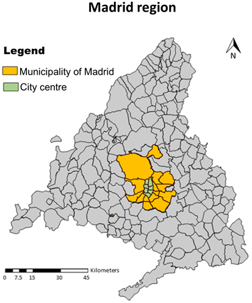

```{r xaringan-themer, include=FALSE, warning=FALSE}
#this themer package allows us to change the .css themes through this chunk. Easier than changing the .css directly.
library(xaringanthemer)
style_mono_accent(
  base_color = "#7A003C", #maroon
  link_color = "#5E6A71", #grey
  text_bold_color = "#FDBF57", #gold
  text_slide_number_color = "#FDBF57", #gold
  header_font_google = google_font("Josefin Sans"),
  text_font_google   = google_font("Montserrat", "300", "300i"),
  code_font_google   = google_font("Fira Mono")
)
```

```{r load-packages, include=FALSE, cache=FALSE}
library(dplyr)
library(sf)
library(ggplot2)
library(tidyverse)
library(units)
library(patchwork)
library(ggspatial)
library(ggforce)
library(geomtextpath)
library(knitr)
library(kableExtra)
options(scipen = 999)
```

```{r sp_avail-function,include=FALSE}
#defining the spatial availability function, this prints all the intermediates
sp_avail_detailed <- function(x, o_id, d_id, pop, opp, r, f, alpha = 1){
  
  o_id <- rlang::enquo(o_id)
  d_id <- rlang::enquo(d_id)
  pop <- rlang::enquo(pop)
  opp <- rlang::enquo(opp)
  r <- rlang::enquo(r)
  f <- rlang::enquo(f)
  
  sum_pop <- x %>%
    dplyr::distinct(!!o_id,
                    .keep_all = TRUE) %>%
    dplyr::mutate(sum_pop = !!r*(!!pop)^alpha) %>%
    dplyr::pull(sum_pop) %>%
    sum()
  
  f_p <- dplyr::pull(x, !!r) * dplyr::pull(x, !!pop)^alpha / sum_pop
  
  sum_impedance <- x %>%
    dplyr::group_by(!!d_id) %>%
    dplyr::summarize(sum_impedance = sum(!!f))
  
  x <- x %>%
    dplyr::left_join(sum_impedance,
                     by = rlang::as_name(d_id))
  
  f_c <- dplyr::pull(x, !!f) / x$sum_impedance
  
  x$f_c <- f_c
  x$f_p <- f_p
  
  sum_pa <- x %>%
    dplyr::group_by(!!d_id) %>%
    dplyr::summarize(sum_pa= sum(f_p * f_c))
  
  x <- x %>%
    dplyr::left_join(sum_pa,
                     by = rlang::as_name(d_id))
  f_t <- (f_p * f_c) / dplyr::pull(x, sum_pa)
  
  x %>%
    dplyr::mutate(V_ij = !!opp * !!f_t)
}
```

```{r synthetic-data, include=FALSE}
od_tt <- data.frame(i = c("A", "A", "A", "B", "B", "B", "C", "C", "C"), # Three origins
                    j = c("1", "2", "3", "1", "2", "3", "1", "2", "3"), # Three destinations
                    tt_z = c(15, 30, 100, 30, 15, 100, 100, 100, 15), # Travel time, z-mode (original)
                    tt_x = c(10, 25, 80, 25, 10, 80, 80, 80, 10), # Travel time, x-mode (the faster mode - like car)
                    pop = c(50000, 50000, 50000, 150000, 150000, 150000, 10000, 10000, 10000), # Population
                    opp = c(100000, 100000, 10000, 100000, 100000, 10000, 100000, 100000, 10000)) # Jobs

#write the dataframe long.
od_tt_m <- data.frame(i = c("A", "A", "A", "A", "A", "A",
                            "B", "B", "B", "B", "B", "B",
                            "C", "C", "C", "C", "C", "C"), # Three origins
                    j = c("1", "2", "3", "1", "2", "3", 
                          "1", "2", "3", "1", "2", "3", 
                          "1", "2", "3", "1", "2", "3"), # Three destinations
                    m = c("pt", "pt", "pt", "car", "car", "car",
                          "pt", "pt", "pt", "car", "car", "car",
                          "pt", "pt", "pt", "car", "car", "car"),
                    tt = c(15, 30, 100, 10, 25, 80, #travel time, z-mode (original) AND THEN x-mode (the faster mode)
                           30, 15, 100, 25,  10,  80,
                           100, 100, 15, 80, 80, 10), 
                    pop = c(20000, 20000, 20000, 30000, 30000, 30000,
                            50000, 50000,50000, 100000, 100000, 100000,
                            3000, 3000, 3000, 7000,7000, 7000),
                    opp = c(100000, 100000, 10000, 100000, 100000, 10000,
                            100000, 100000, 10000, 100000, 100000, 10000,
                            100000, 100000, 10000, 100000, 100000, 10000)) 
```

```{r data-figure-with-toy-example, include=FALSE}
od <- data.frame(id = c("A", "B", "C", "1", "2", "3"),
                 type = c("Population", "Population", "Population", "Jobs", "Jobs", "Jobs"),
                 size = c(50000, 150000, 10000, 100000, 100000, 10000),
                 x = c(2.5, 2.5, 6.5, 0.5, 0.5, 6.5),
                 y = c(8.0, 2.5, 4.5, 7.5, 2.5, 2.5))

centers <- data.frame(id = c("Urban center", "Suburb", "Satellite town"),
                 radius = rep(1.3, 3),
                 x = c(1.5, 1.5, 6.5),
                 y = c(2.5, 7.5, 3.5))

# od_lines coded as segments
od_lines <- data.frame(x = c(2.5, 2.5, 2.5, 2.5, 2.5, 2.5, 6.5, 6.5, 6.5),
                       y = c(8.0, 8.0, 8.0, 2.5, 2.5, 2.5, 4.5, 4.5, 4.5),
                       xend = c(0.5, 0.5, 6.5, 0.5, 0.5, 6.5, 0.5, 0.5, 6.5),
                       yend = c(7.5, 2.5, 2.5, 7.5, 2.5, 2.5, 7.5, 2.5, 2.5),
                       group = c("A", "A", "A", "B", "B", "B", "C", "C", "C"),
                       time = c("15 min (pt)\n10 min (car)", "30 min (pt)\n25 min (car)", "100 min (pt)\n80 min (car)",
                                "30 min (pt)\n25 min (car)", "15 min (pt)\n10 min (car)", "100 min (pt)\n80 min (car)",
                                "100 min (pt)\n80 min (car)", "100 min (pt)\n80 min (car)", "15 min (pt)\n10 min (car)"))

od_table <- data.frame(Center = c("A", "B", "C", "1", "2", "3"),
  Size = c("50,000 pop (40% pt)", "150,000 pop (33% pt)", "10,000 pop (30% pt)", 
           "100,000 jobs", "100,000 jobs", "10,000 jobs"))

od_table2 <- data.frame(Path = c("A to 1", "A to 2", "A to 3", 
                                "B to 1", "B to 2", "B to 3", 
                                "C to 1", "C to 2", "C to 3"),
  Value = c("15 min (pt)\n10 min (car)", "30 min (pt)\n25 min (car)", "100 min (pt)\n80 min (car)",
            "30 min (pt)\n25 min (car)", "15 min (pt)\n10 min (car)", "100 min (pt)\n80 min (car)",
            "100 min (pt)\n80 min (car)", "100 min (pt)\n80 min (car)", "15 min (pt)\n10 min (car)"))
```

```{r, create-figure-with-toy-example, echo=FALSE, eval=FALSE}
toy_example_plot <- ggplot() + 
  # Plot centers
  geom_circle(data = centers,
             aes(x0 = x, 
                 y0 = y,
                 r = radius),
             color = "grey40") +
  annotate(geom = "label", 
           x=c(0.5, 0.6, 7),
           y=c(9, 1, 5.2), 
           label = c("Suburban", "Urban", "Satellite"), 
           size=4, 
           label.size=NA) +
  # Connect origins and destinations with curves
  geom_curve(data = od_lines,
               aes(x = x,
                   y = y,
                   xend = xend,
                   yend = yend,
                   linetype = group,
                   group = group),
             curvature = 0.20,
             linewidth = 1,
             color = "black") +
  # Text on curves
  geom_textcurve(data = od_lines,
               aes(x = x,
                   y = y,
                   xend = xend,
                   yend = yend,
                   linetype = group,
                   group = group,
                   label = time),
               size = 3.5,
             curvature = 0.20,
             color = "black") +
  # Plot origins and destinations
  geom_point(data = od,
            aes(size = size,
                x = x, 
                y = y, 
                color = type,
                shape = type)) +
  scale_size(range = c(4, 10)) +
  # Label origins and destinations
  geom_text(data = od, 
            aes(x, 
                y, 
                label=id), 
            size=4) +
  # Create table
  annotate(geom = "table",
           x = 9, 
           y = 9, 
           label = list(od_table),
           fill = "white",
           size=3) +
  # Theme the plot
  coord_fixed() + 
  theme_void() + guides(shape = "none", size = "none", color = "none", linetype ="none") 

toy_example_plot
ggsave("Presentation-images/toy-example.png",dpi=600)
```
class: center, middle
## Overview of multi-modal accessibility measures

##### Hansen-type accessibility _(Hansen, 1959)_
_No competition_ and _unconstrained_: $S_i^m = \sum_j O_j f^m(c_{ij}^m)$

--

##### Shen-type accessibility _(Shen, 1998)_ and _(Luo and Wang, 2003)_
**Competitive** and _unconstrained_: $a_i^m = \sum_j \frac{O_jf^m(c_{ij}^m)}{\sum_m D_j^m}$

--

##### Spatial availability _(Soukhov et al., 2023)_
**Competitive** and **constrained**: $V_i^m = \sum_j O_j F^{t,m}_{ij}$

???
<!-- for the title slide --> 
In this presentation I will speak on how current accessibility measures _miss_ considering competition
**1.** Limitations of current accessibility measures
**2.** Explaining **spatial availability** with a multi-modal extension
**3.** Policy scenario planning applications - equity

<!-- for this slide-->

Accessibility: a way to quantify the access that a spatial unit has, a product of land-use and the population's means of transportation. It measures the amount of _potential interaction_ a population has with opportunities _(Hansen, 1959)_

What do all these types of measures have in common? How they are a weighted sum of opportunities that can be interacted with. What differs between them is how they weight the opportunities.

---
class: center
### Simulated example: uncompetitive and unconstrained

```{r, toy-example0, out.width='80%', echo=FALSE}
knitr::include_graphics("Presentation-images/toy-example.png")
```

---
count: false

### Simulated example: uncompetitive and unconstrained

.pull-left[

```{r, toy-example1, out.width='120%', echo=FALSE}
knitr::include_graphics("Presentation-images/toy-example.png")
```

]

--

.pull-right[

##### Hansen-type accessibility
$S_i^m = \sum_jO_jf^m(c_{ij}^m)$ 

Impedance function: $f(c_{ij})^{\text{car}} = f(c_{ij})^{\text{pt}} =exp(-0.1 \cdot c_{ij}^m)$; 

```{r, echo=FALSE, message=FALSE}
#set b and calculate impedance
b_x <- 0.1 #the faster mode, car
b_z <- 0.1 #the original slower mode, transit

od_tt_m <- od_tt_m |>
  mutate(f = case_when(m=="car" ~ exp(-b_x * tt),
                       m=="pt" ~ exp(-b_z * tt)))

S <- od_tt_m |>
  group_by(i,m) |>
  summarize(S = sum(opp * f),
            .groups = "drop")

add_data <- data.frame(i = "TOTAL", m = "" , S = S$S%>%sum())
S <- bind_rows(S, add_data)


S %>% kable(format = "html",
        booktabs = TRUE,
        digits = 1)
```
]


???
- NOTE: the sum of all that is what it means to be unconstrained. Also, A and B are equal, that is what it means to be uncompetitive. 


- explain the map; blue and orange dots are origins and employment centers respectively. Travel time within each center is 15 mins, travel time between sub and urban is 30 mins and travel time to the satellite town from sub / urban is 100 mins.

- then explain the accessibility formula; the impedance function is a negative exponential (Wilson 1971), beta 0.1, like in the example. Same for both modes.

- Accessibility can be interpreted as a score, such as, population center at A and B has the same _potential_ access to 27,292 jobs using transit and 44,999.80 jobs using car. It is difficult to understand the meaning of the value other than A and B have a higher score than C. 

- We know that the size of population matters. They are different in both A and B -- the population that uses transit is also different in both centers -- how does these two levels of differing demand size impact accessibility to opportunities? We can't use hansen-type measure without further processing.
---

### Simulated example: competitive and unconstrained

.pull-left[
```{r, out.width='120%',echo=FALSE}
knitr::include_graphics("Presentation-images/toy-example.png")
```
]

--

.pull-right[

##### Shen-type accessibility
$a_i^m = \sum_j \frac{O_j f^m(c_{ij}^m)}{\sum_m \sum_i P_{i}^m f^m(c_{ij}^m)^m}$

```{r, echo=FALSE}
#set b and calculate impedance
LOS_j <- od_tt_m |>
  group_by(j,m) |>
  summarize(opp = mean(opp),
            D_j = sum(pop * f),
            .groups = "drop") |>
  group_by(j) |>
  summarize(LOS_j = first(opp)/sum(D_j),
            opp = mean(opp),
            D_j = mean(D_j))

a_m <- od_tt_m %>%
  left_join(LOS_j |> 
              dplyr::select(j, LOS_j, opp, D_j),
            by = c("j")) %>%
  group_by(i,m) |>
  summarize(a_i_m = sum(LOS_j * f),
            pop = mean(pop),
            .groups = "drop") |>
  rename("a" = "a_i_m")

```
```{r, echo=FALSE, message=FALSE}
knitr::kable(a_m %>% dplyr::select(-c("pop")),
             format = "html",
             booktabs = TRUE,
             digits = 2)
```
]

???
-  ## NOTE: this is competitive for S. you have high access with less demand, A and B are different. It is still unconstrained when you try to retrieve the number of opportunities -- it is the totla population and not the job-seeking population 
---
count: false
### Simulated example: competitive and unconstrained

.pull-left[
```{r, out.width='120%',echo=FALSE}
knitr::include_graphics("Presentation-images/toy-example.png")
```

]

--

.pull-right[

##### Shen-type accessibility
$a_i = \sum_m \biggl(\frac{P_i^m}{P_i}\biggr) a_i^m$
```{r, echo=FALSE, message=FALSE}
a <- a_m %>%
  group_by(i) |>
  summarize(a = sum(pop*a)/sum(pop),
            .groups = "drop") 

knitr::kable(a,
             format = "html",
             booktabs = TRUE,
             digits = 2)

# weighted average-- is based just on the population overall not the opportunity-skeeing populationg (i.e., not weighted by travel behaviour impedance function)
```

]

???

Now let's look at Shen's accessibility, same impedance function.

First and foremost, we see that Shen's accessibility can still be interpreted as as score, like Hansen-style accessibility. But it can also be interpreted as travel-cost adjusted jobs per travel-cost adjusted capita (potential supply over potential demand) per mode. 

It also accounts for competition between modes by weighted-sum of mode-specific population over the total population at that origin $i$. 

---
### Spatial availability: competitive _and_ constrained

.pull-left[

- Spatial availability considering multi-modes:

$V^m_{i} = \sum_{j}^J O_j\ F^{t,m}_{ij}$

- The **proportional allocation factor** combines two aspects of the problem, population and cost:

$F^{t,m}_{ij} = \frac{F^{pm}_{i} \cdot F^{cm}_{ij}}{\sum_{m} \sum_{i} F^{pm}_{i} \cdot F^{cm}_{ij}}$

- Where $F^{p,m}_{i}$ is **population allocation** factor:

$F^{p,m}_{i} = \frac{P^m_{i}}{\sum_{m}\sum_{i} P^m_{i}}$

- And the $F^{c,m}_{ij}$ is a **cost allocation** factor:

$F^{c,m}_{ij} = \frac{f^m(c_{ij}^m)}{\sum_{m} \sum_{i} f^m(c_{ij}^m)}$
]

--

.pull-right[

##### Proportional allocation mechanism

- $V^m_{i}$ is always singly-constrained: $\sum_{i} V_{i} = \sum_{m}\sum_{i} V_{i}^m = \sum_{j} O_j$

- So, one can calculate spatial availability....
  - **per $i$**: ( $V_{i} = \sum_{m} V^m_{i}$ )
  - **per mode**: ( $v^{m} = \sum_{m} \sum_{i} V^m_{i}$ )
  - **per capita in $i$**: ( $v_{i} = \sum_{m} \frac{V_i^m}{P_{i^m}}$ )
  - Etc. etc.,

]

???
- So let me introduce spatial availability, it consists of proportional allocation factors and the opportunities. the population allocation factor is the allocation of opportunities, proportional to the population size. It is always a proportion between 0 to 1. 

- The cost factor allocates opportunities proportionally based on the impedance function. The impedance function can be anything - gravity-based like Hansen, cumulative, etc. It is also always a proportion between 0 to 1. 

- You multiple both factors together and by opportunities --> the number of opportunities are preserved! This is why you can just add up all the spatial availabilies per mode. It all sums up.

-supply of population and demand for opportunities are both travel-cost and population adjusted

- why singly-constrained? the sum of all accessibility values for i equals all the opportunities for i to j (like in a singly constrained gravity model - it is attraction constrained)

- Can calculate spatial availability per $i$, or per capita in $i$, or per $m$. Per subset of population -- anything! This is also something that you couldn't just do with the Shen-type measure because it is unconstrained. 

---
### Simulated example: competitive _and_ constrained

.pull-left[

```{r, out.width='120%',echo=FALSE}
knitr::include_graphics("Presentation-images/toy-example.png")
```
]

--

.pull-right[

##### Spatial availability
$V^m_{i} = \sum_{j} O_j\ F^{t,m}_{ij}$

```{r, echo=FALSE, message=FALSE}
od_tt_m <- od_tt_m %>%
  mutate(catch = 1) %>%
  sp_avail_detailed(o_id = i, #spatial availability
                    d_id = j, 
                    pop = pop,
                    opp = opp,
                    r = catch,
                    f = f, 
                    alpha = 1)

V_m <- od_tt_m %>%
  group_by(i,m) %>%
  summarize(V = sum(V_ij),
            v = V/first(pop))

add_data <- data.frame(i = "TOTAL", m = "", V = V_m$V%>%sum(), v = NA)
V_m <- bind_rows(V_m, add_data)

```
```{r, echo=FALSE, message=FALSE}
knitr::kable(V_m %>% dplyr::select(-v),
             format = "html",
             booktabs = TRUE,
             digits = 2)
```

]

???

- And finally, if you divide spatial availability by the population, it can be simply normalized to be opportunities available per capita. This is equivalent to Shen-style accessibility. Both competitive and singly-constrained 


---
count: false
### Simulated example: competitive _and_ constrained

.pull-left[
```{r,out.width='120%', echo=FALSE}
knitr::include_graphics("Presentation-images/toy-example.png")
```
]

--

.pull-right[

##### Spatial availability
$V_{i} = \sum_{m} V^m_{i}$

```{r, echo=FALSE, message=FALSE}
V <- od_tt_m %>%
  group_by(i) %>%
  summarize(V = sum(V_ij))

V <- V %>% left_join(a, by=c("i")) |> rename("v" = "a") |> transmute(i, V, v) 

add_data <- data.frame(i = "TOTAL", V = V$V%>%sum(), v = NA)
V <- bind_rows(V, add_data)
```

```{r, echo=FALSE, message=FALSE}
knitr::kable(V %>% dplyr::select(-v),
             format = "html",
             digits = 2)
```

$V^m = \sum_iV_i^m$

```{r, echo=FALSE, message=FALSE}
V_m <- od_tt_m %>%
  group_by(m) %>%
  summarize(V = sum(V_ij)) |> 
  transmute(m, V, 
            v = c((30+100+7)/(50+150+10), (20+50+3)/(50+150+10)))

add_data <- data.frame(m = "TOTAL", V = V_m$V%>%sum())
V_m <- bind_rows(V_m, add_data)

knitr::kable(V_m,
             format = "html",
             booktabs = TRUE,
             digits = 2) 
```

]


???
XXX

---
### Madrid's low emission zones - a policy of modal discrimination

.pull-left[
```{r, echo=FALSE, out.width='80%', fig.align='center'}

```
]

.pull-right[
```{r, echo=FALSE, out.width='50%', fig.align='center'}
knitr::include_graphics("Presentation-images/city-centre.png")
```
- November 2018 - LEZ Centro
- 2023 - LEZ within M-30
- 2024 - LEZ within Madrid Municipality 
]

???
A NEEED for multi-modal analysis methods that are interpretive and comparative -- proportional allocation achieves that!
---
class: center
### Multi-modal home-to-work accessibility in Madrid: 2018 travel survey
```{r, echo=FALSE, out.width='70%',fig.align='center'}
knitr::include_graphics("Presentation-images/Hansen_im_V_zn208_plot.png")
```
Uncompetitive and unconstrained accessibility $S_i^m$ at resolution Zona 208

???
1) totals don't add up - not constrained
2) uncompetive between modes

---
class: center
### Multi-modal home-to-work accessibility in Madrid: 2018 travel survey
```{r, echo=FALSE, out.width='70%',fig.align='center'}
knitr::include_graphics("Presentation-images/SA_im_V_zn208_plot.png")
```
Spatial Availability $V_i^m$ at resolution Zona 208

???
- SA is better for transit/walk for centro. Car mode is limited in the centro. 
- those who live in the periphery have high accessibility, those are the ones who have cars and use transit. 

---
class: center
### Multi-modal home-to-work accessibility in Madrid: 2018 travel survey
```{r, echo=FALSE, out.width='70%', fig.align='center'}
knitr::include_graphics("Presentation-images/SA_i_V_zn208_plot.png")
```
Spatial Availability $V_i$ at resolution Zona 208

???
- center -- high competition, for all modes and those that travel from close/far of the city.

---
class: middle
### Spatial availability: planning multi-modal transportation policy

- Scenario evaluation: accessibility when...
  - LEZ boundaries change
  - Vehicle characteristic restrictions change
  - Travel behaviour changes
  
- Questions of equity: which neighbourhoods, what people, what modes?
  - GHG emission reductions
  - Advantages to non-car users
  - Who is impacted disproportionally


???
- policy scenario creation

- Quantitatively, this method can be used to more interpetble answer these questions of equity. Socio-economic impact, GHG emissions, across sub-sets of population (multi-modal users included).

<!-- - MUAP exists, seen in Madrid transport data, the need for simulated calculation and consistent aggregation of accessibility (through proportional allocation) -->

---
class: center, middle, inverse

## Acknowledgments

```{r, echo=FALSE, out.width="20%"}
knitr::include_graphics("Presentation-images/MJ_logo.png")
```

```{r, echo=FALSE, out.width="30%"}
knitr::include_graphics("Presentation-images/mcm-sci-sees_left-col.png")
```

### Any questions? Remarks?

#### Anastasia Soukhov, **soukhoa@mcmaster.ca** 

#### Spatial availability paper:
```{r, echo=FALSE, out.width="10%"}

```

---
class: center, middle, inverse

#Extra slides

---
---
## Multi-modal accessibility measures

.pull-left[

#### No competition and unconstrained
##### Hansen-type accessibility

$$S_i^m = \sum_{j}O_jf^m(c_{ij}^m)$$
-   $m$ is a set of modes
-   $i$ is a set of origin locations
-   $j$ is a set of destination locations
-   $O_j$ is the number of opportunities at location $j$
-   $f(\cdot)$ is an impedance function of $c_{ij}$ for each mode $m$ (a function of cost of moving between $i$ and $j$ for each mode $m$)

]

--
.pull-right[

**E.g.** used in _(Tahmasbi et al., 2019)_.

**Unconstrained** - suffers from the same interpretability issues _(Handy and Niemeier, 1997; Miller et al., 2018)_.

Does not include **competition** - no mass effect consideration _(Shen, 1998; Merlin and Hu, 2018)_.

]

???
1. Accessibility: a sum of opportunities.

2. E.g., it is used in Tahmasbi et al., 2019 to calculate accessibility per spatial unit per mode -- and compared across modes. Other literature has varied how the measure has been aggregated. 

It is unconstrained -- interpretability issues. The impedance function weights the opportunities, but what is a 'travel-cost adjusted potential opportunity' anyways? This difficulty in interpretation is a result of no global 'maximum' accessibility. difficult to make comparisons.

It is not competitive -- it does not consider demand for the opportunities in how the opportunities are summed. This does not include the 'mass effect' 

---
## Multi-modal accessibility measures

.pull-left[
#### Competition and unconstrained
##### Shen-type accessibility

Popularized as the **two-step floating catchment area (2SFCA) method** by _(Luo and Wang, 2003)_ (introduced by _Shen 1998_)

$$a_i^m = \sum_j \frac{O_jf(c_{ij})^m}{\sum_m D_j^m}$$

with:
$$D_j^m = \sum_i P_{i}^m f(c_{ij})^m$$
- $a_{i}^m$ is Shen-type accessibility for each mode $m$
- $D_j^m$ is the demand at $j$ from $P_{i}$ using each mode $m$

]

.pull-right[

Generalized multi-model competition:
$$a_i = \sum_m \biggl(\frac{P_i^m}{P_i}\biggr) \sum_j \frac{O_jf(c_{ij})^m}{\sum_m \sum_i P_{i}^m f(c_{ij})^m}$$

**E.g.**, used in _Tao et al., 2020_.

Though **competitive**, it is still **unconstrained** making interpretation difficult _(Soukhov et al., 2023)_

]

???
**Shen**-type accessibility - the sum of travel-cost adjusted opportunities (supply) divided by travel-cost adjusted demand! It considers travel-cost from both the opportunities perspective and the population side. It can be seen as an access score of the supply to demand.
 
To calculate the generalized version, access is calculated for each mode and then multiplied by the population weighted average.

It is used by some literature, such as _Tao et al. 2020_ and is competitive as it does consider demand. However it is still not constrained. The totals do not sum up to anything. The numerator and denominator's definitions are confusing (trust me). And now in the multi-modal case, the score is multiplied by the pop weighted average -- further difficult to understand.


---
### Proof: Spatial availability cancels out into Shen-style accessibility

Population allocation factor:
$F^p_{ij} = \frac{P_{i\in r}^\alpha}{\sum_{i}^K P_{i\in r}^\alpha}$

$F^p_{A} = \frac{P_{A}^\alpha}{P_{A}^\alpha + P_{B}^\alpha + P_{C}^\alpha}$

Cost allocation factor:
$F^c_{ij} = \frac{f(c_{ij})}{\sum_{i=A}^K f(c_{ij})}$

$F^c_{A1} = \frac{f(c_{A1})}{f(c_{A1})+f(c_{B1})+f(c_{C1})}$
$F^c_{B1} = \frac{f(c_{A2})}{f(c_{A2})+f(c_{B2})+f(c_{C2})}$
$F^c_{C1} = \frac{f(c_{A3})}{f(c_{A3})+f(c_{B3})+f(c_{C3})}$

Now let's put it together with P, and see how the denominators end up cancelling out:
$v_{i} = \sum_{j}\frac{O_j}{P_{i\in r}^\alpha}\frac{\frac{P_{i\in r}^\alpha}{\sum_{i}^K P_{i\in r}^\alpha} \cdot \frac{f(c_{ij})}{\sum_{i}^K f(c_{ij})}}{\sum_{i}^K \frac{P_{i\in r}^\alpha}{\sum_{i}^K P_{i\in r}^\alpha} \cdot \frac{f(c_{ij})}{\sum_{i}^K f(c_{ij})}}$

???

- we presented this formula to a few accessibility academics and because the way we explained it - from the perspective of proportional allocation - made it appear to be different than shen's. It was a surprise to see the denominators cancel out to equal shen's! 

---

$v_{A} = \frac{O_1}{P_{A}^\alpha}(\frac{\frac{P_{A}^\alpha}{P_{A}^\alpha+P_{B}^\alpha+P_{C}^\alpha} \cdot \frac{f(c_{A1})}{f(c_{A1})+f(c_{B1})+f(c_{C1})}}{\frac{P_{A}^\alpha}{P_{A}^\alpha+P_{B}^\alpha+P_{C}^\alpha} \cdot \frac{f(c_{A1})}{f(c_{A1})+f(c_{B1})+f(c_{C1})} + \frac{P_{A}^\alpha}{P_{A}^\alpha+P_{B}^\alpha+P_{C}^\alpha} \cdot \frac{f(c_{B1})}{f(c_{A1})+f(c_{B1})+f(c_{C1})}+ \frac{P_{A}^\alpha}{P_{A}^\alpha+P_{B}^\alpha+P_{C}^\alpha} \cdot \frac{f(c_{C1})}{f(c_{A1})+f(c_{B1})+f(c_{C1})}}) +$

$\frac{O_2}{P_{A}^\alpha}(\frac{\frac{P_{A}^\alpha}{P_{A}^\alpha+P_{B}^\alpha+P_{C}^\alpha} \cdot \frac{f(c_{A2})}{f(c_{A2})+f(c_{B2})+f(c_{C2})}}{\frac{P_{A}^\alpha}{P_{A}^\alpha+P_{B}^\alpha+P_{C}^\alpha} \cdot \frac{f(c_{A2})}{f(c_{A2})+f(c_{B2})+f(c_{C2})} + \frac{P_{A}^\alpha}{P_{A}^\alpha+P_{B}^\alpha+P_{C}^\alpha} \cdot \frac{f(c_{B2})}{f(c_{A2})+f(c_{B2})+f(c_{C2})}+\frac{P_{A}^\alpha}{P_{A}^\alpha+P_{B}^\alpha+P_{C}^\alpha} \cdot \frac{f(c_{C2})}{f(c_{A2})+f(c_{B2})+f(c_{C2})}} )+$

$\frac{O_3}{P_{A}^\alpha}(\frac{\frac{P_{A}^\alpha}{P_{A}^\alpha+P_{B}^\alpha+P_{C}^\alpha} \cdot \frac{f(c_{A3})}{f(c_{A3})+f(c_{B3})+f(c_{C3})}}{\frac{P_{A}^\alpha}{P_{A}^\alpha+P_{B}^\alpha+P_{C}^\alpha} \cdot \frac{f(c_{A3})}{f(c_{A3})+f(c_{B3})+f(c_{C3})} + \frac{P_{A}^\alpha}{P_{A}^\alpha+P_{B}^\alpha+P_{C}^\alpha} \cdot \frac{f(c_{B3})}{f(c_{A3})+f(c_{B3})+f(c_{C3})}+\frac{P_{A}^\alpha}{P_{A}^\alpha+P_{B}^\alpha+P_{C}^\alpha} \cdot \frac{f(c_{C3})}{f(c_{A3})+f(c_{B3})+f(c_{C3})}} )$

First, notice how the denominator on the denominator is the same across the summation? Let's simplify it:

$v_{A} = \frac{O_1}{P_{A}^\alpha}(\frac{\frac{P_{A}^\alpha}{P_{A}^\alpha+P_{B}^\alpha+P_{C}^\alpha} \cdot \frac{f(c_{A1})}{f(c_{A1})+f(c_{B1})+f(c_{C1})}}{\frac{P_{A}^\alpha \cdot f(c_{A1}) + P_{A}^\alpha \cdot f(c_{B1}) + P_{A}^\alpha \cdot f(c_{C1})}{(P_{A}^\alpha+P_{B}^\alpha+P_{C}^\alpha) \cdot (f(c_{A1})+f(c_{B1})+f(c_{C1}))}}) +$
$\frac{O_2}{P_{A}^\alpha}(\frac{\frac{P_{A}^\alpha}{P_{A}^\alpha+P_{B}^\alpha+P_{C}^\alpha} \cdot \frac{f(c_{A2})}{f(c_{A2})+f(c_{B2})+f(c_{C2})}}{\frac{P_{A}^\alpha \cdot f(c_{A2}) + P_{A}^\alpha \cdot f(c_{B2}) + P_{A}^\alpha \cdot f(c_{C2})}{(P_{A}^\alpha+P_{B}^\alpha+P_{C}^\alpha) \cdot (f(c_{A2})+f(c_{B2})+f(c_{C2}))}}) +$
$\frac{O_3}{P_{A}^\alpha}(\frac{\frac{P_{A}^\alpha}{P_{A}^\alpha+P_{B}^\alpha+P_{C}^\alpha} \cdot \frac{f(c_{A3})}{f(c_{A3})+f(c_{B3})+f(c_{C3})}}{\frac{P_{A}^\alpha \cdot f(c_{A3}) + P_{A}^\alpha \cdot f(c_{B3}) + P_{A}^\alpha \cdot f(c_{C3})}{(P_{A}^\alpha+P_{B}^\alpha+P_{C}^\alpha) \cdot (f(c_{A3})+f(c_{B3})+f(c_{C3}))}} )$

See how the denominator of the denominator is the same as the denominator of the numerator's denominator for each J (J=1, J=2, and J=3)? Let's cancel those out and simplify:

$v_{A} = \frac{O_1}{P_{A}^\alpha}(\frac{P_{A}^\alpha \cdot f(c_{A1})}{P_{A}^\alpha \cdot f(c_{A1}) + P_{A}^\alpha \cdot f(c_{B1}) + P_{A}^\alpha \cdot f(c_{C1})} +$
$\frac{O_2}{P_{A}^\alpha}\frac{P_{A}^\alpha \cdot f(c_{A2})}{P_{A}^\alpha \cdot f(c_{A2}) + P_{A}^\alpha \cdot f(c_{B2}) + P_{A}^\alpha \cdot f(c_{C2})} +$
$\frac{O_3}{P_{A}^\alpha}\frac{P_{A}^\alpha \cdot f(c_{A3})}{P_{A}^\alpha \cdot f(c_{A3}) + P_{A}^\alpha \cdot f(c_{B3}) + P_{A}^\alpha \cdot f(c_{C3})} )$

---

Next, see how we can cancel out the $P_{A}^\alpha$? Let's do that.

$v_{A} = O_1(\frac{f(c_{A1})}{P_{A}^\alpha \cdot f(c_{A1}) + P_{B}^\alpha \cdot f(c_{B1}) + P_{C}^\alpha \cdot f(c_{C1})} + O_2\frac{f(c_{A2})}{P_{A}^\alpha \cdot f(c_{A2}) + P_{B}^\alpha \cdot f(c_{B2}) + P_{C}^\alpha \cdot f(c_{C2})} + O_3\frac{f(c_{A3})}{P_{A}^\alpha \cdot f(c_{A3}) + P_{B}^\alpha \cdot f(c_{B3}) + P_{C}^\alpha \cdot f(c_{C3})} )$


```{r, eval=FALSE, include=FALSE}
#Let's check to see if it manually adds up to what shen's is
b<-0
r1 <- 100000*exp(-b*15)/(50000*exp(-b*15) + 150000*exp(-b*30) + 10000*exp(-b*100))
r2 <-100000*exp(-b*30)/(50000*exp(-b*30) + 150000*exp(-b*15) + 10000*exp(-b*100))
r3 <- 10000*exp(-b*100)/(50000*exp(-b*100) + 150000*exp(-b*100) + 10000*exp(-b*15))
r1+r2+r3

#this is shen's, the same!!!
j1<-(100000*exp(-0.1*15))/(50000 * exp(-b * 15) + 150000 * exp(-b * 30) + 10000 * exp(-b * 100))
j2<-(100000*exp(-0.1*30))/(50000 * exp(-b * 30) + 150000 * exp(-b * 15) + 10000 * exp(-b * 100))
j3<-(10000*exp(-0.1*100))/(50000 * exp(-b * 100) + 150000 * exp(-b * 100) + 10000 * exp(-b * 15))
j1 + j2 + j3
```
```{r, eval=FALSE, include=FALSE}
(exp(-b*15)/((50000*exp(-b*15)) + (50000*exp(-b*30)) + (50000*exp(-b*100)))+ exp(-b*30)/((50000*exp(-b*15)) + (50000*exp(-b*30)) + (50000*exp(-b*100)))+ exp(-b*100)/((50000*exp(-b*15)) + (50000*exp(-b*30)) + (50000*exp(-b*100))))*100000
```

Shen's accessibility:

$S_i = \sum_j \frac{O_jf(c_{ij})}{\sum_kP_kf(c_{jk})}$

---
