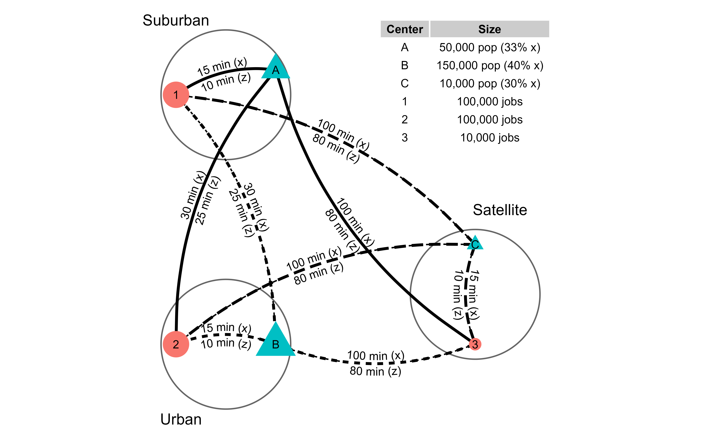
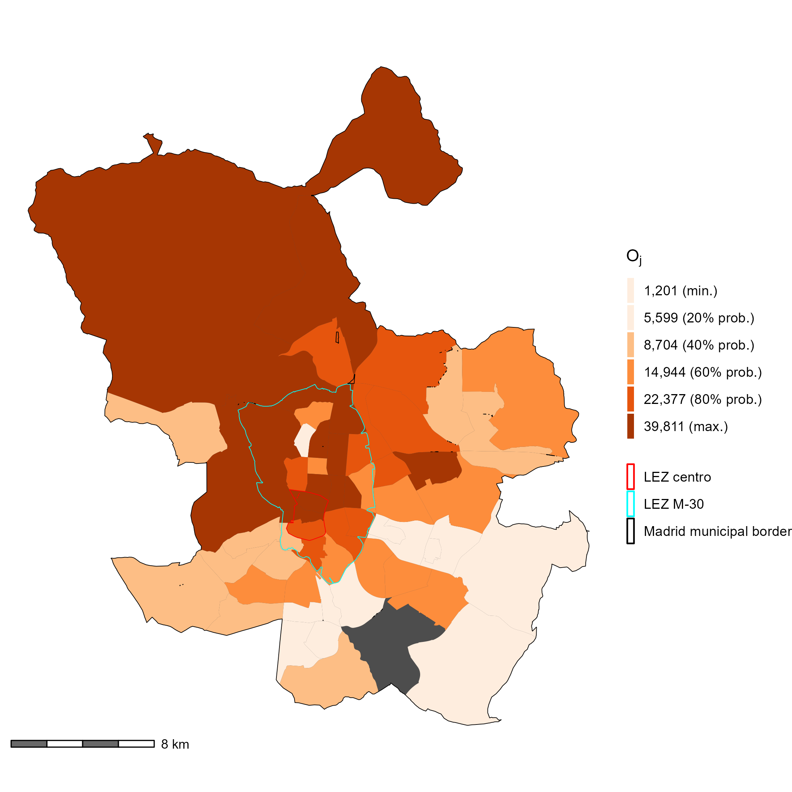
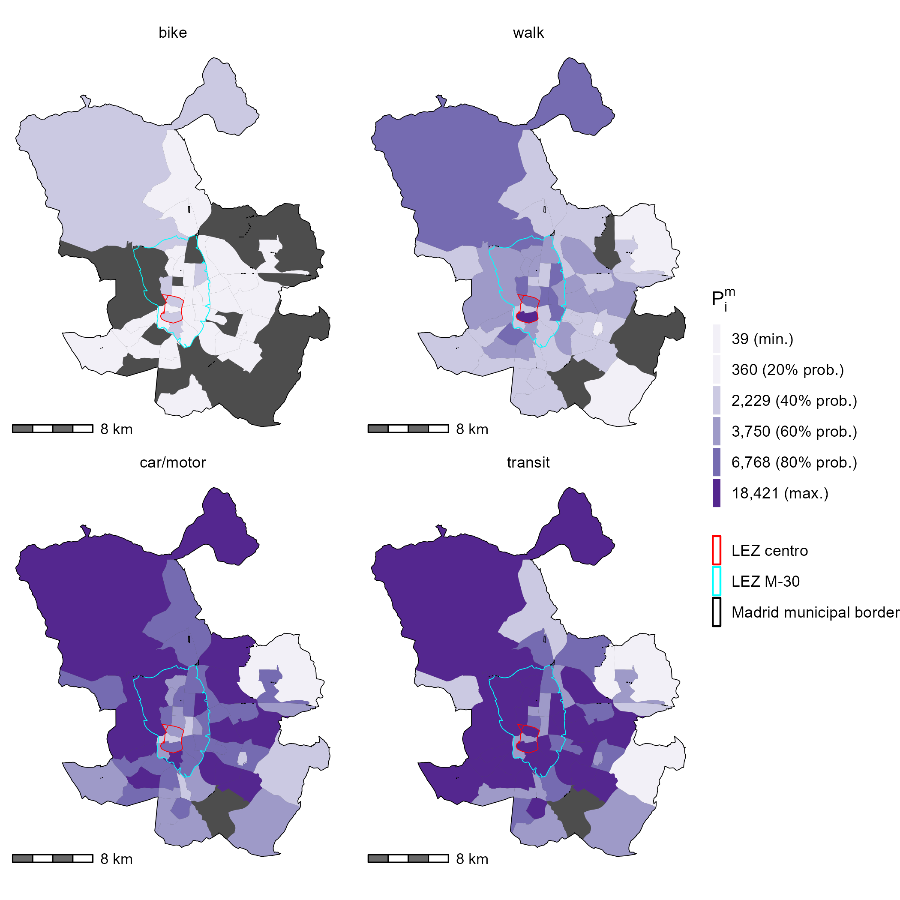
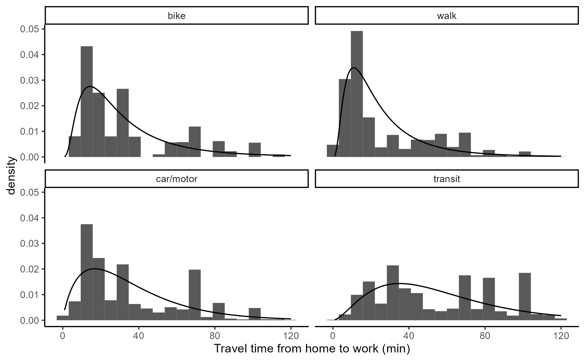
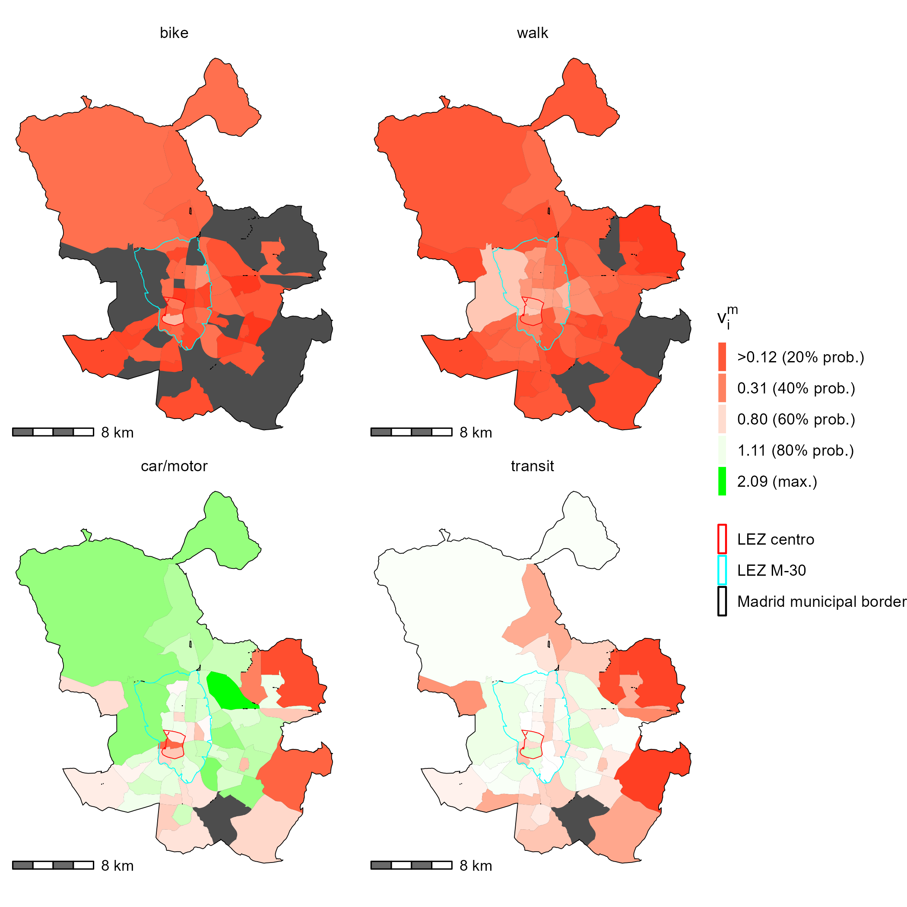
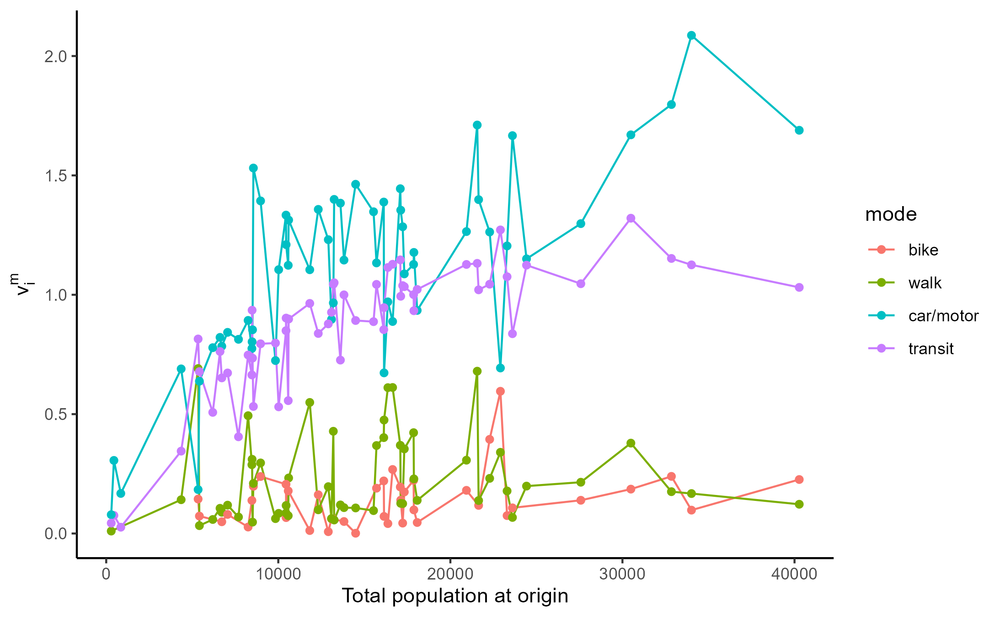

```{r knitr-setup, include=FALSE}
knitr::opts_chunk$set(
  echo = FALSE,
  cache = TRUE,
  warning = FALSE,
  message = FALSE,
  comment = '', 
  out.width = "1\\linewidth")

options(scipen=999) #eliminate scientific notation in print outs.
```

```{r load-packages, include=FALSE, cache=FALSE}
# library(fitdistrplus) # Help to Fit of a Parametric Distribution to Non-Censored or Censored Data
# library(gridExtra) # Miscellaneous Functions for "Grid" Graphics 
# library(kableExtra) # Construct Complex Table with 'kable' and Pipe Syntax

# library(shadowtext) # Shadow Text Grob and Layer
# library(skimr) # Compact and Flexible Summaries of Data
# library(spdep) # Spatial Dependence: Weighting Schemes, Statistics
# library(tidyr) # Tidy Messy Data
# options(scipen = 999)

library(patchwork) # The Composer of Plots
library(sf) # Simple Features for R
library(dplyr) # A Grammar of Data Manipulation
library(ggplot2) # Create Elegant Data Visualisations Using the Grammar of Graphics
library(ggforce) # Accelerating 'ggplot2'
library(geomtextpath) # Curved Text in 'ggplot2'
library(ggpmisc) # Miscellaneous Extensions to 'ggplot2'
library(ggrepel) # Automatically Position Non-Overlapping Text Labels with 'ggplot2'
library(ggspatial) # Spatial Data Framework for ggplot2
library(flextable) # Functions for Tabular Reporting
library(scales) # Scale Functions for Visualization
library(TAM)
library(officer)
library(ggnewscale)
```

```{r sp_avail-function,include=FALSE}
#defining the spatial availability function
sp_avail <- function(x, o_id, d_id, pop, opp, r, f, alpha = 1){

  o_id <- rlang::enquo(o_id)
  d_id <- rlang::enquo(d_id)
  pop <- rlang::enquo(pop)
  opp <- rlang::enquo(opp)
  r <- rlang::enquo(r)
  f <- rlang::enquo(f)

  # Sum of population in system
  sum_pop <- x %>%
    dplyr::distinct(!!o_id,
                    .keep_all = TRUE) %>%
    dplyr::mutate(sum_pop = !!r*(!!pop)^alpha) %>%
    dplyr::pull(sum_pop) %>%
    sum()

  # Balancing factor size
  f_p <- dplyr::pull(x, !!r) * dplyr::pull(x, !!pop)^alpha / sum_pop

  # Sum of impedance
  sum_impedance <- x %>%
    dplyr::group_by(!!d_id) %>%
    dplyr::summarize(sum_impedance = sum(!!f))

  # Join sum of impedance to table
  x <- x %>%
    dplyr::left_join(sum_impedance,
                     by = rlang::as_name(d_id))
  
  # Balancing factor impedance
  f_c <- dplyr::pull(x, !!f) / x$sum_impedance

  # Add balancing factors to table
  x$f_c <- f_c
  x$f_p <- f_p
  
  # Sum of balancing factors for mass and impedance
  sum_pa <- x %>%
    dplyr::group_by(!!d_id) %>%
    dplyr::summarize(sum_pa= sum(f_p * f_c))

  x <- x %>%
    dplyr::left_join(sum_pa,
                     by = rlang::as_name(d_id))
  
  # Joint balancing factor
  f_t <- (f_p * f_c) / dplyr::pull(x, sum_pa)

  dplyr::pull(x, !!opp) * f_t
}

#detailed
sp_avail_detailed <- function(x, o_id, d_id, pop, opp, r, f, alpha = 1){
  
  o_id <- rlang::enquo(o_id)
  d_id <- rlang::enquo(d_id)
  pop <- rlang::enquo(pop)
  opp <- rlang::enquo(opp)
  r <- rlang::enquo(r)
  f <- rlang::enquo(f)
  
  sum_pop <- x %>%
    dplyr::distinct(!!o_id,
                    .keep_all = TRUE) %>%
    dplyr::mutate(sum_pop = !!r*(!!pop)^alpha) %>%
    dplyr::pull(sum_pop) %>%
    sum()
  
  f_p <- dplyr::pull(x, !!r) * dplyr::pull(x, !!pop)^alpha / sum_pop
  
  sum_impedance <- x %>%
    dplyr::group_by(!!d_id) %>%
    dplyr::summarize(sum_impedance = sum(!!f))
  
  x <- x %>%
    dplyr::left_join(sum_impedance,
                     by = rlang::as_name(d_id))
  
  f_c <- dplyr::pull(x, !!f) / x$sum_impedance
  
  x$f_c <- f_c
  x$f_p <- f_p
  
  sum_pa <- x %>%
    dplyr::group_by(!!d_id) %>%
    dplyr::summarize(sum_pa= sum(f_p * f_c))
  
  x <- x %>%
    dplyr::left_join(sum_pa,
                     by = rlang::as_name(d_id))
  x$f_t <- (f_p * f_c) / dplyr::pull(x, sum_pa)
  
  x %>%
    dplyr::mutate(V_ij = !!opp * f_t)
}
```

```{r synthetic-data, include=FALSE}
od_tt <- data.frame(i = c("A", "A", "A", "B", "B", "B", "C", "C", "C"), # Three origins
                    j = c("1", "2", "3", "1", "2", "3", "1", "2", "3"), # Three destinations
                    tt_x = c(15, 30, 100, 30, 15, 100, 100, 100, 15), # Travel time, x-mode(original) 
                    tt_z = c(10, 25, 80, 25, 10, 80, 80, 80, 10), # Travel time, z-mode  (the faster mode - like car)
                    pop = c(50000, 50000, 50000, 150000, 150000, 150000, 10000, 10000, 10000), # Population
                    opp = c(100000, 100000, 10000, 100000, 100000, 10000, 100000, 100000, 10000)) # Jobs

#write the dataframe long.
od_tt_m <- data.frame(i = c("A", "A", "A", "A", "A", "A",
                            "B", "B", "B", "B", "B", "B",
                            "C", "C", "C", "C", "C", "C"), # Three origins
                    j = c("1", "2", "3", "1", "2", "3", 
                          "1", "2", "3", "1", "2", "3", 
                          "1", "2", "3", "1", "2", "3"), # Three destinations
                    m = c("z", "z", "z", "x", "x", "x",
                          "z", "z", "z", "x", "x", "x",
                          "z", "z", "z", "x", "x", "x"),
                    tt = c(10, 25, 80,15, 30, 100,  #travel time, z-mode (faster) AND THEN x-mode (the slower mode, original)
                           25,  10,  80, 30, 15, 100, 
                           80, 80, 10, 100, 100, 15), 
                    pop = c(33000, 33000, 33000, 16500, 16500, 16500,
                            90000, 90000, 90000, 60000, 60000,60000,
                            7000,7000, 7000, 3000, 3000, 3000),
                    opp = c(100000, 100000, 10000, 100000, 100000, 10000,
                            100000, 100000, 10000, 100000, 100000, 10000,
                            100000, 100000, 10000, 100000, 100000, 10000)) 
```

```{r data-figure-with-toy-example, include=FALSE}
od <- data.frame(id = c("A", "B", "C", "1", "2", "3"),
                 type = c("Population", "Population", "Population", "Jobs", "Jobs", "Jobs"),
                 size = c(50000, 150000, 10000, 100000, 100000, 10000),
                 x = c(2.5, 2.5, 6.5, 0.5, 0.5, 6.5),
                 y = c(8.0, 2.5, 4.5, 7.5, 2.5, 2.5))

centers <- data.frame(id = c("Urban center", "Suburb", "Satellite town"),
                 radius = rep(1.3, 3),
                 x = c(1.5, 1.5, 6.5),
                 y = c(2.5, 7.5, 3.5))

# od_lines coded as segments
od_lines <- data.frame(x = c(2.5, 2.5, 2.5, 2.5, 2.5, 2.5, 6.5, 6.5, 6.5),
                       y = c(8.0, 8.0, 8.0, 2.5, 2.5, 2.5, 4.5, 4.5, 4.5),
                       xend = c(0.5, 0.5, 6.5, 0.5, 0.5, 6.5, 0.5, 0.5, 6.5),
                       yend = c(7.5, 2.5, 2.5, 7.5, 2.5, 2.5, 7.5, 2.5, 2.5),
                       group = c("A", "A", "A", "B", "B", "B", "C", "C", "C"),
                       time = c("15 min (x)\n10 min (z)", "30 min (x)\n25 min (z)", "100 min (x)\n80 min (z)",
                                "30 min (x)\n25 min (z)", "15 min (x)\n10 min (z)", "100 min (x)\n80 min (z)",
                                "100 min (x)\n80 min (z)", "100 min (x)\n80 min (z)", "15 min (x)\n10 min (z)"))

od_table <- data.frame(Center = c("A", "B", "C", "1", "2", "3"),
  Size = c("50,000 pop (33% x)", "150,000 pop (40% x)", "10,000 pop (30% x)", 
           "100,000 jobs", "100,000 jobs", "10,000 jobs"))

od_table2 <- data.frame(Path = c("A to 1", "A to 2", "A to 3", 
                                "B to 1", "B to 2", "B to 3", 
                                "C to 1", "C to 2", "C to 3"),
  Value = c("15 min (x)\n10 min (z)", "30 min (x)\n25 min (z)", "100 min (x)\n80 min (z)",
                                "30 min (x)\n25 min (z)", "15 min (x)\n10 min (z)", "100 min (x)\n80 min (z)",
                                "100 min (x)\n80 min (z)", "100 min (x)\n80 min (z)", "15 min (x)\n10 min (z)"))
```

```{r, creating-toy-example-plot, eval=FALSE}
toy_example_plot <- ggplot() + 
  # Plot centers
  geom_circle(data = centers,
             aes(x0 = x, 
                 y0 = y,
                 r = radius),
             color = "grey40") +
  annotate(geom = "label", 
           x=c(0.5, 0.6, 7),
           y=c(9, 1, 5.2), 
           label = c("Suburban", "Urban", "Satellite"), 
           size=4, 
           label.size=NA) +
  # Connect origins and destinations with curves
  geom_curve(data = od_lines,
               aes(x = x,
                   y = y,
                   xend = xend,
                   yend = yend,
                   linetype = group,
                   group = group),
             curvature = 0.20,
             linewidth = 1,
             color = "black") +
  # Text on curves
  geom_textcurve(data = od_lines,
               aes(x = x,
                   y = y,
                   xend = xend,
                   yend = yend,
                   linetype = group,
                   group = group,
                   label = time),
              size = 3,
             curvature = 0.20,
             color = "black") +
  # Plot origins and destinations
  geom_point(data = od,
            aes(size = size,
                x = x, 
                y = y, 
                color = type,
                shape = type)) +
  scale_size(range = c(4, 10)) +
  # Label origins and destinations
  geom_text(data = od, 
            aes(x, 
                y, 
                label=id), 
            size=3) +
  # Create table
  annotate(geom = "table",
           x = 8, 
           y = 9, 
           label = list(od_table),
           fill = "white",
           size=3) +
  # Theme the plot
  coord_fixed() + 
  theme_void() + guides(shape = "none", size = "none", color = "none", linetype ="none") 

toy_example_plot
ggsave("images/Fig1.png",dpi=600)
```

```{r access-calcs-table, include=FALSE}
#table with all the accessibility calculations
# Impedance parameter
b <- 0.1

# Calculate impedance function
od_tt_m <- od_tt_m %>%
  mutate(f = exp(-b * tt))
```

```{r access-Si-calc, include=FALSE}
S_im <- od_tt_m %>% 
  group_by(i,m) %>% 
  summarize(S_im = sum(opp*f))
            #,pop = mean(pop)

#not needed for this comparison
# S_i <- S_im %>%
#   group_by(i)%>%
#   summarise(S_i = sum(S_im*pop)/sum(pop))
```

```{r access-ai-calc, include=FALSE}
LOS_j <- od_tt_m %>% 
  group_by(j) %>%
  summarize(opp = mean(opp),
            R_j = sum(pop * f)) %>%
  mutate(LOS_j = opp/R_j)

a_im <- od_tt_m %>% 
  merge(LOS_j, by=c("j")) %>%
  group_by(i,m) %>%
  summarize(a_im = sum(LOS_j * f),
            pop = mean(pop)) 

a_i <- a_im %>%
  group_by(i) %>%
  summarize(a_i = sum(a_im*pop)/sum(pop))

a_i <- a_im %>% merge(a_i, by="i", all.x = T) %>% select(-c("pop"))
```

```{r calculating-beta-0.1-Vi-table-creation}
V_ijm <- od_tt_m %>%
  mutate(catch = 1) %>%
  sp_avail_detailed(o_id = i, #spatial availability
                    d_id = j, 
                    pop = pop,
                    opp = opp,
                    r = catch,
                    f = f, 
                    alpha = 1)

V_im <- V_ijm %>% 
  group_by(i,m) %>%
  summarise(V_im = sum(V_ij),
            pop = first(pop))

V_i <- V_im %>%
  group_by(i) %>%
  summarize(V_i = sum(V_im))

V_i <- V_im %>% merge(V_i, by="i", all.x = T)
```


```{r creating-synth-table}
table_toy_format <- V_i %>% select(-c(pop)) %>%
  left_join(S_im, by = c("i","m")) %>%
  left_join(a_i, by = c("i","m")) %>%
  transmute(i,
            m,
            S_im,
            a_im,
            V_im,
            a_i,
            V_i,
            V_im = ifelse(V_im < 0.001, "< 0.001", round(V_im, 3)),
            S_im = ifelse(S_im < 0.001, "< 0.001", round(S_im, 3)),
            a_im = ifelse(a_im < 0.001, "< 0.001", round(a_im, 3)),
            V_i = ifelse(V_i < 0.001, "< 0.001", round(V_i, 3)),
            a_i = ifelse(a_i < 0.001, "< 0.001", round(a_i, 3))
            )

add_data <- data.frame(i = "TOTALS", m = "" , 
                       S_im = table_toy_format$S_im %>% sum(),
                       a_im = NA,
                       V_im = table_toy_format$V_im %>% sum(),
                       a_i = NA,
                       V_i = 210000
                       )

table_toy_format <- bind_rows(table_toy_format, add_data)
```

```{r creating-flex-table}
table_toy_format_flex <- flextable(table_toy_format) %>% colformat_double(big.mark = ",", digits = 2, na_str = "N/A")

table_toy_format_flex <- compose(table_toy_format_flex,
                                 i = 1, j = c(3), part = "header",
                                 value = as_paragraph("S", as_sub("i"), as_sup("m")))%>%
  compose(
    i = 1, j = c(4), part = "header",
    value = as_paragraph("a", as_sub("i"), as_sup("m"))) %>%
  compose(i = 1, j = c(5), part = "header",
          value = as_paragraph("V", as_sub("i"), as_sup("m"))) %>%
  compose(
    i = 1, j = c(6), part = "header",
    value = as_paragraph("a", as_sub("i"))) %>%
  compose(
    i = 1, j = c(7), part = "header",
    value = as_paragraph("V", as_sub("i"))) %>%
  merge_v(j=c(1)) %>%
  merge_v(j=c(6)) %>%
  merge_v(j=c(7)) %>%
  vline(j = c(2,5)) %>%
  hline(i = c(2,4,6)) %>% 
  autofit()
<<<<<<< HEAD
<<<<<<< HEAD
=======

table_toy_format_flex
>>>>>>> 21431ddad7a6b8c2f40c37983993ced7438ed4bd
=======

table_toy_format_flex
>>>>>>> 21431ddad7a6b8c2f40c37983993ced7438ed4bd
```

```{r load-data}
load("data-prep/data/zn1259.RData") 
zn1259 <- zn %>% dplyr::select(c("FID", "CD_ZT12", "ZT1259"))
remove(zn)
load("data-prep/data/zn208.RData")
load("data-prep/data/zn_u.RData") # a key to join the zn1259 to the zn208 + contains municipality names

zn1259 <-  merge(zn1259, zn_u, by="ZT1259")

LEZ_centro <- read_sf("data-prep/data-raw/LEZ.shp") %>% st_transform(4326) %>% mutate(merge_all = 1) %>%
    group_by(merge_all) %>%
    summarise(geometry = sf::st_union(geometry)) %>%
    ungroup()
#add M30 for visualizing
LEZ_M30 <- read_sf("data-prep/data-raw/Zona_Bajas_Emisiones_MADRID.shp") %>% st_transform(4326)

#creating a list of zones that correspond to the zn208, which indicate if they are in a LEZ.
# LEZ_centro_list <- st_intersection(zn208, LEZ_centro) %>% 
#   st_drop_geometry() %>% 
#   dplyr::select(CD_ZT208) %>% 
#   unlist()

# LEZ_M30_list <- st_intersection(zn208, LEZ_M30) %>% 
#   st_drop_geometry() %>% 
#   dplyr::select(CD_ZT208) %>% 
#   unlist()

#import travel times
load("./data-prep/data-raw/intermed/ttresults/calc_bikett.Rdata")
load("./data-prep/data-raw/intermed/ttresults/calc_walktt.Rdata")
load("./data-prep/data-raw/intermed/ttresults/calc_transittt.Rdata")
load("./data-prep/data-raw/intermed/ttresults/calc_cartt.Rdata")
```

```{r travel-data-calculated-filtered}
zn1259_mad <- zn1259 %>% filter(Municipality == "Madrid")
zn1259_mad_list <- zn1259_mad %>% st_drop_geometry() %>% dplyr::select(ZT1259)

calc_walktt <- calc_walktt %>% filter((VORIZT1259 %in% zn1259_mad_list$ZT1259) & (VDESZT1259 %in% zn1259_mad_list$ZT1259))
calc_cartt <- calc_cartt %>% filter((VORIZT1259 %in% zn1259_mad_list$ZT1259) & (VDESZT1259 %in% zn1259_mad_list$ZT1259))
calc_transittt <- calc_transittt %>% filter((VORIZT1259 %in% zn1259_mad_list$ZT1259) & (VDESZT1259 %in% zn1259_mad_list$ZT1259))
calc_bikett <- calc_bikett %>% filter((VORIZT1259 %in% zn1259_mad_list$ZT1259) & (VDESZT1259 %in% zn1259_mad_list$ZT1259))
```

```{r travel-data-from-survey}
#import travel survey 2018
load(file = "data-prep/data/OD_v.RData")

#Keep only the direct home to work trips for the spatial availability calculation (no chained home-to-x-to-work trips, they only make up a small portion of home-to-work trips anyways, see the exploration of this in the 'data-exploration.rmd' file)
OD_v_HW <- OD_v %>% filter(VORI == "1" & VDES == "2" &
                             VORI_Municipality == "Madrid" & VDES_Municipality == "Madrid" &
                             TIEMPO_VIAJES <= 120) #VORG = 1 = casa, VDES = 2 = trabajo

#here we separate all the "car" trips, "transit" trips, "bike" trips, and "walk" trips. We then will create 4 different impedance functions
transit_HW_alltt <- OD_v_HW  %>% 
  filter(MODO_PRIORITARIO <= 9) %>% #(1. Renfe Cercanías ', 2. Autobus interurbano, 3. Autobus urbano otro municipio, 4. Metro, 5. Metro ligero/tranvía, 6. Autobus urbano Madrid EMT, 7. Resto renfe, 8. Autobus discrecional, 9. Autobus de largo recorrido)
  transmute(TIEMPO_VIAJES, 
            ELE_G_POND_ESC2,
            mode = "transit",
            VORIZT1259,
            VDESZT1259)

car_motor_HW_alltt <- OD_v_HW  %>% 
  filter(MODO_PRIORITARIO <= 19 & MODO_PRIORITARIO >= 10) %>% #includes both motorcycles and cars (specifically: 10. Taxi, 11. Coche conductor particular, 12. Coche conductor empresa, 13. Coche conductor alquiler sin conductor, 14. Coche pasajero particular, 15. Coche pasajero empresa, 16. Coche pasajero alquiler con conductor, 17. Moto/ciclomotor particular, 18. Moto/ciclomotor publica, 19. Moto/ciclomotor empresa)
  transmute(TIEMPO_VIAJES, 
            ELE_G_POND_ESC2,
            mode = "car/motor",
            VORIZT1259,
            VDESZT1259)

bike_HW_alltt <- OD_v_HW  %>% 
  filter(MODO_PRIORITARIO <= 23 & MODO_PRIORITARIO >= 20) %>% #includes cycling and 'otros', specificially: 20. Bicicleta particular, 21. Bicicleta publica, 22. Bicicleta empresa, 23. Otros)
  transmute(TIEMPO_VIAJES, 
            ELE_G_POND_ESC2,
            mode = "bike",
            VORIZT1259,
            VDESZT1259)

walk_HW_alltt <- OD_v_HW  %>% filter(MODO_PRIORITARIO == 24) %>% #"24. Andando/pie"
  transmute(TIEMPO_VIAJES,
            ELE_G_POND_ESC2,
            mode = "walk",
            VORIZT1259,
            VDESZT1259)
```

```{r seeing-how-similar-calc-tt-is-to-survey, eval=FALSE}
#Let's see how similar the calc tt is to the survey (only Madrid city travel times). We can see that transit is the most worrisome -- calculating travel times from some arbitrary point in the center of the TAZ is not very accurate. Also travel times for all active modes should also be calculated for trips between 60-120mins (not only 0-60mins). For now let's only work with the survey data.

#This provides justification -- we need to use hexagons! for paper 2. 

#walk
compare_walktts <- calc_walktt %>% merge(walk_HW_alltt, by=c("VORIZT1259", "VDESZT1259")) %>% dplyr::select(-c("ELE_G_POND_ESC2", "mode"))
compare_walktts %>% summary()

#bike
compare_biketts <- calc_bikett %>% merge(bike_HW_alltt, by=c("VORIZT1259", "VDESZT1259")) %>% dplyr::select(-c("ELE_G_POND_ESC2", "mode"))
compare_biketts %>% summary()

#car
compare_cartts <- calc_cartt %>% merge(car_motor_HW_alltt, by=c("VORIZT1259", "VDESZT1259")) %>% dplyr::select(-c("ELE_G_POND_ESC2", "mode"))
compare_cartts %>% summary()

#transit 
compare_transittts <- calc_transittt %>% merge(transit_HW_alltt, by=c("VORIZT1259", "VDESZT1259")) %>% dplyr::select(-c("ELE_G_POND_ESC2", "mode"))
compare_transittts %>% summary()
```

```{r fitting-impedance-function1}
#see which curve will fit the best using the descdist() function. This is to calibrate an impedance function for each mode based on the travel survey

#transit
transit_HW_alltt_long <- transit_HW_alltt[rep(seq_len(dim(transit_HW_alltt %>% dplyr::select(-mode))[1]), transit_HW_alltt$ELE_G_POND_ESC2), 1]
#fitdistrplus::descdist(data=transit_HW_alltt_long) #try beta, uniform, and normal

#car
car_motor_HW_alltt_long <- car_motor_HW_alltt[rep(seq_len(dim(car_motor_HW_alltt %>% dplyr::select(-mode))[1]), car_motor_HW_alltt$ELE_G_POND_ESC2), 1]
#fitdistrplus::descdist(data=car_motor_HW_alltt_long) #try beta, gamma

#bike
bike_HW_alltt_long <- bike_HW_alltt[rep(seq_len(dim(bike_HW_alltt %>% dplyr::select(-mode))[1]), bike_HW_alltt$ELE_G_POND_ESC2), 1]
#fitdistrplus::descdist(data=bike_HW_alltt_long) #try beta, gamma

#walk
walk_HW_alltt_long <- walk_HW_alltt[rep(seq_len(dim(walk_HW_alltt %>% dplyr::select(-mode))[1]), walk_HW_alltt$ELE_G_POND_ESC2), 1]
#fitdistrplus::descdist(data=walk_HW_alltt_long) #try beta, gamma, exp

```

```{r fitting-impedance-function2-transit}
# using fitdist function to fit a distribution using the default maximum likelihood estimation method and Nelder-Mead method for direct optimization

#for transit, try: uniform, normal, gamma, lognormal
gamma_ <- fitdistrplus::fitdist(data=transit_HW_alltt$TIEMPO_VIAJES,
                                "gamma", 
                                method="mle",
                                weights = round(transit_HW_alltt$ELE_G_POND_ESC2),
                                optim.method="Nelder-Mead")
unif_ <- fitdistrplus::fitdist(data=transit_HW_alltt$TIEMPO_VIAJES,
                                "unif", 
                                method="mle",
                                weights = round(transit_HW_alltt$ELE_G_POND_ESC2),
                               optim.method="Nelder-Mead")
norm_ <- fitdistrplus::fitdist(data=transit_HW_alltt$TIEMPO_VIAJES,
                                "norm", 
                                method="mle",
                                weights = round(transit_HW_alltt$ELE_G_POND_ESC2),
                                optim.method="Nelder-Mead")
lnorm_ <- fitdistrplus::fitdist(data=transit_HW_alltt$TIEMPO_VIAJES,
                                "lnorm", 
                                method="mle",
                                weights = round(transit_HW_alltt$ELE_G_POND_ESC2),
                                optim.method="Nelder-Mead")
```

```{r fitting-impedance-function2-transit2, eval=FALSE}
gamma_$aic #lowest aic and bic, so we pick this distribution.
unif_$aic 
norm_$aic
lnorm_$aic

gamma_$bic #lowest aic and bic, so we pick this distribution.
unif_$bic 
norm_$bic
lnorm_$bic
```

```{r fitting-impedance-function2-transit3}
HW_transit_gamma <- gamma_
```

```{r fitting-impedance-function2-car}
#for car, try: uniform, lnorm
gamma_ <- fitdistrplus::fitdist(data=car_motor_HW_alltt$TIEMPO_VIAJES,
                                "gamma", 
                                method="mle",
                                weights = round(car_motor_HW_alltt$ELE_G_POND_ESC2),
                                optim.method="Nelder-Mead")

lnorm_ <- fitdistrplus::fitdist(data=car_motor_HW_alltt$TIEMPO_VIAJES,
                                "lnorm", 
                                method="mle",
                                weights = round(car_motor_HW_alltt$ELE_G_POND_ESC2),
                                optim.method="Nelder-Mead")
```

```{r fitting-impedance-function2-car2, eval=FALSE}
gamma_$aic #lowest aic and bic, so we pick this distribution.
lnorm_$aic

gamma_$bic #lowest aic and bic, so we pick this distribution.
lnorm_$bic
```

```{r fitting-impedance-function2-car3}
HW_car_motor_gamma <- gamma_
```

```{r fitting-impedance-function2-bike}
#for bike, try: uniform, lnorm
gamma_ <- fitdistrplus::fitdist(data=bike_HW_alltt$TIEMPO_VIAJES,
                                "gamma", 
                                method="mle",
                                weights = round(bike_HW_alltt$ELE_G_POND_ESC2),
                                optim.method="Nelder-Mead")

lnorm_ <- fitdistrplus::fitdist(data=bike_HW_alltt$TIEMPO_VIAJES,
                                "lnorm", 
                                method="mle",
                                weights = round(bike_HW_alltt$ELE_G_POND_ESC2),
                                optim.method="Nelder-Mead")
```

```{r fitting-impedance-function2-bike2, eval=FALSE}
gamma_$aic 
lnorm_$aic #lowest aic and bic, so we pick this distribution.

gamma_$bic 
lnorm_$bic #lowest aic and bic, so we pick this distribution.
```

```{r fitting-impedance-function2-bike3}
HW_bike_lnorm <- lnorm_
```

```{r fitting-impedance-function2-walk}
#for walk, try: uniform, lnorm, normal
gamma_ <- fitdistrplus::fitdist(data=walk_HW_alltt$TIEMPO_VIAJES,
                                "gamma", 
                                method="mle",
                                weights = round(walk_HW_alltt$ELE_G_POND_ESC2),
                                optim.method="Nelder-Mead")

lnorm_ <- fitdistrplus::fitdist(data=walk_HW_alltt$TIEMPO_VIAJES,
                                "lnorm", 
                                method="mme",
                                weights = round(walk_HW_alltt$ELE_G_POND_ESC2),
                                optim.method="Nelder-Mead")
norm_ <- fitdistrplus::fitdist(data=walk_HW_alltt$TIEMPO_VIAJES,
                                "norm", 
                                method="mle",
                                weights = round(walk_HW_alltt$ELE_G_POND_ESC2),
                                optim.method="Nelder-Mead")
```

```{r fitting-impedance-function2-walk2, eval=FALSE}
gamma_$aic 
lnorm_$aic #lowest aic and bic, so we pick this distribution.
norm_$aic

gamma_$bic 
lnorm_$bic #lowest aic and bic, so we pick this distribution.
norm_$bic
```

```{r fitting-impedance-function2-walk3}
HW_walk_lnorm <- lnorm_
```

```{r}
# To visualize the impedance functions we create a data frame and calculate the density of the distribution given the estimated parameters:

x <- data.frame(t = seq(1, 120, 1))

x_transit <- x %>%
  mutate(f = dgamma(t,
                    HW_transit_gamma$estimate[1],
                    HW_transit_gamma$estimate[2]),
         mode = "transit")

x_car_motor <- x %>%
  mutate(f = dgamma(t,
                    shape = HW_car_motor_gamma$estimate[1],
                    rate = HW_car_motor_gamma$estimate[2]),
         mode = "car/motor")

x_bike <- x %>%
  mutate(f = dlnorm(t,
                    HW_bike_lnorm$estimate[1],
                    HW_bike_lnorm$estimate[2]),
         mode = "bike")

x_walk <- x %>%
  mutate(f = dlnorm(t,
                    HW_walk_lnorm$estimate[1],
                    HW_walk_lnorm$estimate[2]),
         mode = "walk")
```

```{r}
# Bind the empirical and theoretical trip length distributions:
tld_empirical <- rbind(transit_HW_alltt,
      car_motor_HW_alltt,
      bike_HW_alltt,
      walk_HW_alltt) %>%
  mutate(mode = factor(mode,
                       levels = c("bike", "walk", "car/motor", "transit")),
         distribution = "empirical") 

tld_theoretical <- rbind(x_transit,
      x_car_motor,
      x_bike,
      x_walk) %>%
  mutate(mode = factor(mode,
                       levels = c("bike", "walk", "car/motor", "transit")))
```

```{r, eval=FALSE, warning=FALSE}
#plot
tlds_curves_m_plot <- ggplot() + 
  geom_histogram(data = tld_empirical,
                 aes(x = TIEMPO_VIAJES, 
                     weights = ELE_G_POND_ESC2, 
                     after_stat(density)),
                 bins = 20) +
  geom_line(data = tld_theoretical,
            aes(x = t, y = f)) + 
  xlab("Travel time from home to work (min)") +
  facet_wrap(~ mode, nrow = 2) +
  theme_classic()

tlds_curves_m_plot
ggsave("images/tlds_curves_m_plot.png")
```

```{r, eval=FALSE}
#here, let's double check the empirical trip length distributions, as we can see from the two generated plots, our input TLD is correct!
rbind(transit_HW_alltt,
      car_motor_HW_alltt,
      bike_HW_alltt,
      walk_HW_alltt) %>%
  mutate(mode = factor(mode,
                       levels = c("bike", "walk", "car/motor", "transit"))) %>%
  ggplot(aes(x = TIEMPO_VIAJES, after_stat(density),
             weights = ELE_G_POND_ESC2
             )) + 
  geom_histogram(bins = 20) + 
  facet_wrap(~ mode, nrow = 2)
```
```{r define-population-balancing-factor}
# We define $P_i$ (for the population balancing factor) for each mode and $O_j$ associated with each zone. To do this, we add the number of trips (by mode) and create objects that contain the number of workers (origin) and jobs (destinations) - by mode:

# Instead of creating various columns like above, create a single column with the mode
OD_v_HW <- OD_v_HW  %>% 
  mutate(mode = case_when(MODO_PRIORITARIO <= 9 ~ "transit",
                          MODO_PRIORITARIO <= 19 & MODO_PRIORITARIO >= 10 ~ "car/motor",
                          MODO_PRIORITARIO <= 23 & MODO_PRIORITARIO >= 20 ~ "bike",
                          MODO_PRIORITARIO == 24 ~ "walk"),
         mode = factor(mode,
                       levels = c("bike", "walk", "car/motor", "transit")))

# The workers are classified by mode and origin. Ex. from Origin 1 five people use bike mode to get to destinations. This is P_i for each m
workers_zn208 <- OD_v_HW %>%
  group_by(VORI_CD_ZT208,
           mode) %>%
  summarize(workers = sum(ELE_G_POND_ESC2),
            total_ttworkers = sum(workers*mean(TIEMPO_VIAJES)),
            .groups = "drop") %>%
  rename(CD_ZT208 = VORI_CD_ZT208) 

jobs_zn208 <- OD_v_HW %>%
  group_by(VDES_CD_ZT208) %>%
  summarize(jobs = sum(ELE_G_POND_ESC2),
            .groups = "drop") %>%
  rename(CD_ZT208 = VDES_CD_ZT208)
```

```{r}
# Next join the number of workers summed at each origin to the ZN simple features object:
workers_sf_zn208 <- workers_zn208 %>%
  left_join(zn208,
            by = "CD_ZT208") %>%
  st_as_sf()

jobs_sf_zn208 <- jobs_zn208 %>%
  left_join(zn208,
            by = "CD_ZT208") %>%
  st_as_sf()
```

```{r}
#Now we reshape the data. Each row will represent an any origin to to 1 destination (i.e., destination row is unique). We will average the travel times, by mode, and then use this average travel time to find the 'f' (impedance value for travel for each mode). Hint: this is why we needed to find the impedance function in the first place! The functions represent the cost of travel for each mode based on the travel time for a trip, since we are averaging together the travel time for each mode.

OD <- OD_v_HW %>%
  group_by(VORIZT1259,
           VDESZT1259,
           mode) %>%
  summarize(tt = mean(TIEMPO_VIAJES),
            .groups = "drop")

OD_zn208 <- OD_v_HW %>%
  group_by(VORI_CD_ZT208,
           VDES_CD_ZT208,
           mode) %>%
  summarize(tt = mean(TIEMPO_VIAJES),
            .groups = "drop")
```

```{r, eval=FALSE}
# Check the mean and median travel times by mode, the first is at the level of zn1259 and the second is at zn208
OD_zn208 %>% 
  group_by(mode) %>% 
  summarize(mean_tt = mean(tt),
            median_tt = median(tt),
            min_tt = min(tt),
            max_tt = max(tt))
```

```{r}
#let's also do this at the level of zn208
OD_3 <- OD_zn208 %>%
  left_join(workers_zn208,
            by = c("VORI_CD_ZT208" = "CD_ZT208", "mode"))

OD_3 <- OD_3 %>%
  left_join(jobs_zn208,
            by = c("VDES_CD_ZT208" = "CD_ZT208"))

```

```{r, echo=FALSE, warning=FALSE, message=FALSE}
#Estimate f value using these averaged travel times:
OD_3 <- OD_3 %>%
  mutate(f = case_when(mode == "transit" ~ dgamma(tt,
                                                  HW_transit_gamma$estimate["shape"], 
                                                  HW_transit_gamma$estimate["rate"]),
                       mode == "car/motor" ~ dgamma(tt,
                                                    HW_car_motor_gamma$estimate["shape"],
                                                    HW_car_motor_gamma$estimate["rate"]),
                       mode == "bike" ~ dlnorm(tt,
                                               HW_bike_lnorm$estimate["meanlog"],
                                               HW_bike_lnorm$estimate["sdlog"]),
                       mode == "walk" ~ dlnorm(tt, 
                                               HW_walk_lnorm$estimate["meanlog"], 
                                               HW_walk_lnorm$estimate["sdlog"])),
         jobs_f = jobs*f) #for Hansen-type accessibility (unconstrained)
```

```{r, echo=FALSE, warning=FALSE, message=FALSE}
# ## Calculating hansen-type accessibility (for comparison)
OD_Si_zn208 <- OD_3 %>%
  group_by(VORI_CD_ZT208, mode) %>%
  summarize(S_i = sum(jobs_f)) # Hansen-type accessibility (unconstrained)
```

```{r}
#calculating SA
OD_SA_zn208 <- OD_3 %>%
  mutate(catch = 1) %>%
  sp_avail_detailed(.,
                    o_id = VORI_CD_ZT208,
                    d_id = VDES_CD_ZT208,
                    pop = workers,
                    opp = jobs,
                    r = catch,
                    f = f) %>% 
  mutate(jobs_tt_f_t = jobs*tt*f_t)
```

```{r}
SA_i_zn208 <- OD_SA_zn208 %>%
  group_by(VORI_CD_ZT208) %>%
  summarize(V_i = sum(V_ij))

SA_im_zn208 <- OD_SA_zn208 %>%
  group_by(VORI_CD_ZT208, 
           mode) %>%
  summarize(V_im = sum(V_ij),
            population_m = mean(workers),
            .groups = "drop")

population_zn208 <- workers_zn208 %>%
  group_by(CD_ZT208) %>%
  summarize(population = sum(workers))

jobs_zn208 <- jobs_zn208 %>%
  group_by(CD_ZT208) %>%
  summarize(jobs = sum(jobs))
```


```{r, eval=FALSE}
#Preforming checks. Spatial availability by origin (with check). Here we represent spatial availability per origin across all modes for each i. We know that car mode represents the majority of spatial availability per i overall: 
summary(SA_i_zn208) 
sum(SA_i_zn208$V_i)
```

```{r, eval=FALSE}
#But we can suspect that the spatial distribution of SA is uneven depending on the mode. So here we represent Spatial availability by origin, mode (with check):
summary(SA_im_zn208)
sum(SA_im_zn208$V_im)
```

```{r, eval=FALSE}
#more checks, calc.  Calculate worker population by zone of origin
sum(population_zn208$population)
sum(workers_zn208$workers)
```

```{r}
# Finally, let's join the zonal worker population to the SA_i and SA_im spatial objects
SA_i_zn208 <- SA_i_zn208 %>%
  left_join(population_zn208,
            by = c("VORI_CD_ZT208" = "CD_ZT208"))

SA_i_zn208 <- SA_i_zn208 %>%
  left_join(jobs_zn208,
            by = c("VORI_CD_ZT208" = "CD_ZT208"))

SA_im_zn208 <- SA_im_zn208 %>%
  left_join(population_zn208,
            by = c("VORI_CD_ZT208" = "CD_ZT208"))
```

```{r, eval=FALSE}
# checks
sum(SA_i_zn208$V_i)
sum(SA_im_zn208$V_im)
```

```{r}
# To facilitate the interpretation of spatial availability, here we calculate spatial availability per capita:

SA_i_zn208 <- SA_i_zn208 %>%
  mutate(v_i = V_i/population)

# summary(SA_i_zn208)

SA_im_zn208 <- SA_im_zn208 %>%
  mutate(v_im = V_im/population_m)

# summary(SA_im_zn208)
```

```{r}
# Lastly, join geometry of zones to SA so we can visualize:
SA_i_zn208 <- SA_i_zn208 %>%
  left_join(zn208 %>%
              dplyr::select(CD_ZT208),
            by =c("VORI_CD_ZT208" = "CD_ZT208")) %>%
  st_as_sf()

SA_im_zn208 <- SA_im_zn208 %>%
  left_join(zn208 %>%
              dplyr::select(CD_ZT208),
            by = c("VORI_CD_ZT208" = "CD_ZT208")) %>%
  st_as_sf()

OD_Si_zn208 <- OD_Si_zn208 %>%
  left_join(zn208 %>%
              dplyr::select(CD_ZT208),
            by = c("VORI_CD_ZT208" = "CD_ZT208")) %>%
  st_as_sf()
```
```{r create-bounding-boxes}
#create the bounding box for the Madrid city + a little extra
bbox_new1 <- st_bbox(zn1259_mad) # current bounding box

xrange <- bbox_new1$xmax - bbox_new1$xmin # range of x values
yrange <- bbox_new1$ymax - bbox_new1$ymin # range of y values

bbox_new1[1] <- bbox_new1[1] - (0.0 * xrange) # xmin - left
bbox_new1[3] <- bbox_new1[3] + (0.0 * xrange) # xmax - right
bbox_new1[2] <- bbox_new1[2] - (0.0 * yrange) # ymin - bottom
bbox_new1[4] <- bbox_new1[4] + (0.0 * yrange) # ymax - top

bbox_Madrid_muni <- bbox_new1 %>%  # take the bounding box ...
  st_as_sfc()

sf::sf_use_s2(FALSE) #this terns off the spherical geometry component in the st_union() function - this assumes the sf is just planar. Thats' fine for our purposes
Madrid_muni_border <- zn1259_mad %>%
  st_union()
```
```{r merging-borders-for-plotting}
Madrid_muni_border <- Madrid_muni_border %>% st_as_sf() %>% transmute(Border = "Madrid municipal border") %>% rename( "geometry" = "x")

borders <- rbind(LEZ_centro %>% transmute(Border = "LEZ centro"), 
                 LEZ_M30 %>% transmute(Border = "LEZ M-30"),
                 Madrid_muni_border)
```

```{r, eval=FALSE}
#mapping population P_i^m by mode!
pop_i_m_plot <- ggplot() +
  geom_sf(data = Madrid_muni_border, # border for Madrid muni
          colour=NA,
          fill="grey30") +
  geom_sf(data = SA_im_zn208,
          aes(fill = population_m),
          color = NA) +
  
  scale_fill_fermenter(palette = "Purples", #legend scale bar
                       na.value = "grey90",
                       direction = 1,
                       name = expression(P['i']^{m}),
                       limits = c(38, 18421),
                       breaks = c(38, 360,2229,3750, 6768, 18421),
                       labels = c("39 (min.)", "360 (20% prob.)", "2,229 (40% prob.)",
                                  "3,750 (60% prob.)", "6,768 (80% prob.)","18,421 (max.)"))+
  geom_sf(data = borders,
          aes(colour=Border),
          size = 0.5,
          fill=NA) +
  scale_color_manual(values = c( "red", "cyan", "black"),
                       name = element_blank())+
  annotation_scale(bar_cols = c("dimgrey", "white"), # scale bar for both the main plot and inset
                   height = unit(0.15, "cm")) +
  theme_void() +
  theme(legend.key.width = unit(0.2, 'cm')) +
  guides(fill = guide_legend(order = 1), colour = guide_legend(order = 2))+
  facet_wrap(~mode, nrow = 2)
```


```{r, eval=FALSE}
# jobs_i !
jobs_i_plot <- ggplot() +
    geom_sf(data = Madrid_muni_border, # border for Madrid muni
          colour=NA,
          fill="grey30") +
  geom_sf(data = SA_i_zn208,
          aes(fill = jobs),
          color = NA) +
  scale_fill_fermenter(palette = "Oranges", #legend scale bar
                       direction = 1,
                       name = expression(O['j']),
                       limits = c(1201, 39811),
                       breaks = c(1201, 5599,8703,14944,22377, 39811),
                       labels = c("1,201 (min.)", "5,599 (20% prob.)", "8,704 (40% prob.)",
                                  "14,944 (60% prob.)", "22,377 (80% prob.)","39,811 (max.)"))+
  geom_sf(data = borders,
          aes(colour=Border),
          size = 0.5,
          fill=NA) +
  scale_color_manual(values = c( "red", "cyan", "black"),
                       name = element_blank())+
  guides(fill = guide_legend(order = 1), colour = guide_legend(order = 2))+
  annotation_scale(bar_cols = c("dimgrey", "white"), # scale bar for both the main plot and inset
                   height = unit(0.15, "cm")) +
  theme_void() +

  theme(legend.key.width = unit(0.2, 'cm'))
```

```{r, eval=FALSE}
pop_i_m_plot
ggsave("images/im_populations_zn208_plot.png")
```

```{r, eval=FALSE}
jobs_i_plot
ggsave("images/i_jobs_zn208_plot.png")
```

```{r}
#Plot V (spatial availability) by origin-mode (then zn208). 
SA_im_V_zn208_plot <- ggplot() +
    geom_sf(data = Madrid_muni_border, # border for Madrid muni
          colour=NA,
          fill="grey30") +
  geom_sf(data = SA_im_zn208,
          aes(fill = V_im),
          color = NA) +
  scale_fill_fermenter(palette = "Blues", #legend scale bar
                       name = expression(V["i"]^{m}),
                       direction = 1,
                       limits = c(0.07, 36531),
                       breaks = c(0.07, 81, 670, 6409, 7727, 36531),
                       labels = c("0.07 (min.)", "81 (20% prob.)", "670 (40% prob.)", "2,707 (60% prob.)", "7,727 (80% prob.)", "36,531 (max.)"))+
    geom_sf(data = borders,
          aes(colour=Border),
          size = 0.5,
          fill=NA) +
  scale_color_manual(values = c( "red", "cyan", "black"),
                       name = element_blank())+
  guides(fill = guide_legend(order = 1), colour = guide_legend(order = 2))+
  annotation_scale(bar_cols = c("dimgrey", "white"), # scale bar for both the main plot and inset
                   height = unit(0.15, "cm")) +
  theme_void() +
  theme(legend.key.width = unit(0.2, 'cm')) +
  facet_wrap(~mode, nrow = 2)

#the accessibility plot (Hansen-type) -- this is for internal comparision.
S_im_plot_zn208_plot <- ggplot() +
    geom_sf(data = Madrid_muni_border, # border for Madrid muni
          colour=NA,
          fill="grey30") +
  geom_sf(data = OD_Si_zn208,
          aes(fill = S_i),
          color = NA) +
  scale_fill_distiller(palette = "YlGn", #legend scale bar
                       name = expression(S["im"]),
                       na.value = "grey80",
                       direction = 1)+
    geom_sf(data = borders,
          aes(colour=Border),
          size = 0.5,
          fill=NA) +
  scale_color_manual(values = c( "red", "cyan", "black"),
                       name = element_blank())+
  guides(fill = guide_legend(order = 1), colour = guide_legend(order = 2))+
  annotation_scale(bar_cols = c("dimgrey", "white"), # scale bar for both the main plot and inset
                   height = unit(0.15, "cm")) +
  theme_void() +
  theme(legend.key.width = unit(0.2, 'cm')) +
  facet_wrap(~mode, nrow = 2)

```

```{r, eval=FALSE}
S_im_plot_zn208_plot
ggsave("images/Hansen_im_V_zn208_plot.png")
```

```{r, eval=FALSE}
SA_im_V_zn208_plot
ggsave("images/SA_im_V_zn208_plot.png")
```

```{r}
#Plot v (spatial availability per capita) by origin:
SA_im_v_zn208_plot <- ggplot() +
  geom_sf(data = Madrid_muni_border, # border for Madrid muni
          colour=NA,
          fill="grey30") +
  geom_sf(data = SA_im_zn208,
          aes(fill = v_im),
          color = NA) +
  scale_fill_gradient2(low="red", high="green", mid = "white", midpoint = 1,
                       name = expression(v["i"]^{m}),
                       limits = c(0.001106867, 2.086736720),
                       breaks = c( 0.12, 0.31, 0.80, 1.11, 2.086736720),
                       labels = c(">0.12 (20% prob.)", "0.31 (40% prob.)", "0.80 (60% prob.)", "1.11 (80% prob.)", "2.09 (max.)"))+
    geom_sf(data = borders,
          aes(colour=Border),
          size = 0.5,
          fill=NA) +
  scale_color_manual(values = c( "red", "cyan", "black"),
                       name = element_blank())+
  guides(fill = guide_legend(order = 1), colour = guide_legend(order = 2))+
  annotation_scale(bar_cols = c("dimgrey", "white"), # scale bar for both the main plot and inset
                   height = unit(0.15, "cm")) +
  theme_void() +
  theme(legend.key.width = unit(0.2, 'cm')) +
  facet_wrap(~mode, nrow = 2)
```
```{r, eval=FALSE}
SA_im_v_zn208_plot
ggsave("images/SA_im_vv_zn208_plot.png")
```
```{r, eval=FALSE}
v_im_per_pop_plot <- ggplot(SA_im_zn208 %>% mutate(area = st_area(SA_im_zn208),
                                                   pop_den = population/area),
       aes(x=population,
         #x = reorder(VORI_CD_ZT208, population),
           y = v_im,
           group=mode,
           color=mode)) +
  geom_line()  + geom_point()+
  xlab("Total population at origin") +
  ylab(expression(v["i"]^{m}))+
  #scale_x_discrete(breaks=c("5","15","30","45","60"),labels=c("100","10000","20000","30000","41000"))
  theme_classic()

v_im_per_pop_plot #this doesn't tell me tooo much.. it just means that levels of SA is similar across population densities for the most part. And that bike/walk are similar while car/transit are similar.
ggsave("images/v_im_per_pop_plot.png")
```

# Abstract
An increasing number of studies within the domain of transport are concerned with the inequities in accessibility to opportunities. A dimension of these inequities arise from differences in access by mode type (e.g., the number of work opportunities that can be reached using a car as opposed to transit in a city). However, methods assessing multimodal accessibility in the literature fall short as aspects of competition for opportunities and the explicit methodological acknowledgement of opportunities being _finite_ are lacking. In this vein, this paper presents an extension of _spatial availability_, a singly-constrained competitive accessibility measure, for the context of multimodal accessibility analysis. We first illustrate the features of spatial availability that lends itself to multimodal analysis. We then demonstrate its use on the case study of Low Emission Zones in Madrid (Spain) and highlight how this policy intervention changes the accessibility of populations using different modes. In summary, spatial availability can be used to create and interpret multimodal policy intervention scenarios unlike previous methods: this creation and interpretation can help regions envision a more sustainable and equitable access-to-opportunity landscape by better identifying differences in accessibility afforded by different modes.

# Introduction

<!-- outlines the use of location-based accessibility measures in the literature: equity, planning -- esp. as it relates to modal competition (brief) -->
Implementing urban policies that re-shape cities through accessibility gains (i.e., the _potential to interact_ with opportunities as a result of land-use mix and transport systems as originally defined by @hansenHowAccessibilityShapes1959) have been widely applied within the transportation literature and is increasingly discussed by planners [@levinsonTransportAccessManual2020; @gowerPlanningInnovationCity2022; @siddiqToolsTradeAssessing2021; @yanAccessibilityBasedPlanningAddressing2021]. An important challenge in the identification of interventions that sustainably and equitably transform cities is the effective evaluation of _trade-offs_: cities are complex and dynamic ecologies, and advantaging one component of the city can disadvantage another area, population, or sub-component In this way, policy evaluation should take a _systems_ approach [@fikselSustainabilityResilienceSystems2006]. One way of considering systems is from the perspective of the _finite_. As an illustration, consider the amount of transport space within a city: the amount is typically finite so re-allocating road space away from one mode directly impacts the performance of the others (see the literature on road space reallocation e.g., @valencaMainChallengesOpportunities2021). Evaluating policy impacts in the context of _finity_ provides a way to contextualize the balance of trade-offs that the citizens of a city should tolerate.

From the perspective of urban transport systems, location-based accessibility measures have been used in the context of policy evaluation. For instance, @leeMeasuringImpactsNew2018 assesses the transit accessibility gains to healthcare and employment opportunities for disadvantaged neighbourhood in Columbus, Ohio, USA after the transit system's re-design and introduction of a rapid bus system. However, a limitation of this study, like others that implement accessibility measures, is they do not calculate results under a _constrained_ framework i.e., one of _finity_. The citizens of Columbus should experience qualitative accessibility gains - but is it at the expense of access to opportunities by other modes? As another example, @mohriClusteringMethodMeasuring2021 implements a modified cumulative opportunity measure to assess differences between private vehicle and transit system accessibility to jobs in Melbourne, but a similar question remains, does the accessibility afforded to the private vehicle using population come at the expense of accessibility losses to transit users? 

The two studies discussed in the previous paragraph use _non-competitive_ accessibility measures. There is a branch of location-based accessibility measures that do incorporate the effect of competition for opportunities by the population in the region. However, we argue that these existing methods fall short in acknowledging the _finity_ of opportunities. For instance, @maoMeasuringSpatialAccessibility2013 applies the competitive measure, the two-step floating catchment approach (2SFCA) for the case of access to healthcare services in Florida for both a multimodal network and a single modal network. While the differences in modal access are discussed, the question of how the advantage in access afforded by one mode over another impacts access for different mode users is unanswered. 

This question of how much one mode-using population can access at the expense of another mode-using population is pertinent equity question in the evaluation of policy scenarios that are multimodal. For instance, consider the impact of a low emission zone (LEZ). LEZ is a policy of spatial and modal discrimination: the circulation of vehicles that are excessively polluting are restricted in specific areas in a city. In the recognition that opportunities are finite, the implementation of a LEZ explicitly reduces the access that the population using polluting vehicles has to opportunities. This restriction allows the population using other more sustainable modes to potentially have a higher level of access than before the LEZ implementation. This evaluation is especially urgent as LEZ are currently in effect in cities globally; their reception has been mixed [@tarrinoortizPublicAcceptabilityLow2021] and may be having negative impacts on disadvantaged populations who have become mobility restricted [@devrijNooneVisitsMe2022; @verbeekJustManagementUrban2022]. Measures that evaluate the accessibility of modes given both _constrained_ and _competitive_ considerations are lacking in the literature, but are needed, to evaluate such policy interventions to effectively comment on how accessibility changes as a result of the mobility-restricted mode.
 
In @soukhovIntroducingSpatialAvailability2023, we introduce spatial availability, a type of location-based accessibility measure that is both _constrained_ and _competitive_. In this paper, we extend the spatial availability measure into a multimodal framework and explore its use in answering the question outlined: _"given opportunities are finite, how many are available to a given location depending on the mode used?"._ The answer to this question quantifies how many opportunities can be accessed, considering competition, for different modes. To foreground this exploration, in Section 2, we discuss short falls of a few existing location-based measures in comparison to spatial availability through a synthetic example. In Section 3, the spatial availability of an empirical example of the LEZ in the city of Madrid, Spain is calculated. We demonstrate how the restriction of private vehicles with the LEZ implementation impacts the spatial availability of opportunities for each sub-population using transit, cycling and walking modes. In Section 4, we provide concluding remarks on the strengths of the use of spatial availability as a multi-modal accessibility measure, limitations, and potential future uses in policy planning scenarios.

<<<<<<< HEAD
<<<<<<< HEAD
# A review of multimodal accessibility measurement methods
=======
# A brief review of multimodal accessibility measurement methods
>>>>>>> 21431ddad7a6b8c2f40c37983993ced7438ed4bd
=======
# A brief review of multimodal accessibility measurement methods
>>>>>>> 21431ddad7a6b8c2f40c37983993ced7438ed4bd

Location-based accessibility indicators are quantitative measures of _potential_ interaction with opportunities for locations within a given region: they are a product of the relationship between land-use and transport systems. Arguably the most commonly used location-based measured are cumulative opportunity measures and weighted cumulative opportunity measures [@levinsonTransportAccessManual2020]. These measures weight the opportunities that can be potentially interacted with from origin $i$ to destination $j$ based on some sort of travel cost function (e.g., travel time, fare, travel distance) otherwise known as a travel impedance function $f^{m}(c^m_{ij})$. Many weighted cumulative opportunities (often refered to as the gravity-based measure) originate from the measure proposed by @hansenHowAccessibilityShapes1959, which can take the following multimodal form: $S_i^m = \sum_j O_j f^m(c_{ij}^m)$ where $m$ is a set of modes which have mode-specific travel costs $(c_{ij}^m)$ and travel impedance functions $f^m(\cdot)$.

The Hansen-type measure does not consider competition between modes nor is it constrained. As an example, the work of @tahmasbiMultimodalAccessibilitybasedEquity2019 uses the Hansen-type measure to measure the potential interaction with retail locations using walking, public transit, and car modes $m$. $S_i^m$ is the sum of retail locations $j$ that can potentially be interacted with under the travel impedance as calculated for each $i$ and $m$. In other words, each $i$ has three $S_i$ values, one per $m$. In this work, they demonstrate that the car mode has the highest $S_i^{m=car}$ values in the majority of $i$, i.e., populations using a car can potentially interact with the most retail opportunities than populations using other modes. However, the higher $S_i^{m=car}$ values are not a result of lower $S_i^{m}$ values for other modes: it is not assumed that car-using populations potentially accessing more opportunities take away potential opportunities for other populations within the measure. Put another way, this measure does not consider competition. This measure is also not constrained: there is no global maximum for $S_i$ or $S_i^m$ values, they are presented as a population normalized accessibility index. This makes the interpretation of the 'potentially interacted opportunities' relative to the region, making comparisons of the results across different regions challenging.

However, opportunities in a region can be considered finite. There are only so many school-seats, hospital capacity, food stores, jobs, etc., in a region and if one person interacts with an opportunity at a given time, it is taken. As such, if one person is advantaged and has the ability to reach more opportunities through a lower travel-cost mode, than they have more opportunities to potentially interact with more opportunities than other people. From the other perspective, their are fewer opportunities left to be potentially interacted with for populations using higher travel-cost modes. In this way, populations using modes with a higher travel impedance are at a higher access disadvantage than populations using lower travel impedance modes. This recognition is the motivation behind integrating _competition_ for opportunities within multimodal accessibility measures. Arguably one of the most popular competitive location-based accessibility measures is the two-step floating catchment area (2SFCA) approach popularized by @luoMeasuresSpatialAccessibility2003 who simplified the approach proposed by @shenLocationCharacteristicsInnercity1998 (with similar considerations for competition in @weibullAxiomaticApproachMeasurement1976 and @josephMeasuringPotentialPhysical1982). 

The Shen-type accessibility measure's formulation is: $a_i^m = \sum_j \frac{O_jf^m(c_{ij}^m)}{\sum_m D_j^m}$ where $D_j^m$ is the potential demand for opportunities equal to travel impedance weighted population $\sum_i P_i^m f^m(c_{ij}^m)$. In this way, the Shen-type measure can be understood as a ratio of the potential opportunity supply over the potential demand for opportunities. The measure considers competition, but it is _non-constrained_. A score of competitive potential accessibility associated is associated with each location $i$ for each mode $m$, but there are no global maximums. In other words, it is difficult to interpret the meaning of differences in Shen-type accessibility scores between modes.

To illustrate, @taoInvestigatingImpactsPublic2020a calculates $a_i^m$ to jobs for different income-group populations in Shenzhen (China) using $m = \text{public transit}$ and $m={car}$. They demonstrate that $i$s with low-income populations have lower $a_i^m$ than $i$s with higher-income populations. Further, they demonstrate that $a_i^{m=\text{public transit}}$ is lower than $a_i^{m=\text{car}}$ at many $i$s, arguing that this may put $i$s with lower-income populations in a further disadvantage. $a_i$ and/or $a_i^m$ are used to compare relative spatial differences in overall competitive accessibility and modal competitive accessibility, but because there is no global maximum, making it is difficult to interpret the significance between differences in $a_i^{m}$ values. Questions such as: What is the impact that competition has on the difference in $a_i^m$ values? How does impact vary spatially? And what is the interpretation of this difference? are left unanswered. 

Spatial availability improves on previous multi-modal accessibility approaches as it considers _competition_ in the potential interaction with opportunities in a _constrained_ framework (e.g., finite opportunities). This is done by considering: 1) competition between mass effect (e.g., the advantage of sub-populations residing in relatively low population-density and high opportunity-proximate areas) and 2) competition between travel impedance (e.g., sub-populations with relatively low travel-impedance) through a proportional allocation mechanism. The following sub-section demonstrates how spatial availability compares to the two other measures and the advantages in its interpretation through a synthetic example.

## A synthetic example: calculating accessibility for multiple modes considering finite opportunities

In brief, we define the _spatial availability_ at $i$ ( $V_{i}$ ) as the proportion of all opportunities in the region $O$ that are allocated to location $i$ from all opportunity destinations $j$. $V_{i}$ is a value of how many opportunities are available to each location $i$ out of all the opportunities in the region (e.g., a neighbourhood has 1,000 spatially available jobs out of 100,000 jobs in the total region). The general formulation of spatial availability $V_{i}$ is shown in Equation (\ref{eq:spatial-availability-general}):
```{=tex}
\begin{equation}
\label{eq:spatial-availability-general}
V_i = \sum_{j=1}^J O_jF^t_{ij}
\end{equation}
```

\noindent where:

- $F^t_{ij}$ is a balancing factor that depends on the demand for opportunities $O_j$ and cost of movement in the system $f(c_{ij})$.
- $V_i$ is the number of spatially available opportunities at $i$; the sum of $V_{i}$ is equivalent to the total sum of opportunities in the region (i.e., $\sum_j O_j = \sum_i V_i$)

Spatial availability measure is introduced in @soukhovIntroducingSpatialAvailability2023. The unique feature in the measure is the balancing factor $F^t_{ij}$, a proportional allocation mechanisms, which ensures that the $V_i$ calculated for each $i$ sums to the total number of opportunities. Through $F^t_{ij}$, spatial availability is a  _competitive_ and _constrained_ accessibility measure that handles the number of opportunities in the region in a finite way. $F^t_{ij}$ consists of two components: a population-based balancing factor $F^p_{i} = \frac{P_i}{\sum_i P_i}$ and an impedance-based balancing factor $F^c_{ij} = \frac{F^c_{ij}}{\sum_j F^c_{ij}}$ that, respectively, allocate opportunities to $i$ in proportion to the size of the population at $i$ (the mass effect) and the cost of reaching opportunities at $j$ (the impedance effect). $F^p_{i}$ and $ F^c_{ij}$ are calculated for each $i$ such that they both equal 1 when summed across all $i$ in the region (e.g., $\sum_i F^p_{i} = 1$ and $\sum_i F^c_{ij} = 1$). These balancing factors are combined multiplicatively to yield $F^t_{ij}$ which ensures that a proportion of the opportunities $O_j$ are allocated to each $i$ accordingly. In other words, assuming a finite number of opportunities in the region, $F^t_{ij}$ proportionally allocates $O_j$ to each $i$ such that the resulting $V_i$ value represents the number of opportunities _spatially available_ to the population at $i$. This value can be seen to represent spatial availability as it is a proportion of the opportunities in the region (i.e., $\sum_j O_j = \sum_i V_i$).

The focus of this paper is to extend $V_i$ for multimodal applications. To do so, the balancing factors are reformulated to yield a proportional value for the set of modes $m$ used by populations at each $i$. As these factors are proportional, $F^{pm}_{i}$ and $F^{cm}_{ij}$ can be summed up across each $m$ at each $i$ and across all $i$ to equal to 1. They are also similarly combined multiplicatively to obtain their joint effect, represented as the combined balancing factor $F^{tm}_{ij}$ detailed in Equation (\ref{eq:multimodal-balancing-factors}).

```{=tex}
\begin{equation}
\label{eq:multimodal-balancing-factors}
F^{tm}_{ij} = \frac{F^{pm}_{i} \cdot F^{cm}_{ij}}{\sum_{m=1}^M \sum_{i=1}^N F^{pm}_{i} \cdot F^{cm}_{ij}}
\end{equation}
```

\noindent Where:
- The population balancing factor for each $m$ at each $i$ is $F^{pm}_{i} = \frac{P_{i}^m}{\sum_{m}\sum_{i} P_{i}^m}$
- The cost of travel balancing factor for each $m$ at $i$ is $F_{ij}^{cm} = \frac{f(c_{ij}^m)}{\sum_{m} \sum_{i} f(c_{ij}^m)}$

Implementing $F^{tm}_{ij}$, the following Equation (\ref{eq:spatial-availability-multimodal}) demonstrates the multimodal configuration of spatial availability $V_i^m$:

```{=tex}
\begin{equation}
\label{eq:spatial-availability-multimodal}
V^m_{i} = \sum_{j=1}^J O_j\ F^{tm}_{ij}
\end{equation}
```

\noindent Where: 

-   $m$ is a set of modes used by populations in the region $m = 1, \cdots, M$.
-   $F^{tm}_{ij}$ is a balancing factor $F^t_{ij}$ for each $m$ at each $i$.
-   $V^m_{i}$ is the spatial availability $V_{i}$ for mode $m$ at each $i$; the sum of $V^m_{i}$ for all $m$ at each $i$ is equivalent to the total sum of opportunities in the region (i.e., $\sum_j O_j = \sum_i V_i = \sum_{m} \sum_{i} V^m_{i}$)
 
Consider the following synthetic example: Figure \ref{fig:Fig1} depicts a region with population and jobs at three population centers ($A$, $B$, $C$) and three employment centers ($1$, $2$, $3$). The population at each population center is divided into two sub-groups, one using a faster mode $z$ and another using a slower mode $x$, to travel to employment centers. Population center $A$ is Suburban: it is closest to its own relatively large employment center at $A$, close to the Urban area's equally large employment center $B$, and has a population that is smaller than the Urban center $2$ and larger than the Satellite center $3$. The Urban population center has the largest number of population using slower mode $x$, followed by the Suburban then Satellite area. This synthetic example was inspired by the single-mode example used in @shenLocationCharacteristicsInnercity1998 and reconfigured in @soukhovIntroducingSpatialAvailability2023.

```{r, synthetic-example-plot, fig.cap="\\label{fig:Fig1} Modified synthetic example from Shen (1998) with locations of employment centers (in orange), population centers (in blue), number of jobs and population, and travel times for two modes (slower x mode and faster z mode).", fig.show='hold', fig.align='center'}

```

From the perspective of access to a _finite_ amount of opportunities in the region ($210,000$ jobs), the sub-population that is most proximate to jobs, furthest from densely populated centers, and is using the lowest travel cost mode $z$ can potentially access the most job opportunities. This appears to be the sub-population at Suburban center $A$ using the faster mode $z$. From the other perspective, sub-populations located further away from jobs, close to dense populations, and using high cost travel mode $x$ are at a job opportunity access _disadvantage_ relative to the other sub-populations. This could be the sub-populations using the slowest mode $x$ at either Urban $B$ or Satellite $C$ area. From the perspective of inequities, the competition for opportunities between different mode-using populations (i.e., how well the land-use and transport system may serve some and not others), matters.

```{r toy-example-table-all-values}
autonum <- run_autonum(seq_id = "tab", bkm = "Tab1")
table_toy_format_flex <- flextable::set_caption(table_toy_format_flex, 
                                                caption = "Summary description of the synthetic example: accessibility values at each origin per mode m at each origin i and aggregated between modes for each i.",
                                                style = "Table Caption",
                                                autonum = autonum)

table_toy_format_flex
```

The calculated $S_i^m$, $a_i^m$ and $V_i^m$ accessibility values for each $i$ and $m$ are shown in the middle three columns and are aggregated for each $i$ in the final two columns in Table (\ref{tab:Tab1}). We use a negative exponential impedance function $f(c_{ij}) = \exp(-\beta\cdot c_{ij})$ with $\beta=0.1$ for both $x$ and $z$ modes for all accessibility measures calculations.

The Hansen-type measure $S_i^m$ is presented for each origin and mode in third column of Table (\ref{tab:Tab1}). For all $i$, the sub-population using the faster mode $z$ has higher $S_i^m$ values than the $x$ using sub-populations. Additionally, $S_i^m$ is equal for both mode using populations in population centers $A$ and $B$. This is the case because $S_i^m$ does not consider _competition_, it only relies on reflecting the count of opportunities that may be potentially interated with as a product of $f^m(c_{ij}^m)$. Recall, populations in $A$ and $B$ have the same travel impedance to employment centers $1$, $2$ and $3$ (either 15, 30, or 100 minutes for mode $x$ or 10, 25, or 80 minutes for mode $z$). As such, these the calculated $S_i^m$ values are the same for both $A$ and $B$. Furthermore, the total sum of $S_i^m$ in the region is equal to `r S_im$S_im %>% sum() %>% prettyNum(big.mark = ",")`. This value is difficult to interpret: it represents the weighted sum of opportunities that may be interacted with within the region based on travel impedance. It cannot be interpreted as a global maximum or any sort of benchmark as the measure is _non-constrained_. To connect this example to literature, this method of modal accessibility calculation is used in the work of @tahmasbiMultimodalAccessibilitybasedEquity2019; they compare differences in $S_i^m$ values between modes in a relative and comparative sense, but make no further interpretation of the $S_i^m$ values.

In the fourth and sixth column in Table (\ref{tab:Tab1}) the Shen-type measure is calculated: first for both origin and mode $a_i^m$ as well as aggregated by the weighted mean mode-population ( $\sum_m \frac{P_i^m}{P_i}*a_i^m$ ) to represent a value for each origin $a_i$. Unlike $S_i^m$, this measure considers _competition_. For instance, the populations using the same modes in $A$ and $B$ centers do not have the same $a_i^m$ values. In fact, the Suburban $A$ has the highest values since this center has the smallest travel impedance to opportunities (lower than at $C$) and has the lowest relatively proximate to populations (lower than at $B$). 

However, the Shen-type measure is _non-constrained_: the total sum of $a_i^m$ or $a_i$ is practically meaningless since it represents a sum of ratios. For instance, the sub-population using the fast mode $z$ at $A$ has a value of `r a_i %>% filter(i=="A" & m=="z") %>% select(a_im) %>% round(digits=2)` potential jobs per potential job-seeking population compared to `r a_i %>% filter(i=="A" & m=="x") %>% select(a_im) %>% round(digits=2)` for the slow mode $x$ population. What is the significance of these values? The difference between these modes is equal to `r ((a_i %>% filter(i=="A" & m=="z") %>% select(a_im)) - (a_i %>% filter(i=="A" & m=="x") %>% select(a_im))) %>% round(digits=2)`, but `r ((a_i %>% filter(i=="A" & m=="z") %>% select(a_im)) - (a_i %>% filter(i=="A" & m=="x") %>% select(a_im))) %>% round(digits=2)` of what? How many more job opportunities are $z$ users interacting with than $x$ users? When $a_i^m$ is aggregated to $a_i$ as shown in the sixth column, the values face similar interpretability issues. 

The Shen-type measure is implemented in the previously discussed work of @taoInvestigatingImpactsPublic2020a to calculate modal $a_i^m$ values and the aggregated $a_i$ is implemented in the work of @carpentieriMultimodalAccessibilityPrimary2020. However, similar to the Hansen-type measure, these works discuss relative and spatially comparative differences in values, they do not make further interpretation of the $a_i^m$ or $a_i$ themselves. This may be because the Shen-type measure is _non-constrained_, this is no benchmark or global maximum to which comparisons can be drawn from. Being unable to do so makes the interpretation of competition between modes challenging to tease out. 

By contrast, spatial availability $V_i$ considers competition and is constrained such that the total sum of values is equal to the total number of opportunities in the region (i.e., $210,000$ jobs). Seen in fifth column of Table (\ref{tab:Tab1}), $V_i^m$ for the same mode-using populations in $A$ and $B$ are not the same (as this measure considers competition). In fact, at $A$ for instance, the sub-population using faster mode $z$ captures `r ((table_toy_format %>% filter(i == "A" & m == "z") %>% select("V_im")) - (table_toy_format %>% filter(i == "A" & m == "x") %>% select("V_im"))) %>% prettyNum(big.mark = ",")` more spatially available jobs (of the $210,000$ jobs in the region) than the sub-population using mode $x$. The numerical difference have a practical interpretation. 

Furthermore, $V_i^m$ values for an $i$ can be aggregated across $m$ and compared across $i$ ( $V_i = \sum_m{\sum_i{V_i^m}}$ ) as a result of the proportional allocation mechanism. This aggregation, $V_i$, is shown in the seventh column in Table (\ref{tab:Tab1}). Again looking at center $A$, $A$ is allocated `r ((V_i %>% filter(i == "A" & m == "z") %>% select("V_i"))) %>% prettyNum(big.mark = ",")` spatially available opportunities for both modes. `r ((V_i %>% filter(i == "A" & m == "z") %>% select("V_im")) / ((V_i %>% filter(i == "A" & m == "z") %>% select("V_i")))) %>% as.numeric() %>% percent() ` of this spatial availability allocated to $A$ is assigned to the $z$-using population despite representing `r 0.66 %>% percent()` of the population at $A$.

Spatial availability can be further aggregated to better interpret competition between modes. Across the entire region,  `r V_ijm %>% filter(m=="z") %>% group_by(i) %>% summarize(pop = first(pop)) %>% select(pop) %>% sum() %>% prettyNum(big.mark = ",")` use the faster mode $z$ (`r ((V_ijm %>% filter(m=="z") %>% group_by(i) %>% summarize(pop = first(pop)) %>% select(pop) %>% sum()) / (V_ijm %>% group_by(i,m) %>% summarize(pop = first(pop), .groups = "drop") %>% select("pop") %>% sum())) %>% percent()` of the region population). However, $z$-using populations accounts for `r ((V_ijm %>% filter(m=="z") %>% select(V_ij) %>% sum()) / (V_ijm %>% select(V_ij) %>% sum())) %>% percent()` of the region's total spatial availability - the rest is allocated to the population using $x$ (of which represents `r ((V_ijm %>% group_by(i,m) %>% summarize(pop = first(pop), .groups = "drop") %>% filter(m == "x") %>% dplyr::select(pop) %>% sum()) / (V_ijm %>% group_by(i,m) %>% summarize(pop = first(pop), .groups = "drop") %>% dplyr::select(pop) %>% sum())) %>% percent()` of the population). Notably, the $x$ population captures `r (((V_ijm %>% group_by(i,m) %>% summarize(pop = first(pop), .groups = "drop") %>% filter(m == "x") %>% dplyr::select(pop) %>% sum()) / (V_ijm %>% group_by(i,m) %>% summarize(pop = first(pop), .groups = "drop") %>% dplyr::select(pop) %>% sum())) - ((V_ijm %>% filter(m=="x") %>% select(V_ij) %>% sum()) / (V_ijm %>% select(V_ij) %>% sum()))) %>% percent()` less spatial availability to opportunities than its population proportion. 

Since spatial availability is constrained and has an interpretable meaning of a proportion of the total opportunities in the region, the values have a new significance. Inequality in spatial availability values can be explored through a variety of approaches. For instance, consider travel times. The $z$ population using the faster mode $z$ accounts for `r ((V_ijm %>% group_by(i,m) %>% summarize(V_tt = sum(V_ij*tt), .groups = "drop") %>% filter(m == "z") %>% dplyr::select(V_tt) %>% sum()) / (V_ijm %>% group_by(i,m) %>% summarize(V_tt = sum(V_ij*tt), .groups = "drop") %>% dplyr::select(V_tt) %>% sum())) %>% percent()` of the potential travel time traveled in the region: 6% less travel time than the proportion of spatial available opportunities that the $z$ population has access to. Meaning $z$ population travels less potential minutes overall and has more spatial availability of opportunities than the population using the slower mode $x$.

Alternatively, these inequities in spatial availability between mode-using populations can be explored through proportional benchmarks. A spatial availability per capita as presented in Equation (\ref{eq:SA-per-capita}) is defined at each population center, mode, and/or regionally:

```{=tex}
\begin{equation}
\label{eq:SA-per-capita}
v_{im} = \frac{V_{im}}{P_{im}}
\end{equation}
```

The spatial availability per capita values $v_i^m$ for $A$, $B$, and $C$ for the slower mode $x$ is `r V_i %>% group_by(i,m) %>% summarize(v_i = sum(V_im)/sum(pop), .groups="drop") %>% filter(i=="A" & m =="x") %>% select(v_i) %>% sum() %>% round(digits=2)`, `r V_i %>% group_by(i,m) %>% summarize(v_i = sum(V_im)/sum(pop), .groups="drop") %>% filter(i=="B" & m =="x") %>% select(v_i) %>% sum() %>% round(digits=2)` and `r V_i %>% group_by(i,m) %>% summarize(v_i = sum(V_im)/sum(pop), .groups="drop") %>% filter(i=="C" & m =="x") %>% select(v_i) %>% sum() %>% round(digits=2)` respectively. The benchmarks for $x$ mode are evidently lower than the averages at: `r V_i %>% group_by(i) %>% summarize(v_i = sum(V_im)/sum(pop)) %>% filter(i=="A") %>% select(v_i) %>% sum() %>% round(digits=2)`, `r V_i %>% group_by(i) %>% summarize(v_i = sum(V_im)/sum(pop)) %>% filter(i=="B") %>% select(v_i) %>% sum() %>% round(digits=2)` and `r V_i %>% group_by(i) %>% summarize(v_i = sum(V_im)/sum(pop)) %>% filter(i=="C") %>% select(v_i) %>% sum() %>% round(digits=2)` respectively. Especially for $B$ and $C$. 

The average for the faster mode $z$ with values of: `r V_i %>% group_by(i,m) %>% summarize(v_i = sum(V_im)/sum(pop), .groups="drop") %>% filter(i=="A" & m =="z") %>% select(v_i) %>% sum() %>% round(digits=2)`, `r V_i %>% group_by(i,m) %>% summarize(v_i = sum(V_im)/sum(pop), .groups="drop") %>% filter(i=="B" & m =="z") %>% select(v_i) %>% sum() %>% round(digits=2)` and `r V_i %>% group_by(i,m) %>% summarize(v_i = sum(V_im)/sum(pop), .groups="drop") %>% filter(i=="C" & m =="z") %>% select(v_i) %>% sum() %>% round(digits=2)` respectively. Once again, we see the competitive advantage on a per capita bases that populations have to opportunities when commuting using the faster mode. 

In what follows, we further explore competition between multimodal accessibility and how competition between different modal-users is captured by spatial availability through an empirical example.

# Empirical multimodal spatial availability

## Data inputs: Madrid's LEZ and travel survey
```{r}
pop_props <- SA_im_zn208 %>% st_drop_geometry() %>% group_by(mode) %>% summarize(population_m = sum(population_m))
```
```{r}
tld_empirical_car <- tld_empirical %>% filter(mode == "car/motor") 
tld_empirical_transit <- tld_empirical %>% filter(mode == "transit") 
tld_empirical_bike <- tld_empirical %>% filter(mode == "bike") 
tld_empirical_walk <- tld_empirical %>% filter(mode == "walk") 

car_qs <- weighted_quantile(x=tld_empirical_car$TIEMPO_VIAJES, w=tld_empirical_car$ELE_G_POND_ESC2)
transit_qs <- weighted_quantile(x=tld_empirical_transit$TIEMPO_VIAJES, w=tld_empirical_transit$ELE_G_POND_ESC2)
bike_qs <- weighted_quantile(x=tld_empirical_bike$TIEMPO_VIAJES, w=tld_empirical_bike$ELE_G_POND_ESC2)
walk_qs <- weighted_quantile(x=tld_empirical_walk$TIEMPO_VIAJES, w=tld_empirical_walk$ELE_G_POND_ESC2)
```

<!-- a summary about low emission zones, they are a geographic accessibility restriction. they change the accessibility landscape-->

Low emission zones (LEZ) have been implemented as a climate change policy intervention to reduce GHG emissions, improve air quality, and support sustainable mobility in many countries. Though rules vary depending on legal aspects and cultural norms, LEZ aim to deter or reduce traffic in specially designated zones under the penalty of fines and/or seizure of vehicle. In practice, this limits the volume of traffic by excluding vehicles by license plate, fuel type, or by introducing tolls. 

Spain is one of a few countries which have active LEZ and are interested in expanding their implementation. As specified in their recent climate change plan _Plan Nacional Integrado de Energía y Clima 2021-2030_ [@espanaPlanNacionalIntegrado2020] and the _Plan Nacional de Control de la Contaminación Atmosférica_ [@espanaResolucion10Enero2020], more LEZ will soon be implemented throughout the country. Specifically, the national Spanish law 7/2021 (“Ley de Cambio Climático y Transición Energética”) will require all municipalities to implement LEZ by 2023 if they meet at least one of the following requirements: (i) municipalities >50,000 inhab.; (ii) islands; and (iii) municipalities > 20,000 inhab. when air quality exceeds limits specified in “RD 102/2011 de Mejora de Calidad del Aire” [@barcelonaGUIATECNICAPARA2021].

In 2017, a LEZ was implemented in the capital city of Madrid following the goals set out in the national agenda: to fight climate change, cut nitrogen dioxide levels for the benefit of people's health, and prioritize people's movement in the city. In geographic scope, the 2017 boundaries of the LEZ were relatively small (covering 4.72 km^{2}) and within the center (i.e., LEZ Centro). They were expanded in 2023 to just inside of the M-30, a highway in proximity to the city center (i.e., LEZ M-30) and the city has plans to further spatially expand the LEZ in the future. Within the 2017 LEZ Centro implementation, all cars, motorcycles and freight with environmental label A or B (higher polluting classification, associated with older make and model of fossil fuel internal combustion engine vehicles), are banned from driving into the area unless they are used by residents or meet other exemptions [@tarrinoortizAnalyzingImpactLow2022]. This restriction impacts approximately half of all car that made trips into LEZ Centro. 

From the perspective of restriction for passenger transport, LEZ are a policy of _geographic discrimination_. LEZ actively change how people access opportunities by making the travel impedance more costly for car-mode users. If seeing opportunities as finite, this discrimination allows populations to access opportunities by other modes more readily than before. In this way, the policy changes the multimodal competitive accessibility landscape of the city. Though the cost of travel for modes do dynamically change as a result of the LEZ implementation (i.e., potentially less car congestion, potentially more transit congestion), the focus of this empirical example is to demonstrate the spatial availability, by mode, of the city of Madrid after the 2017 implementation of the LEZ Centro. 

```{r, jobs-plot, fig.cap="\\label{fig:Fig2} Jobs $O_j$ taken by people living and working in Madrid as reported by the 2018 travel survey.", fig.show='hold', fig.align='center'}
 
```

```{r, pop-plot, fig.cap="\\label{fig:Fig3} Population living and working in Madrid, by four summarized modal categories, $P^m_i$ as reported by the 2018 travel survey.", fig.show='hold', fig.align='center'}

```
The 2018 Community of Madrid travel survey is the source of data for the empirical example: it is a representative survey that reflects a snap-shot of the travel patterns for one typical day of the working week (e.g., n=222,744 trips with representative population elevation factors). In this paper, a sample of the travel survey is used, namely the residential home origin to work destination trips of all modes and those that originate and end in Madrid. These totals are displayed in Figure \ref{fig:Fig2} and Figure \ref{fig:Fig3}. Both figures are displayed at the level of traffic analysis zones ($i$ and $j$) that correspond to the 2018 travel survey. The red boundary represents the LEZ Centro in effect in 2017 and thus those travel patterns of car-restriction reflected in the 2018 travel survey data. The cyan boundary represents the LEZ that will be within the boundaries of the M-30 highway in 2023 and is present in the plots as a spatial reference for areas in proximity to the LEZ Centro.

The total sum of jobs $O_j$ that are held are shown in Figure \ref{fig:Fig2} and the populations that go to a work destination by four modal categories $P^m_i$, is reflected in Figure \ref{fig:Fig3}. The modal categories represented in Figure \ref{fig:Fig3} were summarized for the following trip mode types:
   - Car/motor: all cars and operating modes (e.g., cab, private driver, company, rental care, main driver, passenger, etc.) and all public, private or company motorcycle/mopeds.
  - Transit: all bus, trams, and trains
  - Bike: all bicycle trips (e.g., private, public, or company bike trips) and "other" types of micromobility options
  - Walk: walking or by foot
  
From Figure \ref{fig:Fig2}, it can be seen that the largest concentration of jobs are within, near, and to the north of the LEZ Centro.. The population that is accessing those jobs by mode (Figure \ref{fig:Fig3}), appear spatially distinct. Car and transit trips represent `r (pop_props$population_m[3]/sum(pop_props$population_m)) %>% percent()` and `r (pop_props$population_m[4]/sum(pop_props$population_m)) %>% percent()` of the modal share respectively. The population that travels using transit is more spatially distributed than those using cars - particularly near and within LEZ Centro. This distribution could be a result of a variety of factors including: transit coverage and service within with city,  effective car infrastructure outside of the M-30, and/or the impact of the Central LEZ itself. 

From Figure \ref{fig:Fig2}, it can also be seen that biking and walking trips are less common than motorized trips at `r (pop_props$population_m[1]/sum(pop_props$population_m)) %>% percent()` and `r (pop_props$population_m[2]/sum(pop_props$population_m)) %>% percent()` respectively. The distribution of walking and biking trips appear to be similar to that of transit trips. This is to be expected as active transport and a higher diversity of land-use spatially occurs with transit infrastructure. <!--CITE-->

The travel time for each trip is provided within the 2018 survey. These travel times, per modal category, are used to calibrate mode specific travel impedance functions $f^m(c_{ij}^m)$. To illustrate the modal differences in travel lengths, summary descriptive per mode are detailed as follows:

- Car/motor: `r weighted_mean(x=tld_empirical_car$TIEMPO_VIAJES, w=tld_empirical_car$ELE_G_POND_ESC2) %>% round()` min (Min:`r car_qs[1]%>% round()`min, Q2: `r car_qs[2]%>% round()` min, Q3: `r car_qs[4]%>% round()` min, Max: `r car_qs[5]%>% round()` min) 
- Transit: `r weighted_mean(x=tld_empirical_transit$TIEMPO_VIAJES, w=tld_empirical_transit$ELE_G_POND_ESC2)%>% round()` min (Min:`r transit_qs[1]%>% round()` min, Q2: `r transit_qs[2]%>% round()` min, Q3: `r transit_qs[4]%>% round()` min, Max: `r transit_qs[5]%>% round()` min) 
- Bike: `r weighted_mean(x=tld_empirical_bike$TIEMPO_VIAJES, w=tld_empirical_bike$ELE_G_POND_ESC2)%>% round()` min (Min:`r bike_qs[1]%>% round()` min, Q2: `r bike_qs[2]%>% round()` min, Q3: `r bike_qs[4]%>% round()` min, Max: `r bike_qs[5]%>% round()` min) 
- Walk: `r weighted_mean(x=tld_empirical_walk$TIEMPO_VIAJES, w=tld_empirical_walk$ELE_G_POND_ESC2)%>% round()` min (Min:`r walk_qs[1]%>% round()` min, Q2: `r walk_qs[2]%>% round()` min, Q3: `r walk_qs[4]%>% round()` min, Max: `r walk_qs[5]%>% round()` min) 

To calculate the mode specific travel impedance functions $f^m(c_{ij}^m)$ from the travel times, a concept known as the trip length distribution (TLD) is used. A TLD represents the proportion of trips that are taken at a specific travel cost such as travel time. This distribution is then used to derive impedance functions as done in previous accessibility research [e.g., works of @lopez_2017_spatial, @horbachov_theoretical_2018, and @batista_estimation_2019]. Maximum likelihood estimation and the Nelder-Mead method for direct optimization available within the R {fitdistrplus} package [@fitdistrplus_2015] is used. As shown as shown in Figure \ref{fig:Fig4}, based on goodness-of-fit criteria and associated diagnostics, the gamma and log-normal probability density function (line curves) are selected as best fitting curves for the motorized and non-motorized modes respectively. The selection of functional form aligns with examples used in the literature (e.g., @reggianiAccessibilityImpedanceForms2011). <!--e.g., car gamma XX and active transport log-normal XX.--> Overall, the plots in Figure \ref{fig:Fig4} display the probability of travel given a trip travel time, based on actual travel behaviour from the 2018 survey. These 'probability of travel' at each travel time for each mode are realized observations reflect the land-use, the transport system, and the population travel preferences/behaviour in Madrid.

<!-- TOO MUCH DETAIL, removed. 
They are used in this study (as similar to other work that uses TLD [e.g., @lopez_2017_spatial, @horbachov_theoretical_2018, @batista_estimation_2019]) to reflect the travel impedance of each mode to work destinations in Madrid. Overall, as seen from the four plots, trips under 5 minutes do not occur frequently for any mode and as such are assigned a lower travel impedance $f^m(c_{ij}^m)$ value. One reason that these under 5 minute trips do not frequently occur as a result of land-use (residential and job mismatch): not everyone lives in immediate proximity to their workplace. Observing the non-motorized modes, shorter trips occurred more frequently overall for walking populations, particularly around 15 minute lengths, so a trip of approximately 15 minutes is assigned the highest $f^m(c_{ij}^m)$. For biking populations, longer travel times are more common so though the highest $f^m(c_{ij}^m)$ value also corresponds to approximately 15 minutes, the curve is more spread out and values decrease less rapidly at longer travel times than for the walk mode curve. A similar trend occurs for the motorized modal options where transit mode is more spread out than car/motor mode.  -->


```{r, tlds-curves-m-plot, fig.cap="\\label{fig:Fig4} Fitted impedance function curve (line) against empirical TLD (bars) per mode.", fig.show='hold', fig.align='center', fig.height=6}

```

## Results: spatial availability $V_i^m$ and $V_i$

Using the data inputs outlined, spatial availability of jobs are calculated for each of the four modal categories at the level of traffic analysis zones in Madrid, $V_i^m$. The spatial distribution of the resulting calculations are demonstrated in this section.

```{r, SA-m-plot, fig.cap="\\label{fig:Fig5} Spatial availability of job opportunities per origin and mode $V_i^m$ in Madrid as reported by the home-to-work origin destination flows from the 2018 travel survey. 2017 central LEZ is shown in blue. 2023 expanded LEZ boundaries shown in red.", fig.show='hold', fig.align='center'}
knitr::include_graphics("images/SA_im_V_zn208_plot.png")
```
```{r, eval=FALSE}
#Check that the totals are maintained, it is!:
sum(OD_SA_zn208$V_ij, na.rm = T) #847574 workers -- 
OD_SA_zn208 %>% group_by(VDES_CD_ZT208) %>% summarize(jobs = mean(jobs)) %>% select(jobs) %>% sum()

sum(OD_SA_zn208$tt)
sum(OD_SA_zn208$total_ttworkers)

#for comparision, the number of travel minutes spent going to jobs. group by jobs zona, and the the number of potential minutes traveling to jobs. This sum is the number of minutes spent commuting to jobs. it is 33680009 minutes, this is approx equal to 43min (mean travel time) *847574 (the total number of workers).

OD_SA_zn208 %>% group_by(VDES_CD_ZT208) %>% 
  summarize(jobs_tt_f_t = sum(jobs_tt_f_t)) %>% 
  select(jobs_tt_f_t) %>% sum() #should equal 33680009 mins total
```

```{r}
# Spatial availability by mode, we can see that car mode captures ~48% of the spatial availability but only accounts for ~36% of the tt_ijm !!:
modal_V_comps <- OD_SA_zn208 %>%
  group_by(mode) %>%
  summarize(V_m = sum(V_ij),
            V_m_perc = sum(V_ij)/847574,
            jobs_tt_f_t = sum(jobs_tt_f_t)/33680009)
#modal_V_comps
```

Figure \ref{fig:Fig5} displays the spatial availability values for the four modal categories at the level of the spatial units used in the 2018 travel survey. These values represent a proportion of the total number of the `r SA_i_zn208$V_i %>% sum()  %>% prettyNum(big.mark = ",")` jobs in the region that are _spatially available_ to the population located at the $i$ based on the travel impedance of the mode (relative to the travel impedance of all modes) and the mode-using population size at the $i$ (relative to the population size of all modes and $i$). Since population, their job locations, and associated travel times are used to calculate $V_i^m$, Figure \ref{fig:Fig5} demonstrates values that represent the _realized_ spatial availability of jobs in Madrid. In other words, if someone decided to move into a neighbourhood at an $i$, the amount of jobs that are spatially available to them based on the population within their $i$ and their travel impedance for their used $m$, both relative to the city, is captured by the value of $V_i^m$.

In Figure \ref{fig:Fig5}, the difference in the magnitudes of $V_i^m$ values between $m$ can be observed. The majority of $V_i^m$ is allocated to the populations using motorized modes. This is to be expected as commuting using motorized modes represents `r (pop_props$population_m[3]/sum(pop_props$population_m) + pop_props$population_m[4]/sum(pop_props$population_m)) %>% percent()` of the population (`r (pop_props$population_m[3]/sum(pop_props$population_m)) %>% percent()` (car/motor) and `r (pop_props$population_m[4]/sum(pop_props$population_m)) %>% percent()` (transit)). However, these modal options capture `r (modal_V_comps$V_m_perc[3] + modal_V_comps$V_m_perc[4]) %>% percent()` of the total spatial availability in Madrid. In particular, the car/motor using population is allocated disproportionately more $V_i^m$ than its modal population (`r (pop_props$population_m[3]/sum(pop_props$population_m)) %>% percent()` of the population vs. `r modal_V_comps$V_m_perc[3] %>% percent()` of the $V_i^m$) compare to the transit using population and its relatively proportional $V_i^m$ value (`r (pop_props$population_m[2]/sum(pop_props$population_m)) %>% percent()` of the population vs. `r modal_V_comps$V_m_perc[4] %>% percent()` $V_i^m$).

How does the $V_i^m$ advantage allocated to car-using population arise? From the perceptive of finite opportunities, $V_i^m$ is allocated to car-using populations from less competitive modal populations. How competitive one mode is compared to other modes varies spatially, but overall car-using populations capture more opportunities per car-using population than other modal populations. Namely, though walking and cycling populations represent `r (pop_props$population_m[2]/sum(pop_props$population_m)) %>% percent(accuracy = 0.01)` and `r (pop_props$population_m[1]/sum(pop_props$population_m)) %>% percent(accuracy = 0.01)` respectively, $V_i^m={walk}$ and $V_i^m={bike}$ is `r modal_V_comps$V_m_perc[2] %>% percent(accuracy = 0.01)` and `r modal_V_comps$V_m_perc[1] %>% percent(accuracy = 0.01)` in the region respectively. These modes are less competitive, especially compared to the car/motor mode, as a result of: 1) their lower travel impedance values at longer travel times (see Figure \ref{fig:Fig4} at travel times beyond ~30 minutes), 2) their low population values values overall, and 3) higher populations present in origins with high motorized mode commuting. These factors all contribute to the the car/motor mode being most advantaged in capturing spatially available job opportunities overall.

```{r, SA-per-capita-m-plot, fig.cap="\\label{fig:Fig6} Spatial availability of job opportunities per capita per origin and mode $v_i^m$ in Madrid as reported by the home-to-work origin destination flows from the 2018 travel survey. 2017 central LEZ is shown in blue. 2023 expanded LEZ boundaries shown in red.", fig.show='hold', fig.align='center'}

```


Furthermore, there are spatial differences in the competitive advantage of spatial availability between modes. Figure \ref{fig:Fig6} visualizes $v_i^m$, the spatial availability divided by the mode population. $v_i^m$ values above 1 are represented in increasing red shades, values below 1 are represented in increasingly green shades, and values equal to 1 are white. These plots illustrates the discussion of the disproportionately high over representation of spatial availability relative to the mode-using population in many of the origins for the car plot (bottom right, denoted with green $v_i^m$ values above 1). These plots also visualize areas that are awarded disproportionately low spatial availability, represented in shades of red. Interestingly, spatial availability for the car mode within the LEZ Centro is below 1 (red). For all other modes, the area with the LEZ is relatively higher than the modal averages or even green in the case transit-using populations. This difference in spatial availability can be seen as a direct result of the LEZ Centro - the observed reduction of opportunities within the LEZ Centro boundaries being accessed by car-using populations allows lesser competitive modes to interact with these opportunities. 

```{r, SA-per-capita-m-linear-plot, fig.cap="\\label{fig:Fig7} Spatial availability of job opportunities per capita per origin and mode $v_i^m$ in Madrid as reported by the home-to-work origin destination flows from the 2018 travel survey represented by sorted total population per origin.", fig.show='hold', fig.align='center'}

```

Furthermore, Figure \ref{fig:Fig6} makes it evident that transit-using population's spatial availability to jobs is relatively balanced (i.e., many zones are white). Additionally, values for non-motorized modes are higher in origins that have higher transit accessibility. Transit accessibility and non-motorized modes do not appear to be in direct competition as a result of different travel impedance weighting <!-- (? not sure about this)-->. It is not visually clear in the plots but as demonstrated in a line plot of $v_i^m$ sorted by total population in Figure \ref{fig:Fig7}, it can be observed that transit is only close to or above 1 when car accessibility is relatively low. From Figure \ref{fig:Fig7} we can also observe that overall, motorized modes capture more spatial availability per capita than non-motorized modes. <!-- I'm considering removing Fig 7, the paper is becoming too long for TRB! I don't have enough room to explain it -->

<<<<<<< HEAD
<<<<<<< HEAD
# Discussion and conclusions
=======
## Discussion and conclusions
>>>>>>> 21431ddad7a6b8c2f40c37983993ced7438ed4bd
=======
## Discussion and conclusions
>>>>>>> 21431ddad7a6b8c2f40c37983993ced7438ed4bd

Location-based accessibility measures like the Hansen-type measure, Shen-type measure, and spatial availability all have a commonality - they are a weighted sum of opportunities assigned to each spatial unit in a region. In this way, they can be interpreted as a score that represents how many opportunities can be potentially interacted with by the population at each spatial unit. How the weight and sum of the potentially interacted opportunities is what defines the type of accessibility measure. Within this paper, the location-based accessibility measures known as spatial availability, a singly- _constrained_ and _competitive_ measure, is extended for the case of capturing multimodal accessibility to opportunities. A synthetic example and then an empirical case of LEZ in Madrid are detailed to demonstrate the multimodal extension of the spatial availability measure. 

The spatial availability measure is capable of capturing a new interpretation of multimodal competition that previous accessibility measures have not yet done. We can hypothesis that populations using modes with lower travel impedance, when competing for a finite set of opportunities, will capture more opportunities. However, with spatial availability, the number of spatially available opportunities that are captured (of the total opportunities in the region) by each mode can be individually calculated. From there, the difference between how many spatially available opportunities one mode captures versus another can be investigated.

The flexibility and need for an accessibility measure such as spatial availability is pertinent in policy scenario evaluation. As showcased in the empirical example of the LEZ in Madrid, competition for job opportunity availability highly varies spatially and between modes. The car and transit modes have the highest spatial availability, with the car mode having highest availability with exception to the areas with LEZ Centro. This finding reflects real conditions: since car travel has been highly restricted within the LEZ Centro, much fewer car-using population and much more people are entering using other modes relative to the areas surrounding the LEZ Centro. This difference in car-using population within and immediately outside the LEZ Centro increases the competitiveness of the transit-using population (the second most competitive mode) as well as the non-motorized modes. 

Currently, conventional _non-constrained_ accessibility measures are difficult for planners to operationalize for a variety of reasons. They have also been criticized for being difficult to compute and difficult to interpret as they are a ratio of supply to demand [@levinsonTransportAccessManual2020].  With spatial availability, the magnitude of opportunities that are available as a proportion of all the opportunities in the region is equal to $V_i$. As a result of its proportional allocation mechanism it can be easily extended into multimodal applications, pertinent to model policy scenerios in our cities that are becoming increasingly multimodal. This flexibility and interpretation of the spatial availability measure allows for manipulation of $V_i^m$ values to investigate differences of availability between neighbourhoods, modes, and regions, generate per capita benchmarks, and/or generate average values per population-group.

From a spatial equity perspective, spatial availability measure can provide researchers, policy makers, and citizens a newfound interpretation of accessibility measures. With a plot of spatial availability values, one can begin asking, how much is enough and what level is too much. These interpretations were difficult to be made with accessibility measures in the past. 

<<<<<<< HEAD
<<<<<<< HEAD
# Acknowledgements

This research was funded by the Canada Graduate Scholarship - Doctoral Program (CGS D) by the Social Sciences and Humanities Research Council (SSHRC). 

# Author contributions

The authors confirm contribution to the paper as follows: study conception and design: AS, JSL, AP.; data collection: AS, JSL, AP.; analysis and interpretation of results: AS, JSL, AP.; draft manuscript preparation: AS, JSL, AP. All authors reviewed the results and approved the final version of the manuscript.

=======
=======
>>>>>>> 21431ddad7a6b8c2f40c37983993ced7438ed4bd
## Acknowledgements

This research was funded by the Canada Graduate Scholarship - Doctoral Program (CGS D) by the Social Sciences and Humanities Research Council (SSHRC). 

#AUTHOR CONTRIBUTIONS

The authors confirm contribution to the paper as follows: study conception and design: AS, JSL, AP.; data collection: AS, JSL, AP.; analysis and interpretation of results: AS, JSL, AP.; draft manuscript preparation: AS, JSL, AP. All authors reviewed the results and approved the final version of the manuscript.


<<<<<<< HEAD
>>>>>>> 21431ddad7a6b8c2f40c37983993ced7438ed4bd
=======
>>>>>>> 21431ddad7a6b8c2f40c37983993ced7438ed4bd
<!-- rejected text is left here -->

<!-- As reviewed in the work of [@levinsonTransportAccessManual2020], cumulative opportunity measures and weighted cumulative opportunity measures are commonly used location-based accessibility measures; they use distance-decay functions (otherwise known as an impedance functions) to weight the opportunities that can be potentially accessed from origin to destination based on some sort of travel cost (e.g., travel time, fare, travel distance). A score is calculated for each location in the region; the score represents the number of opportunities that can be potentially interacted after being discounted by travel impedance.  -->

<!-- Cumulative opportunity and weighted cumulative opportunities measures can be understood to have two properties: no consideration for _constraints_ or _competition_. The cumulative opportunity measure weights using a binary impedance function and the weighted cumulative opportunity measure weights using an impedance function that can take any functional form (e.g, exponential, log-normal, or even any sort of probability density function as discussed in the Trip Length Distribution literature). They are both _non-constrained_ because there is no consistent consideration of regional totals that produce some global maximum; they do not discount the number of opportunities in any constrained manner e.g., no consideration of the total magnitude of opportunities, total population, total inefficiencies in the transport system, etc. These measure are also _non-competitive_ as they do not consider the population demand for opportunities.  -->

<!-- <!-- examples of constrained (competitive) measures, the introduction of spatial availability --> -->
<!-- Competitive measures are are also a weighted sum of opportunities, but do so in different ways. They weight opportunities by the travel impedance in addition to the supply of the opportunities and the demand for those opportunities. They have been criticized for being difficult to compute (relative to unconstrained measures) and difficult to interpret as they are a ratio of supply to demand [@levinsonTransportAccessManual2020].  -->

<!-- In @soukhovIntroducingSpatialAvailability2023, we introduce spatial availability, a type of competitive accessibility measure that is _constrained_ alongside a popular _non-constrained_ and _non-competitive_ accessibility measure (Hansen-type gravity model) and a _non-constrained_ and _competitive_ accessibility measure (two-step floating catchment area (2SFCA)). We title spatial availability _constrained_  and _competitive_ measure as it proportionally allocates all the opportunities (supply) to each origin-location based on competition from the population (demand) and travel impedance in a single step. The output can be simply interpreted as the number of opportunities available in the region, per location, such that if all the values for the locations in the region were summed they would equal the total opportunities in the region. -->

<!-- <!-- policy applications of accessibility broadly, but what's missing is multi-modal accessibility methods --> -->
<!-- The consideration of both supply of opportunities and demand from the population is important for policy applications. Spatial availability can be used to create supply per capita benchmarks for locations, and the delta of supply from this benchmark to existing conditions can be used to motivate policy. Currently, conventional _non-constrained_ accessibility measures are difficult for planners to operationalize for a variety of reasons. Furthermore, existing competitive measures are difficult to interpret. In the following, we demonstrate  -->

<!-- In another study that implemented Shen-type accessibility, @carpentieriMultimodalAccessibilityPrimary2020 calculates an aggregated $a_i$ to primary healthcare services in Naples (Italy) using combined walking and transit modes for older adults. Three older-adult sub-groups and their different walking speeds are considered in using the public transit network. They find that the elderly population in suburban areas have low accessibility - but how much lower is this accessibility than the urban center? What is the impact that competition has on this difference? What is the interpretation of this difference? -->

<!-- If opportunities in a region are considered finite, than one person being able to potentially interact with more opportunities than others in the region means there are fewer opportunities available for others. Conceptualizing potential interaction with opportunities as a region-relative value of what is _available_ to each location $i$ ishelpful from the perspective of comparative interpretation. -->

<!-- It can be seen that the general form of spatial availability is a sum of weighted opportunities. All location-based accessibility measures, including spatial availability, have this commonality - they are a weighted sum of opportunities assigned to each spatial unit in a region. How the weight and sum of the potential interaction opportunities is what defines the type of accessibility measure. Within this paper, location-based accessibility measures are discussed from the classification of being _constrained_ and/or _competitive_. -->
