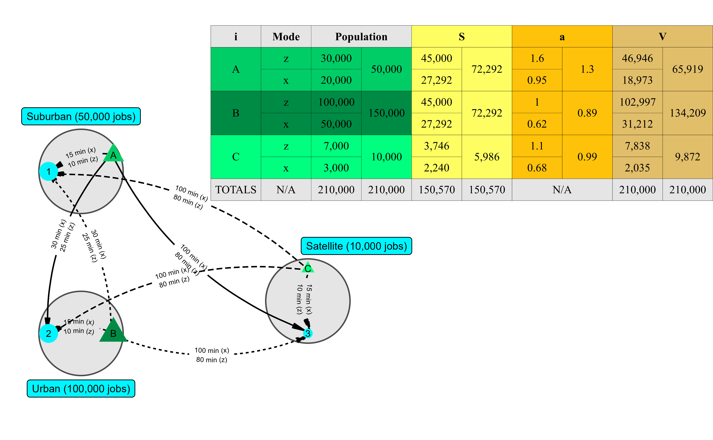

# Overview
```{r setup, include=FALSE}
knitr::opts_chunk$set(echo = TRUE)
```
```{r, eval=FALSE, include=FALSE}
# pagedown::chrome_print("TRB-Poster.Rmd", format = "pdf")
```
```{r load-packages, cache=FALSE, include=FALSE}
library(dplyr)
library(sf)
library(ggplot2)
library(tidyverse)
library(units)
library(patchwork)
library(ggspatial)
library(ggforce)
library(geomtextpath)
library(knitr)
library(gridExtra)
library(grid)
library(huxtable)

options(scipen = 999)
```
```{r sp_avail-function,include=FALSE, include=FALSE}
#defining the spatial availability function, this prints all the intermediates
sp_avail_detailed <- function(x, o_id, d_id, pop, opp, r, f, alpha = 1){
  
  o_id <- rlang::enquo(o_id)
  d_id <- rlang::enquo(d_id)
  pop <- rlang::enquo(pop)
  opp <- rlang::enquo(opp)
  r <- rlang::enquo(r)
  f <- rlang::enquo(f)
  
  sum_pop <- x %>%
    dplyr::distinct(!!o_id,
                    .keep_all = TRUE) %>%
    dplyr::mutate(sum_pop = !!r*(!!pop)^alpha) %>%
    dplyr::pull(sum_pop) %>%
    sum()
  
  f_p <- dplyr::pull(x, !!r) * dplyr::pull(x, !!pop)^alpha / sum_pop
  
  sum_impedance <- x %>%
    dplyr::group_by(!!d_id) %>%
    dplyr::summarize(sum_impedance = sum(!!f))
  
  x <- x %>%
    dplyr::left_join(sum_impedance,
                     by = rlang::as_name(d_id))
  
  f_c <- dplyr::pull(x, !!f) / x$sum_impedance
  
  x$f_c <- f_c
  x$f_p <- f_p
  
  sum_pa <- x %>%
    dplyr::group_by(!!d_id) %>%
    dplyr::summarize(sum_pa= sum(f_p * f_c))
  
  x <- x %>%
    dplyr::left_join(sum_pa,
                     by = rlang::as_name(d_id))
  f_t <- (f_p * f_c) / dplyr::pull(x, sum_pa)
  
  x %>%
    dplyr::mutate(V_ij = !!opp * !!f_t)
}
```
```{r synthetic-data, include=FALSE}
od_tt <- data.frame(i = c("A", "A", "A", "B", "B", "B", "C", "C", "C"), # Three origins
                    j = c("1", "2", "3", "1", "2", "3", "1", "2", "3"), # Three destinations
                    tt_z = c(15, 30, 100, 30, 15, 100, 100, 100, 15), # Travel time, z-mode (original)
                    tt_x = c(10, 25, 80, 25, 10, 80, 80, 80, 10), # Travel time, x-mode (the faster mode - like car)
                    pop = c(50000, 50000, 50000, 150000, 150000, 150000, 10000, 10000, 10000), # Population
                    opp = c(100000, 100000, 10000, 100000, 100000, 10000, 100000, 100000, 10000)) # Jobs

#write the dataframe long.
od_tt_m <- data.frame(i = c("A", "A", "A", "A", "A", "A",
                            "B", "B", "B", "B", "B", "B",
                            "C", "C", "C", "C", "C", "C"), # Three origins
                    j = c("1", "2", "3", "1", "2", "3", 
                          "1", "2", "3", "1", "2", "3", 
                          "1", "2", "3", "1", "2", "3"), # Three destinations
                    m = c("pt", "pt", "pt", "car", "car", "car",
                          "pt", "pt", "pt", "car", "car", "car",
                          "pt", "pt", "pt", "car", "car", "car"),
                    tt = c(15, 30, 100, 10, 25, 80, #travel time, z-mode (original) AND THEN x-mode (the faster mode)
                           30, 15, 100, 25,  10,  80,
                           100, 100, 15, 80, 80, 10), 
                    pop = c(20000, 20000, 20000, 30000, 30000, 30000,
                            50000, 50000,50000, 100000, 100000, 100000,
                            3000, 3000, 3000, 7000,7000, 7000),
                    opp = c(100000, 100000, 10000, 100000, 100000, 10000,
                            100000, 100000, 10000, 100000, 100000, 10000,
                            100000, 100000, 10000, 100000, 100000, 10000)) 
```
```{r data-figure-with-toy-example, include=FALSE}
od <- data.frame(id = c("A", "B", "C", "1", "2", "3"),
                 type = c("Population", "Population", "Population", "Jobs", "Jobs", "Jobs"),
                 size = c(50000, 150000, 10000, 100000, 100000, 10000),
                 x = c(2.5, 2.5, 8.5, 0.5, 0.5, 8.5),
                 y = c(8.0, 2.5, 4.5, 7.5, 2.5, 2.5))

centers <- data.frame(id = c("Urban center", "Suburb", "Satellite town"),
                 radius = rep(1.3, 3),
                 x = c(1.5, 1.5, 8.5),
                 y = c(2.5, 7.5, 3.5))

# od_lines coded as segments
od_lines <- data.frame(x = c(2.5, 2.5, 2.5, 2.5, 2.5, 2.5, 8.5, 8.5, 8.5),
                       y = c(8.0, 8.0, 8.0, 2.5, 2.5, 2.5, 4.5, 4.5, 4.5),
                       xend = c(0.5, 0.5, 8.5, 0.5, 0.5, 8.5, 0.5, 0.5, 8.5),
                       yend = c(7.5, 2.5, 2.5, 7.5, 2.5, 2.5, 7.5, 2.5, 2.5),
                       group = c("A", "A", "A", "B", "B", "B", "C", "C", "C"),
                       time = c("15 min (x)\n10 min (z)", "30 min (x)\n25 min (z)", "100 min (x)\n80 min (z)",
                                "30 min (x)\n25 min (z)", "15 min (x)\n10 min (z)", "100 min (x)\n80 min (z)",
                                "100 min (x)\n80 min (z)", "100 min (x)\n80 min (z)", "15 min (x)\n10 min (z)"))

od_table <- data.frame(Center = c("A", "B", "C", "1", "2", "3"),
  Size = c("50,000 pop (40% x)", "150,000 pop (33% x)", "10,000 pop (30% x)", 
           "100,000 jobs", "100,000 jobs", "10,000 jobs"))

od_table2 <- data.frame(Path = c("A to 1", "A to 2", "A to 3", 
                                "B to 1", "B to 2", "B to 3", 
                                "C to 1", "C to 2", "C to 3"),
  Value = c("15 min (x)\n10 min (z)", "30 min (x)\n25 min (z)", "100 min (x)\n80 min (z)",
            "30 min (x)\n25 min (z)", "15 min (x)\n10 min (z)", "100 min (x)\n80 min (z)",
            "100 min (x)\n80 min (z)", "100 min (x)\n80 min (z)", "15 min (x)\n10 min (z)"))
```
```{r forming the table of synth value, include=FALSE}
#set b and calculate impedance
b_x <- 0.1 #the faster mode, car
b_z <- 0.1 #the original slower mode, transit

od_tt_m <- od_tt_m |>
  mutate(f = case_when(m=="car" ~ exp(-b_x * tt),
                       m=="pt" ~ exp(-b_z * tt)))

S <- od_tt_m |>
  group_by(i,m) |>
  summarize(S = sum(opp * f),
            .groups = "drop")
S_m <- od_tt_m |>
  group_by(i) |>
  summarize(S = sum(opp * f),
            .groups = "drop")

#set b and calculate impedance
LOS_j <- od_tt_m |>
  group_by(j,m) |>
  summarize(opp = mean(opp),
            D_j = sum(pop * f),
            .groups = "drop") |>
  group_by(j) |>
  summarize(LOS_j = first(opp)/sum(D_j),
            opp = mean(opp),
            D_j = mean(D_j))

a_m <- od_tt_m %>%
  left_join(LOS_j |> 
              dplyr::select(j, LOS_j, opp, D_j),
            by = c("j")) %>%
  group_by(i,m) |>
  summarize(a_i_m = sum(LOS_j * f),
            pop = mean(pop),
            .groups = "drop") |>
  rename("a" = "a_i_m")

a <- a_m %>%
  group_by(i) |>
  summarize(a = sum(pop*a)/sum(pop),
            pop = sum(pop),
            .groups = "drop") 

od_tt_m <- od_tt_m %>%
  mutate(catch = 1) %>%
  sp_avail_detailed(o_id = i, #spatial availability
                    d_id = j, 
                    pop = pop,
                    opp = opp,
                    r = catch,
                    f = f, 
                    alpha = 1)

V_m <- od_tt_m %>%
  group_by(i,m) %>%
  summarize(V = sum(V_ij),
            v = V/first(pop))

V <- od_tt_m %>%
  group_by(i) %>%
  summarize(V = sum(V_ij))
```
```{r assembing synth value table, include=FALSE}
access_table <- data.frame(i = c("A", "A", 
                                 "B", "B",
                                 "C", "C", "TOTALS"),
                       Mode = c("z", "x", "z", "x", "z", "x", "N/A"),
                       Population = c(a_m$pop[1], a_m$pop[2], a_m$pop[3], a_m$pop[4], a_m$pop[5], a_m$pop[6], a_m$pop%>%sum()),
                       Population.1 = c(a$pop[1], NA, a$pop[2], a$pop[2], a$pop[3], a$pop[3], a$pop%>%sum()),
                       S = c(S$S[1], S$S[2], S$S[3], S$S[4], S$S[5], S$S[6], S$S%>%sum()),
                       S.1 = c(S_m$S[1], S_m$S[1], S_m$S[2], S_m$S[2], S_m$S[3], S_m$S[3], S$S%>%sum()),
                       a = c(a_m$a[1], a_m$a[2], a_m$a[3], a_m$a[4], a_m$a[5], a_m$a[6], "N/A"),
                       a.1 = c(a$a[1], a$a[1], a$a[2], a$a[2], a$a[3], a$a[3], "N/A"),
                       V = c(V_m$V[1], V_m$V[2], V_m$V[3], V_m$V[4], V_m$V[5], V_m$V[6], V$V%>%sum()),
                       V.1 = c(V$V[1], V$V[1], V$V[2], V$V[2], V$V[3], V$V[3], V$V%>%sum())) 
```
```{r saving synth value table part one, include=FALSE}
ht <- hux(access_table, add_colnames = TRUE)

ht <- ht %>%
  merge_across(1, 3:4) %>%
  merge_across(1, 5:6) %>%
  merge_across(1, 7:8) %>%
  merge_across(1, 9:10) %>%
  merge_across(8, 7:8) %>%
  merge_down(2:3, c(1,4,6,8,10)) %>%
  merge_down(4:5, c(1,4,6,8,10))%>%
  merge_down(6:7, c(1,4,6,8,10)) %>%
  set_background_color(col= 1:4, row=c(6,7), value = "springgreen1") %>%
  set_background_color(col= 1:4, row=2:3, value = "springgreen3") %>%
  set_background_color(col= 1:4, row=4:5, value = "springgreen4") %>%
  set_background_color(col=5:6, value = "#FEFE62") %>%
  set_background_color(col=7:8, value = "#FFC20A") %>%
  set_background_color(col=9:10, value = "#E1BE6A") %>%
  set_background_color(row=8, value = "grey90") %>%
  set_background_color(col= 1:4, row=1, value = "grey90") %>%
  set_all_borders(value = 0.4) %>%
  set_align(value="center") %>%
  set_valign(value="middle") %>%
  set_bold(col=1:10, row=1) %>%
  set_font_size(value = 16) %>%
  set_number_format(fmt_pretty(digits=2)) %>%
  set_col_width(value=c(0.1,0.1,0.1,0.1,0.1,0.1,0.1,0.1,0.1,0.1))

quick_html(ht, file = "images/synth_ex_table.html", open = FALSE)
# higher zoom increases resolution and image size
webshot::webshot(url = "images/synth_ex_table.html", file = "images/synth_ex_table.png",
                 zoom = 5, selector = "table")
```
```{r, create-figure-with-toy-example, echo=FALSE, eval=FALSE, include=FALSE}
toy_example_plot <- ggplot() + 
  # Plot centers
  geom_circle(data = centers,
             aes(x0 = x, 
                 y0 = y,
                 r = radius),
             color = "grey30",
             fill = "grey90") +
  annotate(geom = "label", 
           x=c(1.5, 1.5, 10),
           y=c(9.2, 0.8, 5.2), 
           label = c("Suburban (50,000 jobs)", "Urban (100,000 jobs)", "Satellite (10,000 jobs)"),
           fill = c("turquoise1","turquoise1","turquoise1"),
           size=2.7) +
  # Connect origins and destinations with curves and put the text on curves
  geom_textcurve(data = od_lines,
               aes(x = x,
                   y = y,
                   xend = xend,
                   yend = yend,
                   linetype = group,
                   group = group,
                   label = time),
             color = "black",
             position=position_jitter(width=0.1,height=0.1),
             size = 1.8,
             curvature = 0.20,
             linewidth = 0.5,
             linecolour = "black",
             arrow = arrow(type = "closed", angle = 10, length = unit(0.03, "npc"))) +
  # Plot origins and destinations points
  geom_point(data = od,
            aes(size = size,
                x = x, 
                y = y, 
                color = id,
                shape = type)) +
  scale_size(range = c(3, 7)) +
  scale_shape_manual(values = c("Population" = 17,'Jobs' = 16)) +
  scale_color_manual(values = c("A" = "springgreen3",
                                "B" = "springgreen4",
                                "C" = "springgreen1",
                                '1' = "turquoise1",
                                '2' = "turquoise1",
                                '3' = "turquoise1")) +
  # Label origins and destinations
  geom_text(data = od, 
            aes(x, 
                y, 
                label=id),
            size=2.5) +
  # place the table
    annotation_custom(rasterGrob(png::readPNG(source="images/synth_ex_table.png")),
                      xmin= 5.5, xmax=Inf, 
                      ymin=6, ymax=Inf
                      )+
  # Theme the plot
  coord_fixed(xlim = c(0,20), ylim=c(0,12)) + 
  theme_void() + guides(shape = "none", size = "none", color = "none", linetype ="none")

toy_example_plot
ggsave("images/toy-example.png",dpi=600)
```

Accessibility is a key concept in the analysis of land use and transportation systems. It is too coming of age from the perspective of planning [see _inter alia_, @handyAccessibility2020; @elGeneidyMaking2022]. Beginning with the work of Hansen [@hansenHowAccessibilityShapes1959], accessibility measures have been widely used to evaluate the efficiency of transportation systems when combined with the distribution of opportunities in space.

The most common form of accessibility measure is based on the gravity model, and recent research has focused on the way opportunities are counted (summed). Notably, the sums are not constrained meaning the same opportunity can enter the sum for different origins. This unconstrained counting results in accessibility values that are difficult to interpret, especially when comparing results between multiple modes.

In this paper we address this pitfall by extending spatial availability for multiple modes [@soukhovIntroducingSpatialAvailability2023]. Spatial availability is a singly-constrained competitive accessibility measure that constrains calculations to match a known quantity. This ensures the measurements sum up to a predetermined quantity (i.e., the total number of opportunities), and so each value can be meaningfully related to this total. 

We demonstrate spatial availability's use in the case of multiple modes (i.e., heterogeneous population segments with distinct travel behaviours). We illustrate its features using a synthetic example, an empirical example of low emission zones in Madrid, Spain, and suggest future research directions in its use to evaluate policy interventions.

# General form of multimodal accessibility measures

<u>Hansen-type accessibility</u> [@hansenHowAccessibilityShapes1959] - _Non competitive_ and _unconstrained_:

$S_i^m = \sum_j O_j \color{blue}{f^m(c_{ij}^m)}$

<u>Shen-type accessibility</u> [@shenLocationCharacteristicsInnercity1998; @luoMeasuresSpatialAccessibility2003] - **Competitive** and _unconstrained_: 

$a_i^m = \sum_j O_j \color{blue}{\frac{f^m(c_{ij}^m)}{\sum_m D_j^m}}  = \sum_j O_j \color{blue}{\frac{f^m(c_{ij}^m)}{{\sum_m \sum_i P_{i}^m f^m(c_{ij}^m)^m}}}$

<u>Spatial availability</u> [@soukhovIntroducingSpatialAvailability2023] - **Competitive** and **constrained**: 

$V_i^m = \sum_j O_j \color{blue}{F^{t,m}_{ij}} = \sum_j O_j \color{blue}{\frac{F^{pm}_{i} \cdot F^{cm}_{ij}}{\sum_{m} \sum_{i} F^{pm}_{i} \cdot F^{cm}_{ij}}}$ 

Where:

-   $m = 1, 2,\cdots, M$ is a set of $M$ modes (or sub-populations) of interest.
-   $i$ is a set of origin locations ($i = 1,\cdots,N$) 
-   $j$ is a set of destination locations ($j = 1,\cdots,J$).
-   $c_{ij}^m$ is a measure of the cost of moving between $i$ and $j$ for each $m$.
-   $f^m(\cdot)$ is an impedance function of $c^m_{ij}$ for each $m$, it can take the form of any monotonically decreasing function reflective of travel behaviour.
-   $O_j$ is the number of opportunities at location $j$; $O = \sum_{j=1}^J O_j$ is the total supply of opportunities in the study region.
* $F^{tm}_{ij}$ is the total balancing factor for each $m$ at each $i$; it consists of two factors. 
  + First, the factor for allocation by population for each $m$ at each $i$ is $F^{pm}_{i} = \frac{P_{i}^m}{\sum_{m}\sum_{i} P_{i}^m}$ and 
  + Then the factor for allocation by cost of travel for each $m$ at $i$ is $F_{ij}^{cm} = \frac{f^m(c_{ij}^m)}{\sum_{m} \sum_{i} f^m(c_{ij}^m)}$.

**Spatial availability's proportional allocation mechanism**

- $V^m_{i}$ is always singly-constrained: $\sum_{i} V_{i} = \sum_{m}\sum_{i} V_{i}^m = \sum_{j} O_j$

- So, one can calculate spatial availability per ...
  - **$i$**: ( $V_{i} = \sum_{m} V^m_{i}$ )
  - **mode**: ( $v^{m} = \sum_{m} \sum_{i} V^m_{i}$ )
  - **capita in $i$**: ( $v_{i} = \sum_{m} \frac{V_i^m}{P_{i^m}}$ )

# Synthetic example of 3 zones and 2 mode-using populations

{#id .class width=100%}

When competition is not considered, **S** values for the Suburban A and Urban B are the same. Does this equivalency make sense for the differently sized A and B? Further, if constraints are not incorporated (i.e., **S** and **a**), values are hard to interpret. The regional sums of **S** and **a** are meaningless.

In considering both competition and constraints, **V** is not the same for A and B: Suburban A has more _available_ jobs than mode-using population, the Urban B and the satellite C have fewer _available_ jobs, and the sum of **V** is the total number of jobs in the region. We can interpret that the faster z population captures a higher proportion of availability than population in A, B, and C, unlike x. **The advantage of using spatial availability is the clarity in interpretation.**

# Empirical example: multimodal access in Madrid

The low emission zone (LEZ) in the Centro of the City of Madrid was established in 2017 to pursue climate change mitigation goals. LEZs implement a form of _geographic discrimination_ as they change how people can reach opportunities by making it more costly for some forms of travel, typically cars, to circulate in predetermined zones. LEZ change the accessibility landscape of a city from the perspective of multiple modes. 

We ask: **what is the spatial distribution of availability that can be accessed by different mode-using population, especially for the car-using populations within and outside of the Centro LEZ?**

{#id .class width=100%}

{#id .class width=98%}

- Each $V_i^m$ is a proportion of the 847,574 jobs in the City of Madrid (OD full-time work flows from the 2018 Community of Madrid travel survey [@comunidaddemadridResultadosEDM20182020]). They represent the number jobs spatially available to $m$-using workers at that $i$, relative to all the jobs in the city. 
- Note the differences in magnitudes between modes: the majority of availability is allocated to car- and transit- populations. This is to be expected as these modes represent 84.1% of the total population and reflect greater travel speeds.
- Car users outside of the M-30 broadly have greater spatial availability, while many zones inside the M-30 offer greater spatial availability to transit users. 
- Overall, the magnitude of $V_i^m$ for cyclists and pedestrians are lower than for car and transit, but the highest values of $V_i^{bike}$ and $V_i^{walk}$ are within the M-30 and zones with higher spatial availability by transit.

# Interpreting multimodal spatial availability

{#id .class width=100%}

Note the differences between proportions between mode depending on the spatial neighbourhood examined: car captures more availability than its population proportion overall (black) but this is not the case within the Centro (light grey). As such, non-car modes are better at capturing spatial availability within the M-30 (dark grey) and especially the Centro (light grey). 

{#id .class width=98%}

Do we want a city where the spatial availability of opportunities is equal for all mode users? $V_i^m$ can be divided by the mode-using population at each $i$ to yield mode-population scaled values and used as a planning benchmark. Zones that are orange could be targets for interventions; and car-using populations can be further dissuaded. 

# Conclusions and future work

Opportunities are finite: spatial availability uses this idea as a constraint to consider competition for opportunities by the population. This consideration, through the proportional allocation factors, adds a new-found interpretation of accessibility values. 

With spatial availability, the magnitude of opportunities that are available as a proportion of all the opportunities in the region is equal to $V_i$. Heterogeneous population characteristics, like difference in travel times due to mode used, can be easily incorporated, as done in this multimodal extension. The flexibility of spatial availability can be helpful in identifying zones and modes in need of intervention and highlights the spatial competitive advantage of certain modes.

Future works will look to model policy scenarios considering normative equity standards, and consideration of population and opportunities characteristics like income, travel mode used, and quality of opportunity.

# References

